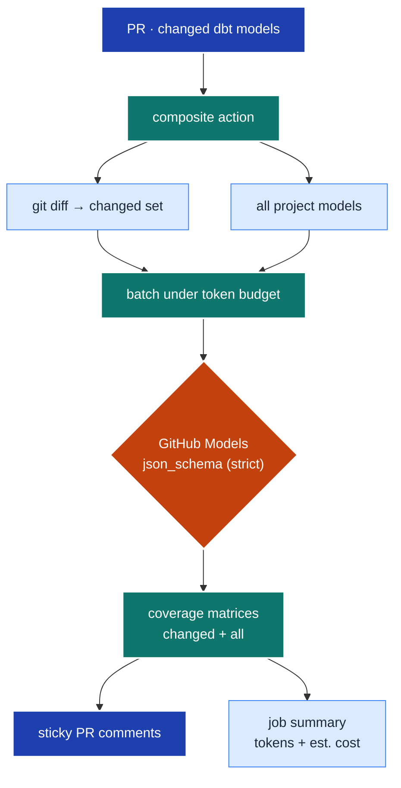

# dbt testing-taxonomy review (composite action)

A composite GitHub Action that reviews the dbt models in a pull request against a curated
**testing taxonomy** and posts the findings back to the PR as coverage-matrix comments — so a
reviewer can see, at a glance, which taxonomy rules each model satisfies, misses, or doesn't
need. It calls an LLM via **GitHub Models** (keyless, using the workflow's `GITHUB_TOKEN`) and
reports token usage + estimated cost on every comment.

<details>
<summary>Table of contents</summary>

<!--TOC-->

- [dbt testing-taxonomy review (composite action)](#dbt-testing-taxonomy-review-composite-action)
  - [Quickstart](#quickstart)
  - [Architecture](#architecture)
  - [Reference](#reference)
    - [Inputs (see \[`action.yml`\](./action.yml))](#inputs-see-actionymlactionyml)
    - [Files](#files)
    - [Rule-code scheme](#rule-code-scheme)
    - [Decision framework (how codes are chosen)](#decision-framework-how-codes-are-chosen)
    - [Troubleshooting](#troubleshooting)
  - [For maintainers](#for-maintainers)

<!--TOC-->

</details>

## Quickstart

**In a workflow** (see [`testing-taxonomy-review.yml`](../../workflows/testing-taxonomy-review.yml)):

```yaml
permissions: { contents: read, pull-requests: write, models: read }
steps:
  - uses: actions/checkout@v6
    with: { fetch-depth: 0 }          # base..head diff needs both commits
  - uses: ./.github/actions/dbt-testing-taxonomy-review
    with:
      github-token: ${{ secrets.GITHUB_TOKEN }}
      pr-number: ${{ github.event.pull_request.number }}
      base-sha: ${{ github.event.pull_request.base.sha }}
      head-sha: ${{ github.event.pull_request.head.sha }}
      # optional: model, models-endpoint, models-glob, cost-per-1m-input, cost-per-1m-output
```

**Run the engine directly** (local iteration / debugging):

```bash
GITHUB_TOKEN=$(gh auth token) PR_NUMBER=123 \
BASE_SHA=$(git merge-base origin/main HEAD) HEAD_SHA=$(git rev-parse HEAD) \
uv run --no-project .github/actions/dbt-testing-taxonomy-review/review.py
```

**Swap the model** (any structured-output-capable GitHub Models id) without code changes:

```yaml
  - uses: ./.github/actions/dbt-testing-taxonomy-review
    with:
      model: openai/gpt-4o-mini          # cheaper; see benchmarks/MODELS.md
      cost-per-1m-input: "0.15"
      cost-per-1m-output: "0.60"
      # … + the required token/pr/sha inputs
```

## Architecture



The engine reviews **all** project models once (batched per request to respect the provider's
~8000-token request cap), then derives the PR's *changed* subset by name — so the two matrices
are consistent and changed models aren't reviewed twice. The model is forced to return JSON
conforming to [`review-output.schema.json`](./review-output.schema.json); the `rule_code` enum is
injected from [`rules.json`](./rules.json) at runtime so the schema and catalogue cannot drift.

## Reference

### Inputs (see [`action.yml`](./action.yml))

| Input | Required | Default | Purpose |
|-------|:--------:|---------|---------|
| `github-token` | ✅ | — | Needs `models:read` + `pull-requests:write` (`secrets.GITHUB_TOKEN`). |
| `pr-number` | ✅ | — | PR to comment on. |
| `base-sha` / `head-sha` | ✅ | — | Diff endpoints for the changed-models set. |
| `model` | | `openai/gpt-4o` | GitHub Models catalogue id (structured-output capable). |
| `models-endpoint` | | `https://models.github.ai/inference` | Inference endpoint. |
| `models-glob` | | `dbt-jaffleshop/models` | Path prefix holding the dbt models. |
| `cost-per-1m-input` / `cost-per-1m-output` | | `2.5` / `10` | USD/1M tokens for the estimated-cost line. |

### Files

| File | Role |
|------|------|
| `action.yml` | Composite action: inputs + `setup-uv` + run. |
| `review.py` | Engine (stdlib-only; `uv run --no-project`). Diff, batch, call, render, comment. |
| `rules.json` | Machine-readable catalogue — single source of truth for the 29 rule codes. |
| `review-output.schema.json` | Structured-output contract enforced on the model. |
| `benchmarks/bench.py`, `benchmarks/MODELS.md` | Model trials + curated pricing/results. |

### Rule-code scheme

`<ROLE>[-<SUBROLE>]-<NN>` — a 2-letter role prefix, an optional sub-role segment (only `time`
has one), then a zero-padded number. Roles are the **stable** axis; the Wang–Strong data-quality
dimension and cost class are columns in `rules.json`, **not** part of the code.

| Prefix | Role | Column behaviour that triggers it |
|--------|------|-----------------------------------|
| `EN-` | entity | Used in a `JOIN ON` (PK / surrogate / FK / compound grain) |
| `DM-` | dimension | Used in a `GROUP BY` (categorical axis) |
| `MS-` | measure | Inside an aggregate (`SUM`/`COUNT`/`AVG`) |
| `TM-SC-` / `TM-GR-` / `TM-AU-` | time · scalar / grain / audit | timestamp in `WHERE`/window · `GROUP BY DATE_TRUNC` · `loaded_at`/SCD2 |
| `MD-` | model | Cross-column / whole-model concerns |

The full catalogue (29 codes, summaries, framework choice, applies-when) lives in
[`rules.json`](./rules.json); the long-form vignettes are in
[`docs/guides/testing_taxonomy/`](../../../docs/guides/testing_taxonomy/README.md).

### Decision framework (how codes are chosen)

For each **column**, union the suites for every query role it plays (a column can play several):
`JOIN ON` → entity `EN-*`; `GROUP BY` → dimension `DM-*`; inside an aggregate → measure `MS-*`;
date/datetime → time `TM-SC/GR/AU-*`. For the **model**, always evaluate `MD-01` (grain test —
the non-negotiable baseline), plus `MD-02` contract / `MD-04` refactor-parity / `MD-05` unit-tests
as applicable. Package-preference ladder when several express the same intent:
`dbt core → dbt-utils → dbt_expectations → elementary → audit_helper` (climb only when the lower
tier can't express it; anomaly/freshness-anomaly → elementary, which is **prod-only** here).

### Troubleshooting

| Symptom | Cause | Fix |
|---------|-------|-----|
| `413 tokens_limit_reached` | A request exceeded the model's ~8000-token cap | Lower the batch budget (`REQUEST_TOKEN_CAP` in `review.py`) or pick a larger-context model. |
| `429 Too many requests` | Free-tier rate/daily limit | Batching + backoff handle bursts; if the daily quota is exhausted, wait for reset or switch `model`. |
| Job skipped on a PR | Fork PR (read-only token, no `models:` access) | Expected — the workflow `if:` restricts to same-repo PRs. |
| Comment not updated | Marker mismatch | Each variant keys off its own `<!-- ttr:* -->` marker; don't edit those out of a comment. |
| `400` on a non-OpenAI model | Model doesn't support `response_format: json_schema` | Use an OpenAI-family model, or extend the engine with a json_object fallback. |

## For maintainers

Design rationale, the ADR log, the extension checklist, and known gotchas live in
[`CLAUDE.md`](./CLAUDE.md). Model selection + empirical cost/latency trials are in
[`benchmarks/MODELS.md`](./benchmarks/MODELS.md).
