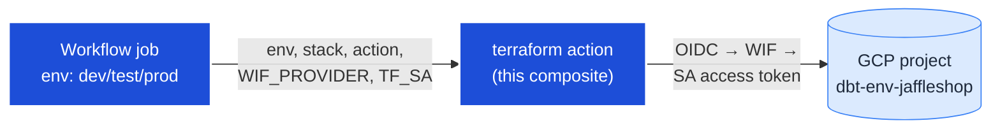
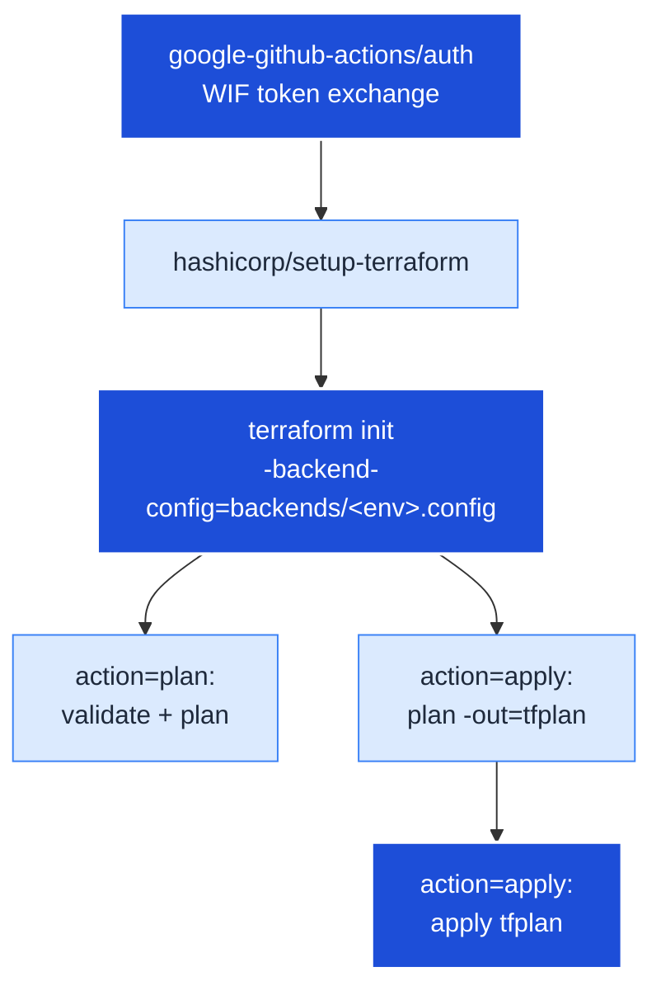

# `terraform` composite action

Authenticate to GCP via **Workload Identity Federation** (no keyfiles) and run
`terraform init` + (`plan` | `apply`) for **one environment of one stack** under
`infra/stacks/<stack>`. This action is the single home for every cloud-touching
terraform CLI call in CI — the reusable workflow that calls it owns only
orchestration (job matrix, environment gating, trigger routing).

<details>
<summary>Table of contents</summary>

<!--TOC-->

- [`terraform` composite action](#terraform-composite-action)
  - [Quickstart](#quickstart)
  - [Architecture](#architecture)
  - [Reference](#reference)
    - [Inputs](#inputs)
    - [Files](#files)
    - [Troubleshooting](#troubleshooting)
  - [For maintainers](#for-maintainers)

<!--TOC-->

</details>

## Quickstart

Wire it into a workflow job. The job must set `environment:` (so the per-env
`vars.WIF_PROVIDER` / `vars.TF_SA` resolve) and the workflow must grant
`id-token: write`:

```yaml
jobs:
  apply-dev:
    runs-on: ubuntu-latest
    environment: dev
    steps:
      - uses: actions/checkout@v6
      - uses: ./.github/actions/terraform
        with:
          env: dev
          stack: dbt_platform
          action: apply
          workload_identity_provider: ${{ vars.WIF_PROVIDER }}
          service_account: ${{ vars.TF_SA }}
```

To reproduce what the action does **locally** (the real commands it wraps), from
the repo root:

```bash
terraform -chdir=infra/stacks/dbt_platform init -backend-config=./backends/dev.config -reconfigure
terraform -chdir=infra/stacks/dbt_platform plan -input=false -var environment=dev
```

The single most useful knob is **`action`**: `plan` runs `validate` + `plan`
(read-only, used by the plan matrix on every trigger); `apply` runs an atomic
`plan -out=tfplan` then `apply tfplan` (the on-disk plan guarantees apply
executes exactly what plan showed).

## Architecture



*The calling job supplies per-env inputs; the action exchanges the GitHub OIDC
token for a short-lived SA token, then runs terraform against that project.*

<details>
<summary>📋 Internal step sequence</summary>



*Every step runs `terraform -chdir=infra/stacks/${stack}`, so one action body
serves every stack.*

</details>

## Reference

### Inputs

See [`action.yml`](./action.yml) for the authoritative contract. Summary:

| Input | Required | Default | Description |
|---|---|---|---|
| `env` | yes | — | Environment name — one of `dev` / `test` / `prod`. |
| `stack` | no | `dbt_platform` | Stack name under `infra/stacks/`. |
| `action` | yes | — | `plan` or `apply`. |
| `workload_identity_provider` | yes | — | Full WIF provider resource (from `vars.WIF_PROVIDER`). |
| `service_account` | yes | — | Deployer SA email (from `vars.TF_SA`). |
| `terraform_version` | no | `1.10.0` | Terraform CLI version to install. |

### Files

| File | Role |
|---|---|
| `action.yml` | The composite action: auth → setup-terraform → init → plan/apply. |
| `README.md` | This file — human-facing usage + architecture. |
| `CLAUDE.md` | Maintainer decision log (why it's built this way). |

### Troubleshooting

| Symptom | Cause / fix |
|---|---|
| `Error: google-github-actions/auth failed` | The calling job is missing `environment:`, so `vars.WIF_PROVIDER`/`vars.TF_SA` are empty — or the workflow lacks `permissions: id-token: write`. |
| `Permission 'iam.serviceAccounts.getAccessToken' denied` | The repo's `principalSet` isn't bound on the deployer SA for that project — re-run `infra/bootstrap/bootstrap_project.sh`. |
| `Backend configuration changed` on init | Expected when switching env in one checkout — the action always passes `-reconfigure`. |
| `Error: stack directory not found` | `stack` input doesn't match a directory under `infra/stacks/`. |

## For maintainers

See [`CLAUDE.md`](./CLAUDE.md) for the rationale, invariants, and extension
checklist.
