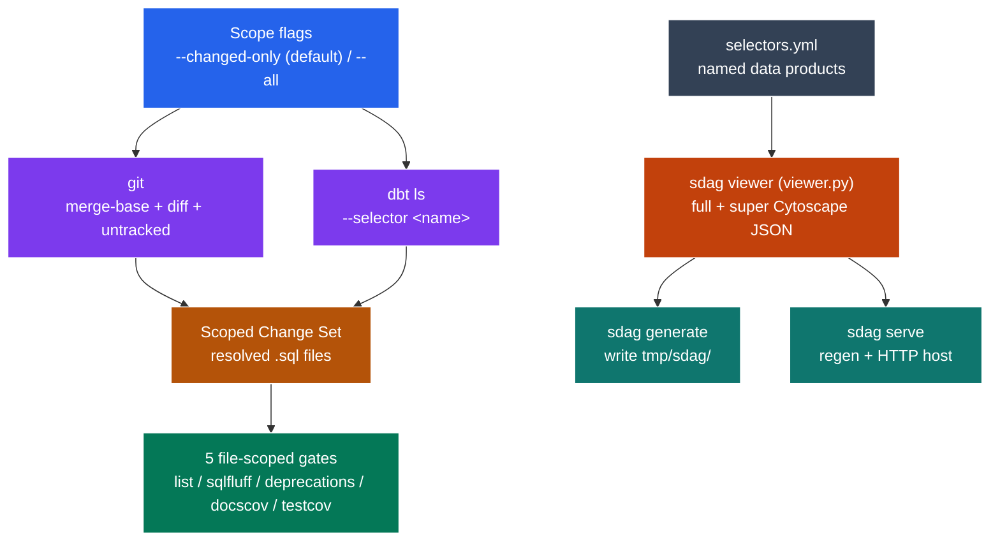
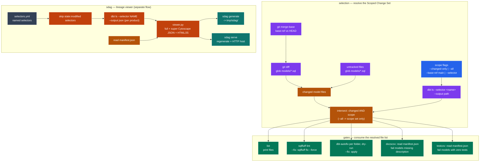

# `adaf` Architecture

How the pieces fit together. For *usage* see [README.md](README.md); for the *why* behind each
decision see the ADR log in [AGENTS.md](AGENTS.md); for the CI workflow graph see
[../../../docs/adaf-ci-cd.md](../../../docs/adaf-ci-cd.md).

## Two independent flows

The **file-scoped gates** (`list`, `sqlfluff`, `deprecations`, `docscov`, `testcov`) all consume one
`Scoped Change Set` — a scope (changed or all) intersected with a named dbt selector. The **`sdag`
viewer** instead walks the data products (named selectors) in `selectors.yml` and renders them.
Change detection is git's job; scope is dbt's.

*Two independent flows at a glance: the file-scoped gates fold a git diff and a `dbt ls` scope into one resolved `Scoped Change Set` of `.sql` files, while `sdag` walks the named selectors straight into the lineage viewer.*

Complete diagram — full selection, gate, and sdag wiring (19 nodes)

*The detailed view: git's three-source union (merge-base, diff, untracked) and the `dbt ls` scope call intersect into the resolved set that all five gates read, while `sdag` skips `state:modified` selectors, resolves each product via `dbt ls`, and feeds `viewer.py` to generate or serve the assets.*

That intersection is the whole point of the gates: of ~1,200 models in the project, only the handful
that are both **changed** and **in your `--selector`** are ever checked.

## Build selection: `adaf ls --flags`

`adaf ls --flags` turns a selector into the dbt `--select`/`--state`/`--defer` flags a `dbt build`
needs. The canonical default seed is `state:modified+ ∩ selector` — the changed models in the
product **plus their in-product descendants** (the `+` is baked into the seed), resolved to concrete
paths because dbt's graph operators can't attach to an intersection. The hop modes instead seed on
the bare change set `state:modified ∩ selector` and let `--upstream`/`--downstream` add `+`/`-`
operators so dbt traverses the lineage out of the product from that seed.
This is what the CI `dbt-build` job runs instead of building the whole product (ADR-0030).

## Findings + the PR comment

Each gate writes its findings as JSON (`--json-out`); the CI matrix uploads them, and `adaf report`
aggregates them into ONE sticky PR comment with two independently-updated sections — `findings`
(posted fast, off the checks) and `build` (the dbt run-results + EDR/sdag links, posted by the build
job). See [AGENTS.md](AGENTS.md) ADR-0028/0029 and the workflow graph in
[../../../docs/adaf-ci-cd.md](../../../docs/adaf-ci-cd.md).

## CI pipeline

The per-product workflow (`adaf-<product>.yml`) is a thin caller of the reusable workflow
(`adaf-reusable.yml`) that holds the parallel job graph (setup → checks ∥ dbt-build → report). Both
the reusable workflow and the `adaf-ci` bootstrap composite action are CLI-owned assets deployed by
`adaf gha init`; `adaf gha create` stamps the per-product caller. The full job graph lives in
[../../../docs/adaf-ci-cd.md](../../../docs/adaf-ci-cd.md).
