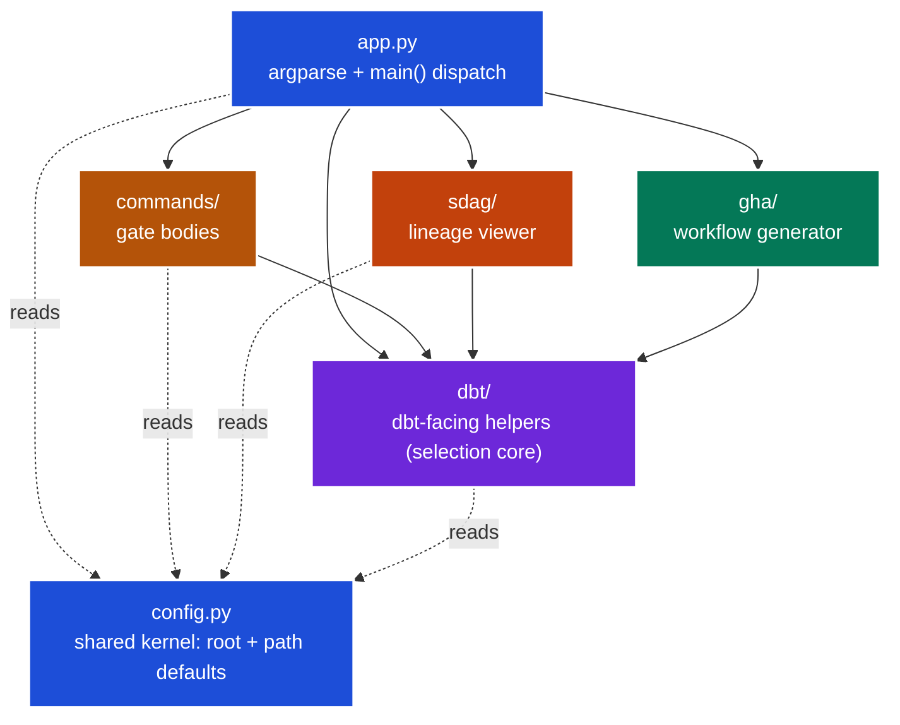
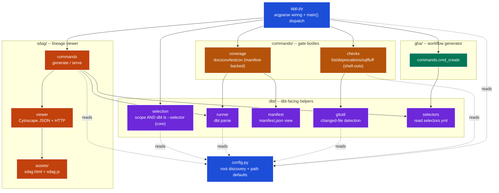

# Contributing to `adaf`

A human centered guide to hacking on the `adaf` CLI. 

- **What it does and how to run it**, see [README.md](README.md)
- **Why it's built the way it is** (the ADR log + decision lenses as agentic memory), see [AGENTS.md](AGENTS.md). 

This file is the bit in between: how to set up, where code lives, and how to add to it without re-litigating decisions already made.

<!--TOC-->

- [Contributing to `adaf`](#contributing-to-adaf)
  - [Dev setup](#dev-setup)
  - [Architecture](#architecture)
  - [Running it locally](#running-it-locally)
  - [How to add things](#how-to-add-things)
    - [A new file-scoped gate](#a-new-file-scoped-gate)
    - [A new subcommand alias](#a-new-subcommand-alias)
    - [Conventions to honour](#conventions-to-honour)
  - [Gotchas](#gotchas)
  - [Where decisions live](#where-decisions-live)

<!--TOC-->

---

## Dev setup

Everything runs from the **repo root** — never `cd` into this package. The dbt project is the
`dbt-jaffleshop/` subdir, and `adaf` is an editable path dep of that project, so drive it with
`uv run --directory dbt-jaffleshop`:

```sh
uv sync --directory dbt-jaffleshop                # editable-installs adaf into the dbt project's venv (the one with dbt/sqlfluff/dbt-autofix)
uv run --directory dbt-jaffleshop adaf --help     # smoke-test the wiring
```

- **Editable install, so edits are live.** `[tool.uv.sources]` in `dbt-jaffleshop/pyproject.toml`
  pulls this package in as `{ path = "../.github/cli/adaf", editable = true }`. Touch a file
  in `src/adaf/` and the next `uv run --directory dbt-jaffleshop adaf` sees it — no reinstall, no rebuild.
- **`requires-python = ">=3.12`.** Use 3.12 syntax freely (`X | None`, `match`, etc.).

---

## Architecture

`app.py` + `config.py` are the kernel; the rest is grouped into sub-packages by
concern (AGENTS.md ADR-0011). Logic never lives in `app.py` — it imports the
command bodies and the `dbt/` selection core and wires them to subparsers.



*At a glance: `app.py` wires every gate body plus the `dbt/` selection core, all three concern packages lean on `dbt/`, and the `config.py` kernel is read throughout.*

<details>
<summary>Full module map (13 nodes)</summary>



*Per-module reality: `commands.checks` shells out via `gitutil`, `coverage` reads the `manifest`, `sdag.commands` drives `runner`/`selectors`/`viewer` (which serves `assets/`), and `gha.cmd_create` only needs `selectors`.*

</details>

---

## Running it locally

`--selector` is **required** on every file-scoped command (no default — be explicit about
which data product you're scoping to). The scope is always the models in `(changed | --all)`
that are also in `dbt ls --selector <name>`.

```sh
uv run --directory dbt-jaffleshop adaf list --selector demand            # what WOULD be checked (changed vs main)
uv run --directory dbt-jaffleshop adaf list --all --selector demand      # widen to every in-scope model
uv run --directory dbt-jaffleshop adaf sqlfluff --selector demand        # lint (report only)
uv run --directory dbt-jaffleshop adaf sqlfluff --all --selector demand --fix   # auto-fix in place (mutates!)
uv run --directory dbt-jaffleshop adaf deprecations --selector demand    # dbt-autofix dry-run
uv run --directory dbt-jaffleshop adaf docscov --selector demand --parse # docs coverage (--parse refreshes manifest)
uv run --directory dbt-jaffleshop adaf testcov --selector demand         # test coverage
```

The **sdag viewer** walks ALL named selectors (no scope flags, no `--product`):

```sh
uv run --directory dbt-jaffleshop adaf sdag generate            # write assets to tmp/sdag/ (all data products)
uv run --directory dbt-jaffleshop adaf sdag generate --inline   # one standalone HTML, no sidecars
uv run --directory dbt-jaffleshop adaf sdag serve               # regen + host at http://localhost:8088
```

The **workflow generator**:

```sh
uv run --directory dbt-jaffleshop adaf gha create <product>     # writes .github/workflows/adaf-<product>.yml (--force to overwrite)
```

Aliases: `list`→`ls`, `deprecations`→`dep`, `sqlfluff`→`fluff`. Pass `-v` for DEBUG logs to stderr.

---

## How to add things

### A new file-scoped gate

1. Write the body in `commands/` (a function taking `files: list[Path]`, returning an int
   exit code — `0` clean, `1` findings, **empty scope returns `0`**, never raises for a
   finding). Put shell-outs in `checks.py`, manifest reads in `coverage.py`.
2. Wire a subparser in `app.py`: `sub.add_parser(...)`, then `_add_scope(p)` for the
   shared scope flags (and `_add_fix`/`_add_manifest` if relevant), then
   `p.set_defaults(func=_cmd_yourgate)`.
3. Add the matching `_cmd_yourgate` leaf handler in `app.py`. It resolves the file set with
   `resolve_model_files(from_args(args))` and hands it to your body — that's all the wiring
   does.

### A new subcommand alias

argparse natively supports it: `sub.add_parser("name", aliases=["short"], ...)`. See how
`list`/`ls` and `sqlfluff`/`fluff` already do it.

### Conventions to honour

- **Follow the argparse `_help` pattern** ([`.claude/rules/python/cli.md`](../../../.claude/rules/python/cli.md)):
  every parser group gets `set_defaults(func=_help(p))` so an incomplete path prints help
  instead of erroring; leaf commands override it with their real handler; `main()` dispatches
  `args.func(args)` unconditionally.
- **`--selector` is REQUIRED, no default.** Don't add one back (AGENTS.md ADR-0012). Scope
  is always explicit.
- **Mutation only behind `--fix`** (ADR-0008). A bare invocation must be safe to run anywhere.
  Add `--fix` *only* to a gate whose underlying tool owns a real fixer.
- **Shell out, don't reimplement** — and **fail loud**: a non-zero from git/dbt/sqlfluff is
  re-raised, never swallowed (a failed check must never read as "clean").
- **Keep `app.py` logic-free.** If you're writing an `if` that isn't argparse plumbing,
  it belongs in a command body.

---

## Gotchas

- **`sqlfluff` needs GCP ADC.** The `.sqlfluff` dbt templater opens a real BigQuery
  connection, so `sqlfluff` fails with auth errors or `'NoneType' … close` unless you've run
  `gcloud auth application-default login`. `dbt ls` / `dbt-autofix` only parse, so they
  don't. (The other gates are parse-only.)
- **`sdag` always resolves ALL ~80 selectors** (one `dbt ls` per product) — slow by design,
  there is no `--product` filter. Pass `--no-parse` while iterating to skip the upfront parse.
- **Outputs go to `tmp/`.** sdag assets default to `tmp/sdag/`. Keep generated artefacts there.
- **Don't run `--fix` to "verify".** It rewrites real files. Confirm fix-mode wiring from
  `--help` and a clean working tree only.

---

## Where decisions live

The **ADR log is in [AGENTS.md](AGENTS.md)** — read the relevant entry's *Lens* before
changing anything it covers, so you decide forward instead of re-opening a settled
trade-off. The extension checklist there is the pre-handoff gate.

**`tests/` covers the pure, warehouse-free logic** (ADR-0007) — `dbt/selectors`, `dbt/cache`
(freshness + fingerprint invalidation), `dbt/manifest`, `git/gitutil`, selection set logic, and
the state-modified calculator. Shell-out paths (`dbt ls`, `dbt parse`, the viewer) are exercised
end-to-end, not unit-mocked. Run `make test`; the dbt version-matrix suite is `make adaf-multiversion-ci`.
