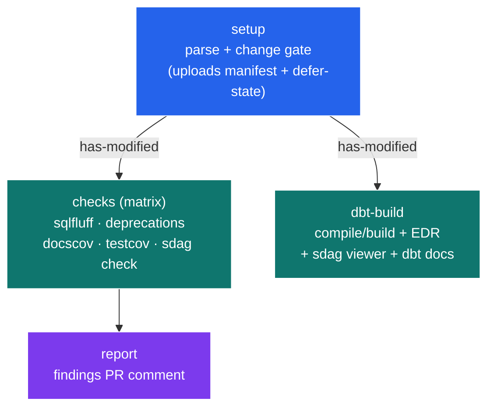

# `adaf gha` — generating and maintaining GitHub Actions

`adaf gha` generates the CI for a dbt repo as **two layers**:

- **Shared infrastructure** (deployed once by `gha init`): one *reusable workflow* plus two composite
  actions, all version-stamped and "managed" by adaf.
- **Per-data-product callers** (one per selector, created by `gha create`): a thin ~20-line workflow
  `adaf-<product>.yml` that triggers on the product's files and calls the reusable workflow.

This split means the heavy pipeline logic lives in ONE place; each data product gets a tiny file that
only says "these paths → run the pipeline for this selector."

----

## The four subcommands

| Command | What it does |
|---|---|
| `adaf gha init` | Deploy the reusable workflow + composite actions into `.github/`. Version-stamps each, reports drift, refuses to overwrite without `--force`. |
| `adaf gha create [PRODUCT] [--all]` | Create `.github/workflows/adaf-<product>.yml` from the template (also runs `init` first to ensure the reusable workflow exists). Refuses to overwrite without `--force`. |
| `adaf gha update [PRODUCT] [--all]` | Re-derive ONLY the trigger `paths` of an existing per-product file; every other hand-edit is preserved. |
| `adaf gha analyse [PRODUCT] [--all]` | Read-only: compare each `--paths` mode's globs against the true selector membership (glob count, matches, false-positive rate). |

Shared flags: `PRODUCT` (positional) or `--all` (every selector in `selectors.yml`), `--selectors`
(default `selectors.yml`), `--paths {strict,leaf,recursive}` (default `recursive`), `--macros`,
`--workflows-dir` (default `.github/workflows`).

----

## 1. The per-product template (`gha create`)

The template `adaf - __PRODUCT__` is round-tripped with comment-preserving YAML; `create` fills exactly
three things plus the trigger paths:

| Token | Filled with |
|---|---|
| `name` | `adaf - <product>` |
| `jobs.adaf.name` | `adaf / <product>` |
| `jobs.adaf.with.selector` | `<product>` |
| `on.pull_request.paths` | globs **derived** from the selector |

The generated file is a thin caller:

```yaml
name: adaf - sales
on:
  pull_request:
    branches: [main]
    paths:
      - 'models/**/sales/**'   # derived from the selector
      - 'dbt_project.yml'
permissions: { contents: read, id-token: write, pull-requests: write }
jobs:
  adaf:
    name: adaf / sales            # prefixes every reusable job
    uses: ./.github/workflows/adaf-reusable.yml
    with:
      selector: sales
      # run_sqlfluff: 'false'     # per-check opt-outs, commented by default
```

### How the trigger paths are derived

`create` runs `dbt ls --selector <product>` to get the product's model `.sql` files (plus the macro
files they depend on, with `--macros`), then collapses them to globs by `--paths` mode:

| Mode | Globs emitted | Trade-off |
|---|---|---|
| `strict` | the verbatim file list | zero false positives; longest list |
| `leaf` | `<dir>/*.{sql,yml}` per directory | medium |
| `recursive` (default) | directories collapsed to `**` (e.g. `models/**/sales/**`) | shortest; may over-match |

Every mode is **over-match safe**: a glob may trigger CI on an unrelated file, but it will never MISS a
model in the product. `gha analyse` (or `adaf ls --paths <mode>`) previews the false-positive rate so
you can pick the trade-off. `dbt_project.yml` is always appended (a project-wide change rebuilds).

----

## 2. Updating

Two independent update paths, because the two layers drift for different reasons:

- **Per-product paths drift** when models are added/moved within a selector. Fix with
  `adaf gha update <product>` — it rewrites ONLY the `paths:` block and leaves your hand-edits (target,
  per-check opt-outs, extra steps) untouched. `gha create --all` deliberately *skips* existing files
  (so it never clobbers edits) and points you to `update`.
- **Shared infra drift** when you upgrade the adaf CLI. Every file `gha init` deploys carries a banner:

  ```yaml
  # adaf:managed version=1.4.0 — generated by adaf gha init; edits are overwritten on the next sync
  ```

  Re-running `adaf gha init` reads each deployed file's `version=`, compares it to the installed CLI
  version, and reports `created / updated / current / stale`. A stale managed file is **not** silently
  overwritten — `init` flags the drift and requires `--force` to re-sync. (The per-product callers are
  yours to edit and carry no version banner, only a comment header.)

----

## 3. The reusable workflow (`adaf-reusable.yml`)

`name: ADAF Reusable Pipeline`, triggered `on: workflow_call`. Its inputs:

| Input | Required | Default | Purpose |
|---|---|---|---|
| `selector` | yes | — | the data product to run the pipeline for |
| `target` | no | `dev` | dbt target |
| `run_sqlfluff` / `run_deprecations` / `run_docscov` / `run_testcov` / `run_sdag_check` | no | `'true'` | per-check opt-out toggles |
| `build_downstream` | no | `'true'` | `'true'` builds changed models + all descendants (`--state-modified-plus-plus`); `'false'` builds only the changed models (`--state-modified`) |

There are no `secrets:` — auth is Workload Identity Federation (WIF) via the composite action, not
passed secrets. The job graph runs in parallel and **abandons early** if nothing in the product changed:



- **`setup`** parses the project, computes whether any model in the selector changed (`has-modified`),
  and uploads the manifest + defer-state as artifacts. If nothing changed, the downstream jobs are
  skipped — the PR pays almost nothing.
- **`checks`** is a `fail-fast: false` matrix where each leg's name IS its adaf subcommand
  (`sqlfluff`, `deprecations`, `docscov`, `testcov`, `sdag check`), each gated by its `run_*` toggle.
- **`dbt-build`** resolves ONE selection against the `--defer`'d baseline, chosen by the
  `build_downstream` toggle: `--state-modified-plus-plus` (default — changed models + all descendants,
  crossing the product boundary) or `--state-modified` (just the changed models). It first prints the
  human-readable plan (`adaf ls --defer`) to a collapsible log group, builds, then produces artifacts —
  the Elementary report (`edr-report`) and the sdag viewer (`sdag-viewer`) — and links them into the
  **build** section of the sticky PR comment via `adaf report --edr-url/--sdag-url`. (A `dbt-docs`
  artifact via `dbt docs generate --static` + `--docs-url` is wired but **currently disabled** in the
  workflow pending an unrelated `dbt docs` error; re-enable the commented steps to restore it.)
- **`report`** posts the quality-gate findings into the **findings** section of the same comment.

### Naming convention — the caller prefixes every job

The reusable jobs have bare names (`setup`, `sqlfluff`, …). Because the caller job is `jobs.adaf` with
`name: adaf / <product>`, GitHub renders each reusable job as **`adaf / <product> / <job>`** — so in a
repo with many products the Actions UI groups every check under its product, e.g.
`adaf / sales / sdag check`.

----

## The two composite actions

Deployed by `gha init` into `.github/actions/`, called by the reusable workflow:

- **`adaf-ci`** ("ADAF Bootstrap") — GCP WIF auth + the uv/dbt environment, and optionally restores the
  `setup` job's manifest/defer-state artifact. Inputs: `wif-provider`, `wif-sa`, `download-state`.
- **`adaf-cleanup`** — tears down the PR-namespaced BigQuery dataset when the PR closes. Inputs:
  `target`, `pr-number`, `dry-run`.

----

## Quick reference

```sh
adaf gha init                          # deploy/refresh the reusable workflow + actions (once)
adaf gha create sales                  # create .github/workflows/adaf-sales.yml
adaf gha create --all                  # one caller per selector (skips existing)
adaf gha update sales                  # refresh only the trigger paths
adaf gha analyse sales --paths leaf    # preview a paths mode's false-positive rate
adaf gha create sales --paths strict   # exact file list (zero false positives)
```
