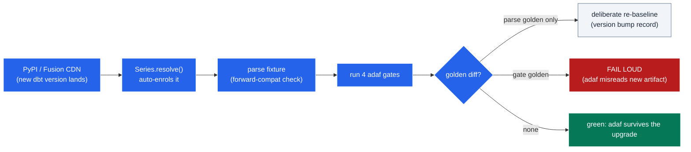

# Multiversion & Forward-Compatibility Testing

`adaf` reads dbt's parse artifacts (`manifest.json` chief among them, plus run results and catalogue)
and projects them into four quality gates:

- `list`: the models in a data product
- `docscov`: documentation coverage
- `testcov`: test coverage
- `sdag check`: boundary annotations and rule violations

Those artifacts are dbt's contract with `adaf`, and **that contract moves**:

- **1.11**: the lenient classic Python parser
- **1.12**: the strict Rust v2 parser (`--use-v2-parser`)
- **2.0**: the dbt-core 2.0 engine
- **Fusion**: the parquet artifact set

Every engine reads the *same* project differently. So the one question that matters is: **does `adaf`
still produce the right answer when a new engine parses the project?**

The **multiversion suite** is the regression net for that movement. One question per dbt version: if a
new parser drops, renames, or *rejects* a field `adaf` reads, a golden diverges and the run fails
loudly. **Escalators, not stairs**: never a silent skip.

This guide explains the idea and walks one version through it. The exhaustive maintainer reference is
[`tests/multiversion/README.md`](../../tests/multiversion/README.md). Read that to *change* the suite;
read this to *understand* it.

----

## Two different things, one suite

You are testing two distinct properties that happen to share one harness. Do not conflate them.

| Term | What it tests | The signal |
|---|---|---|
| **Multiversion testing** | `adaf`'s gates produce correct output across a *matrix* of dbt engines. | A **gate** golden differs → `adaf` misreads a new artifact shape. |
| **Forward-compatibility testing** | The *fixture project itself* parses clean on every engine, including the strictest future parser. | A **parse** golden shows a non-zero exit → the project uses a construct a new dbt version rejects. |

The two are entangled by design: the fixture is **migrated to be forward-compatible** (it parses on
the newest engine), so every engine reaches the gates with a valid manifest. That is what lets you
read any remaining gate diff as a *real `adaf`* regression, never fixture noise.

----

## How the matrix works

Each row of the matrix is a `Series`, a dbt-core **version line**, NOT a fixed pin. At test time the
line resolves its concrete patch *from PyPI*, so a new prerelease (or the GA that supersedes it)
auto-enrols with no edit to the suite.

```python
# tests/multiversion/test_multiversion.py: the matrix
SERIES = [
    Series(id="dbt-1.11", specifier=">=1.11,<1.12",     spec_profile="legacy"),  # classic Python parser
    Series(id="dbt-1.12", specifier=">=1.12.0a0,<1.13", spec_profile="inline"),  # --use-v2-parser (Rust v2)
    Series(id="dbt-2.0",  specifier=">=2.0.0a0,<3",     spec_profile="inline"),  # 2.0 engine, still v12 JSON
    Series(id="dbt-fusion", specifier="",               spec_profile="inline"),  # Fusion (CDN), parquet artifacts
]
```

| Line id | Engine / source | Manifest read | Resolves to today |
|---|---|---|---|
| `dbt-1.11` | `dbt-core` (PyPI), classic parser | JSON `manifest.json` | `dbt-core==1.11.11` |
| `dbt-1.12` | `dbt-core` (PyPI), `--use-v2-parser` | JSON `manifest.json` | `dbt-core==1.12.0b3` |
| `dbt-2.0` | `dbt-core` 2.0 (PyPI) | JSON `manifest.json` | `dbt-core==2.0.0a2` |
| `dbt-fusion` | **Fusion** Rust engine (CDN), `--write-index` | **parquet** (`metadata/parse/*.parquet`) | `dbt-fusion==2.0.0-preview.190` |

> **NOTE: discovery is loud, never silent.** Versions come from `pypi.org/pypi/dbt-core/json`, fetched
> inside the test body. If PyPI is unreachable, or nothing matches a line's specifier, the suite
> **raises**. There is no fallback to a stale pin. A silent fallback would stop the matrix tracking new
> releases, which is the whole point.

Every row builds from **one** ARG-parametrised `docker/Dockerfile`: same image, different build args
(`DBT_CORE_SPEC`, `PARSE_FLAGS`, `ADAF_INSTALL_SPEC`, …). The in-container `harness.py` parses the
fixture, runs all six gates (the `list` / `docscov` / `testcov` / `sdag check` checks plus the
`state-modified-selector` and `ls-defer` selection snapshots), and emits one JSON document; the host
harness splits it into one golden per capability.

----

## The forward-compatibility story: two breaking changes pinned down

The Rust parser (1.12's `--use-v2-parser` and the 2.0 engine) is **schema-strict** where 1.11 was
lenient. Two real constructs broke the newer engines, and both are now **fixed in the fixture**, so the
matrix exercises the forward-compatible project a real upgrade produces. This is the heart of
forward-compatibility testing: *the suite proves the migrated shape parses everywhere.*

### 1. Source config keys MUST nest under `config:`

```yaml
# Loose keys: tolerated by 1.11, a hard UnusedConfigKey (dbt1060) ERROR on the Rust parser
sources:
  - name: raw
    tables:
      - name: orders
        loaded_at_field: _loaded_at
        freshness: { warn_after: { count: 24, period: hour } }

# Nested under config: parses on ALL engines, still lands freshness in the manifest (dbt-autofix does this)
sources:
  - name: raw
    tables:
      - name: orders
        config:
          loaded_at_field: _loaded_at
          freshness: { warn_after: { count: 24, period: hour } }
```

Loose, this is **parse exit 2** on 1.12 `--use-v2-parser` and **`dbt ls` exit 1** on 2.0. Nested, it
parses on all three. The classic 1.11 parser tolerated either form, which is exactly why a project can
ship the broken shape for years and only discover it on upgrade.

### 2. The semantic-layer spec is version-exclusive (no single YAML satisfies both)

- The legacy standalone `semantic_models:` resource is **dbt 1.6–1.11 only** (2.0 drops it, warning
  `dbt1157`).
- The inline `semantic_model:` block on a model is **1.12+/2.0 only** (1.11 silently ignores it).

There is **no** YAML that satisfies both 1.11 and 2.0. So the fixture carries **both forms as
per-profile variants**, and the harness overlays the one matching a line's `spec_profile`:

| File | Staged for `spec_profile` | Spec form |
|---|---|---|
| `_semantic_models__legacy.yml` | `legacy` (the `dbt-1.11` line) | standalone `semantic_models:` |
| `_marts__inline.yml` | `inline` (1.12, 2.0, fusion) | inline `semantic_model:` block |

Keying on the *profile*, not a version id, is what lets a line's pin float without renaming a fixture
file. Trade-off: the fixture carries two copies of the semantic-layer YAML. But it buys a single
fixture that parses on every engine, the only way to test 1.11 and 2.0 from one project tree.

----

## Reading a golden: the known-answer fixture

The fixture is a tiny duckdb project (`dbt parse` opens no connection) with one data product, the
`matrix_demo` selector. Its model mix is a **planted known answer**:

- `raw.orders`: source with freshness, no volume-anomaly test → satisfies **TM-AU-01**, violates **MD-07**
- `stg_orders`: documented + tested interior model → `inner`, no obligations
- `dim_customers`: fully governed outbound mart → **clean**
- `fct_orders`: contract + exposure but no semantic model / description / tests → violates **MD-12**

So every engine's goldens MUST encode the same answer: `list` → **3 models**, `docscov` **1/3**,
`testcov` **1/3**, `sdag check` → exactly **MD-12** (`fct_orders`) + **MD-07** (`raw.orders`).

Goldens are split **by capability** and keyed by the **stable line id**:

```
goldens/
├── parse/dbt-1.11.txt        # the ONLY version-bearing golden (version string + manifest kind + parse exit)
├── list/dbt-1.11.txt         # version-independent: re-passes untouched when the pin floats
├── docscov/dbt-1.11.txt
├── testcov/dbt-1.11.txt
└── sdag-check/dbt-1.11.txt
```

The `parse` golden is the **forward-compatibility receipt**: `parse exit: 0` is the proof the fixture
parses clean on that engine.

```text
# goldens/parse/dbt-1.11.txt: the only golden that carries the resolved version
# versions: dbt-core==1.11.11, dbt-duckdb==1.10.1
# manifest artifact: json
--- dbt parse exit: 0          ← forward-compat proof: the fixture parses clean on this engine
```

Because the four **gate** goldens are version-independent, a new patch with unchanged behaviour
**re-passes them automatically**. Only `parse/<line>.txt` carries the version string, so a
freshly-resolved prerelease/GA surfaces as a *single* `parse` mismatch: the deliberate record of which
version the line now tracks.

----

## Running it

You will want a running **Docker daemon**. The suite is deliberately **off `make ci`** (minutes + image
builds):

```bash
make -C .github/cli/adaf adaf-multiversion-ci          # build + run every line, assert vs goldens
make -C .github/cli/adaf adaf-multiversion-rebaseline  # same, but rewrite goldens (deliberate)
```

First run builds the images; later runs reuse Docker's layer cache. Per-line `result.json`, logs, and
the `docker cp`-ed parse artifacts land under `tmp/multiversion/<line-id>/` (project-local `tmp`, never
system `/tmp`).

> **NOTE: off `ci` is NOT requirement degradation.** `testcontainers` is a **hard dev dependency**,
> imported unconditionally. If it were missing the suite errors loudly, never skips. What keeps Docker
> off `ci` is a single honest lever: the suite is marked `multiversion` and pyproject's
> `addopts = "-m 'not multiversion'"` *deselects* it. `ci` collects the module, deselects the cases, and
> never touches Docker. Environment economy, not a silent skip.

### Re-baselining (deliberate, never automatic)

A golden changes only on a **deliberate** event: a version pin floating to a new release, *or* an
intended change to `adaf`'s gate output (`adaf` is installed from `src/` at build time, so a real code
change legitimately shifts these goldens).

1. Run `adaf-multiversion-ci`; read the failing diff (or inspect `tmp/multiversion/<line>/result.json`).
2. Confirm every changed line is **intended**: a dbt behaviour change or an intended `adaf` change, not
   a regression.
3. Re-baseline with `adaf-multiversion-rebaseline` and **commit the new golden in the same change**,
   explaining the diff in the message.

**Never** auto-overwrite a golden to turn a red run green. The diff *is* the finding.

----

## Why this matters

The flow below is the suite's whole logic: a new version auto-enrols, the fixture proves
forward-compatible, the gates run, and the *kind* of golden diff tells you whether to re-baseline or
panic.



- **Forward compatibility is proven, not assumed:** the fixture is migrated to parse on the strictest
  engine, and `parse exit: 0` on every line is the receipt.
- **`adaf`'s artifact reads are pinned against parser drift** across JSON *and* parquet manifests.
- **The matrix tracks new dbt releases automatically** and fails loudly when one breaks an assumption.
  **Escalators, not stairs.**
