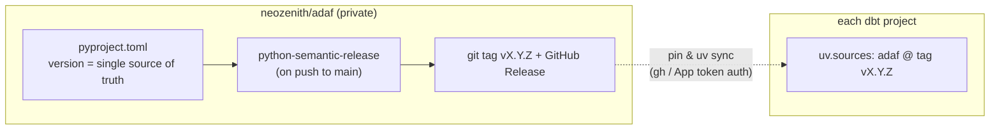

# Refactoring `adaf` into a private, reusable GitHub repo

Today `adaf` lives inside this dbt project at `.github/cli/adaf`. The goal is to lift it out into its
own private repo (`neozenith/adaf`) so **every** dbt project in the org installs the *same* pinned
version as a dependency, instead of each project carrying its own drifting copy.

Three moving parts make that work:

1. **Extraction** — the CLI becomes a standalone repo that builds a wheel.
2. **Consumption** — dbt projects add it as a `uv` git dependency; `gh` handles private-repo auth.
3. **Release** — `python-semantic-release` reads the version from `pyproject.toml` and cuts tagged
   releases automatically from your commit messages.

---

## 1. Extract the CLI into its own repo

The CLI is already self-contained: it has its own `pyproject.toml`, `src/adaf`, `tests/`, and a
`hatchling` build backend that produces a wheel (`adaf = "adaf.app:main"`). Extraction is mostly a
`git` move.

```bash
# From the org's GitHub, create the empty private repo first:
gh repo create neozenith/adaf --private --description "ADAF CLI — shared dbt assurance gates"

# Copy the CLI subtree into a fresh clone (history-preserving extraction is optional; see note).
gh repo clone neozenith/adaf tmp/adaf-repo
cp -R .github/cli/adaf/. tmp/adaf-repo/
git -C tmp/adaf-repo add -A && git -C tmp/adaf-repo commit -m "feat: initial extraction of adaf CLI"
git -C tmp/adaf-repo push origin main
```

> **History (optional).** To carry the file history across, use `git subtree split --prefix
> .github/cli/adaf -b adaf-extract` in this repo, then pull that branch into the new repo. A plain
> copy is simpler and usually fine for a tool — the old location stays in this repo's history.

After extraction the new repo's root looks exactly like today's `.github/cli/adaf/`:

```
adaf/                      # repo root
├── pyproject.toml         # name="adaf", version="0.2.0", [project.scripts] adaf = ...
├── src/adaf/
├── tests/
├── Makefile               # make fix / make ci unchanged
└── docs/
```

Nothing in `pyproject.toml` needs to change — `[build-system] hatchling` and
`[tool.hatch.build.targets.wheel] packages = ["src/adaf"]` already build a clean wheel from the repo
root.

---

## 2. Consume it from a dbt project (`uv` git dependency + `gh` auth)

### Why `gh` is the auth shortcut

A private git dependency needs credentials at install time. `uv` does not speak the GitHub API — it
shells out to plain `git`. So the trick is: **make `git` itself able to read the private repo, and
`uv` inherits it.** That is exactly what `gh` configures:

```bash
gh auth login                 # one-time interactive OAuth (browser or token)
gh auth setup-git             # writes a git credential helper that injects your gh token
```

`gh auth setup-git` adds a `credential.helper` entry pointing at `gh auth git-credential`. From then
on any `git clone https://github.com/jaffleshop/...` — including the clone `uv` runs under the hood —
authenticates silently with your `gh` session. No PATs to paste, no tokens in `pyproject.toml`.

### Declare the dependency

In the consuming dbt project's `pyproject.toml`, pin a **tag** (never a branch — branches move):

```toml
[dependency-groups]
dev = ["adaf"]

[tool.uv.sources]
adaf = { git = "https://github.com/neozenith/adaf.git", tag = "v0.2.0" }
```

Then the usual `uv sync` resolves and builds the wheel from the tag. The `adaf` console script lands
on the project's `.venv` PATH, so `uv run adaf sdag check ...` works identically to today.

> **Pin to a tag, bump deliberately.** `tag = "v0.2.0"` makes every project's `uv.lock` reproducible.
> Upgrading a project is a one-line PR (`v0.2.0` → `v0.3.0`) plus `uv lock`, which is the *point*:
> org-wide rollout becomes a visible, reviewable change rather than silent drift.

### The same auth in CI (GitHub Actions)

CI runners have no `gh` login. The default `GITHUB_TOKEN` also can't read a *different* private repo
in the org. Two clean options:

```yaml
# Option A — a GitHub App token (preferred: short-lived, scoped, no human PAT)
- uses: actions/create-github-app-token@v1
  id: app-token
  with:
    app-id: ${{ vars.ADAF_READER_APP_ID }}
    private-key: ${{ secrets.ADAF_READER_APP_KEY }}
    owner: jaffleshop
    repositories: adaf
- name: Let git read the private dep
  run: |
    git config --global url."https://x-access-token:${{ steps.app-token.outputs.token }}@github.com/".insteadOf "https://github.com/"
- run: uv sync   # now resolves adaf@v0.2.0 over HTTPS
```

```yaml
# Option B — a fine-grained PAT stored as an org/repo secret (simpler, but a long-lived credential)
- run: |
    git config --global url."https://x-access-token:${{ secrets.ADAF_READ_TOKEN }}@github.com/".insteadOf "https://github.com/"
- run: uv sync
```

Both use the same lever as `gh auth setup-git` locally: rewrite the HTTPS URL to carry a token, then
let `git`/`uv` do the rest.

---

## 3. Automated tagged releases from commit messages

The version source of truth is `pyproject.toml:project.version`. We want a push to `main` to:
parse the commits since the last tag, decide the bump (Conventional Commits), write the new version
back into `pyproject.toml`, create the `vX.Y.Z` git tag, and publish a GitHub Release.

`semantic-release` (the JS tool you linked) does this for Node packages. For a Python project the
direct equivalent is **[`python-semantic-release`](https://python-semantic-release.readthedocs.io/)** —
same Conventional-Commits engine, but it natively reads and writes the version *in `pyproject.toml`*,
which is exactly our requirement.

### Commit → bump mapping (Conventional Commits)

| Commit prefix | Example | Release |
|---|---|---|
| `fix:` | `fix: correct state:modified intersection` | **patch** `0.2.0 → 0.2.1` |
| `feat:` | `feat: add sdag archive command` | **minor** `0.2.0 → 0.3.0` |
| `feat!:` or `BREAKING CHANGE:` footer | `feat!: drop python 3.11 support` | **major** `0.2.0 → 1.0.0` |
| `docs:`, `chore:`, `refactor:`, `test:` | `chore: bump ruff` | **none** |

This is why the repo's existing commit style (`fix:`, `docs:`, `chore:` — see this project's recent
log) already pays off: it becomes the release trigger for free.

### Config in `pyproject.toml`

```toml
[tool.semantic_release]
version_toml = ["pyproject.toml:project.version"]   # the single source of truth
build_command = "pip install uv && uv build"        # produce the wheel for the release assets
commit_message = "chore(release): {version}\n\nClaude-Session: skip"

[tool.semantic_release.branches.main]
match = "main"
```

### Release workflow (`.github/workflows/release.yml` in the `adaf` repo)

```yaml
name: release
on:
  push:
    branches: [main]

permissions:
  contents: write        # required to push the tag + create the Release
  id-token: write

jobs:
  release:
    runs-on: ubuntu-latest
    concurrency: release    # never two releases at once
    steps:
      - uses: actions/checkout@v4
        with: { fetch-depth: 0 }   # semantic-release needs full history to find the last tag
      - uses: python-semantic-release/python-semantic-release@v9
        with:
          github_token: ${{ secrets.GITHUB_TOKEN }}
```

On merge to `main`: if the commits since the last tag contain a `feat:`/`fix:`/breaking change, it
bumps `pyproject.toml`, commits `chore(release): vX.Y.Z`, tags `vX.Y.Z`, and publishes the Release.
If they're all `chore:`/`docs:`, it no-ops. **Consuming projects then bump their pin to the new tag.**

> **JS `semantic-release` instead?** If you'd rather standardise on the Node tool org-wide, it works
> via [`@semantic-release/exec`](https://github.com/semantic-release/exec): a `prepare` step shells
> out to a script that writes the version into `pyproject.toml`. It's more moving parts for a Python
> repo than `python-semantic-release`, so prefer the latter unless you already run the JS tool elsewhere.

---

## The end state



- **One tool, one version line**, consumed by N dbt projects.
- **`gh` (local) or an App token (CI)** is the only auth setup, because `uv` defers to `git`.
- **Commit messages drive releases**, so cutting a version is merging a PR — not a manual ritual.

Next: once `neozenith/adaf` exists and tags, open a PR in each dbt project replacing the vendored
`.github/cli/adaf` tree with the `uv.sources` pin.
