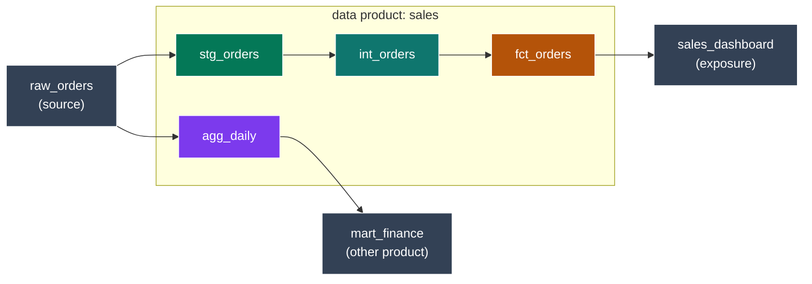
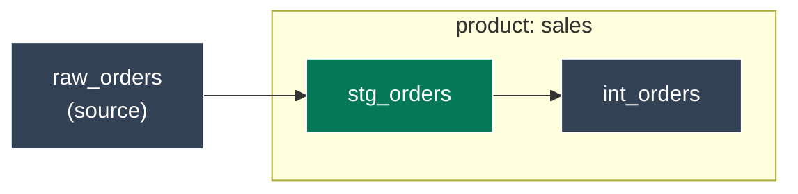
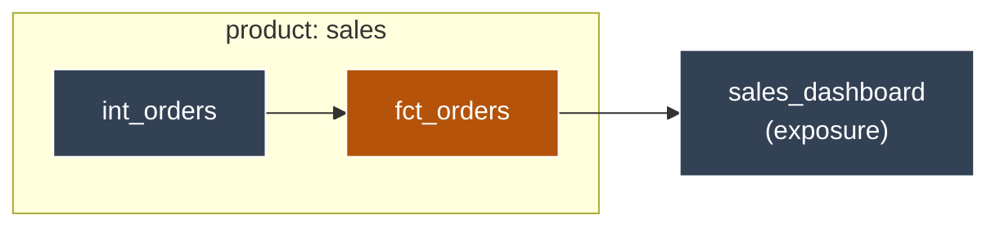
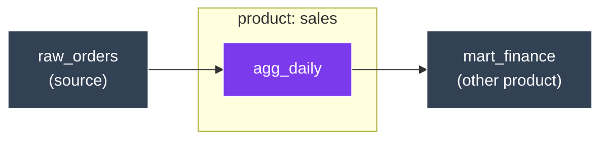
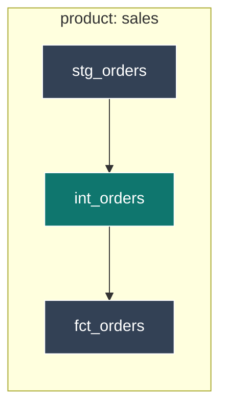

# sdag check — how a model gets its boundary label

`adaf sdag check` (and the sdag visualiser) ask one question about every **model** in a data product:
**where does it sit on the product's edge?** Each model is labelled one of four ways:

- **Inbound** — an entry point: data comes INTO the product here.
- **Outbound** — an exit point: data leaves the product here.
- **Both** — an entry AND an exit.
- **Inner** — fully interior: it neither enters nor leaves.

This guide walks through a worked example so each label is concrete. Read it top to bottom.

Two ground rules first:

- **Only models are labelled.** Sources, exposures, seeds, snapshots and tests are never given a label. Sources and exposures still matter — they are the *edges* that cross the product boundary — but they are not boundary nodes themselves.
- **"Outside the product" means outside the product's MODELS.** A model's parent or child counts as *external* when it is a source, an exposure, or a model that belongs to a different product.

----

## The example product

A data product called **`sales`** holds four models. Around it: a `raw_orders` **source** (upstream),
a `sales_dashboard` **exposure** and a `mart_finance` model in **another product** (both downstream).

*Each model is coloured by its label: `stg_orders` inbound (green), `int_orders` inner (teal),
`fct_orders` outbound (amber), `agg_daily` both (purple). The grey nodes are outside the product.*

----

## Inbound — an entry point

A model is **inbound** when it reads something OUTSIDE the product (a source, or a model in another
product), **or** when nothing inside the product feeds it (it sits at the top of the product's lineage).

*`stg_orders` reads `raw_orders`, which is outside the product — so it is the door data enters
through. The source is the inbound EDGE; `stg_orders` is the inbound node.*

----

## Outbound — an exit point

A model is **outbound** when something OUTSIDE the product reads it (an exposure, or a model in another
product), **or** when nothing inside the product consumes it (it sits at the bottom of the lineage).

*`fct_orders` feeds `sales_dashboard`, an exposure outside the product — so it is the door data leaves
through. The exposure is the outbound EDGE; `fct_orders` is the outbound node.*

----

## Both — an entry AND an exit

A model is **both** when it is inbound *and* outbound at once: it reads from outside the product AND is
read from outside the product.

*`agg_daily` reads the external `raw_orders` (inbound) AND feeds the external `mart_finance` in another
product (outbound). Crossing the boundary on both sides makes it `both`.*

----

## Inner — fully interior

A model is **inner** when every model it reads and every model it feeds is inside the SAME product. No
edge crosses the boundary, so it carries no boundary obligations.

*`int_orders` reads `stg_orders` and feeds `fct_orders`, both in the same product. Nothing crosses the
boundary — so it is interior.*

----

## The attribution — WHY each label was given

The label alone doesn't say *why*. So the selector cache records an **attribution** for every model: a
list of the specific reasons behind its label, to make the boundary algorithm debuggable. Each reason
names the exact crossing node. For the example product:

| Model | Label | Attribution (the reasons) |
|---|---|---|
| `stg_orders` | inbound | `external_parent` reads `raw_orders` (outside); `topological_root` (no in-product model feeds it) |
| `fct_orders` | outbound | `external_child` feeds `sales_dashboard` (outside) |
| `agg_daily` | both | `external_parent` reads `raw_orders`; `external_child` feeds `mart_finance` |
| `int_orders` | inner | `interior` (all refs are in-product) |

Each reason carries an **`axis`** (inbound / outbound / inner), a **`code`** (`external_parent`,
`topological_root`, `external_child`, `topological_leaf`, or `interior`), the **`nodes`** that crossed
(the specific source / exposure / external-model unique_ids), and a plain **`message`**. So when a
model is labelled in a way that surprises you, the attribution tells you exactly which edge caused it —
no need to re-trace the lineage by hand.

----

## What each label owes

The label decides which system-boundary obligations `sdag check` enforces on the model. Inner models
owe nothing; the boundary models owe the contracts that govern data crossing the edge:

| Label | Obligations checked |
|---|---|
| **Inbound** | the source it reads is monitored — freshness + a volume-anomaly test |
| **Outbound** | an enforced contract, a documented exposure, and a semantic model |
| **Both** | the inbound AND outbound obligations together |
| **Inner** | none — it is interior to the product |
