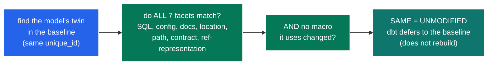
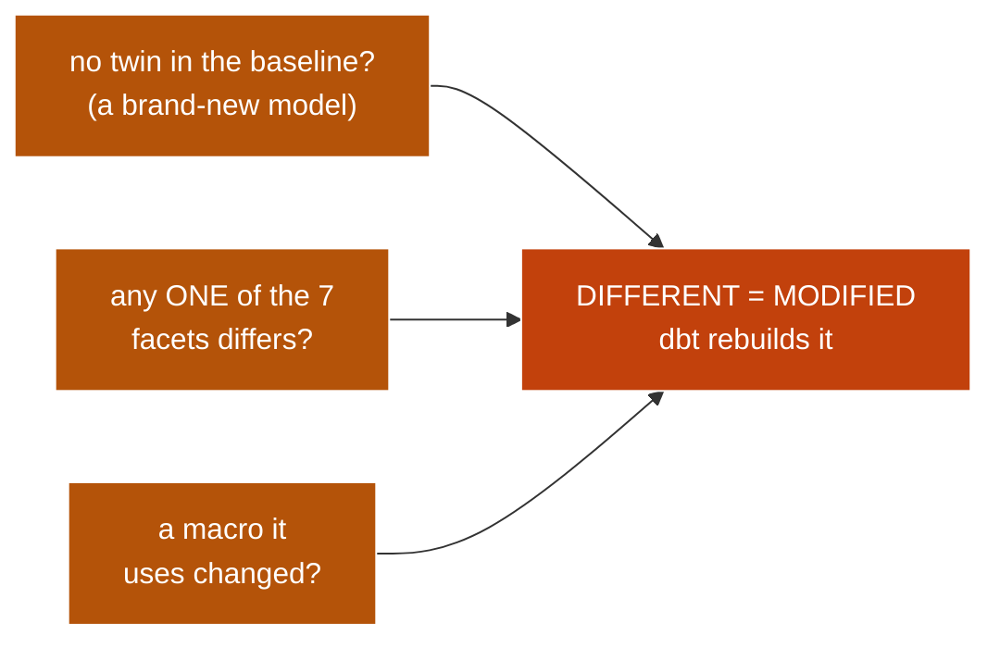

# How dbt decides a model "changed" — the 7 facets

When you run `state:modified` (or `adaf`'s offline calculator), dbt compares every model to a baseline
and sorts it into one of two buckets:

- **SAME** (unmodified) — dbt skips it and *defers* to the baseline (reuses the existing table).
- **DIFFERENT** (modified) — dbt rebuilds it.

It decides by pairing the model with its baseline **twin** and comparing **7 facets** (plus the macros
it uses). This guide shows exactly what tips a model into each bucket. Read it top to bottom.

----

## When a model is the SAME (unmodified)

dbt first finds the model's **twin** in the baseline — matched by `unique_id` (same resource id, not by
reading the SQL). Then it checks the 7 facets. A model is **SAME** only when **every** facet matches
**and** no macro it uses changed. A SAME model is *deferred*: dbt reuses the baseline's table instead of
rebuilding.

*The "nothing to do" path: all seven facets match AND no macro moved. dbt points downstream refs at the
baseline relation and skips the rebuild.*

----

## When a model is DIFFERENT (modified)

It only takes **one** difference. A model is **DIFFERENT** if it has **no twin** in the baseline (a
brand-new model), **or** any single one of the 7 facets differs, **or** a macro it depends on changed.
These are an **OR** — you do not need all seven to differ, just one — and any of them rebuilds the model.

*Any one trigger is enough. New, one changed facet, or a changed macro — each on its own makes the
model DIFFERENT.*

----

## The 7 facets, in plain English

| # | Facet | Plain meaning | Example that flips it to "modified" |
|---|---|---|---|
| 1 | **SQL** (`same_body`) | The model's SQL text. (For a **seed**, the CSV file's checksum instead.) | You edit the `SELECT`. |
| 2 | **Config** (`same_config`) | The model's *authored* settings — `materialized`, custom configs, etc. (compared **before** templating). | You change `materialized='view'` to `'table'`. |
| 3 | **Docs** (`same_persisted_description`) | The model + column descriptions — but **only if** you persist docs to the warehouse (`persist_docs`). | You reword a column `description` and `persist_docs` is on. |
| 4 | **Location** (`same_database_representation`) | Where the table lands: its `database` / `schema` / `alias`. | You set a custom `alias` or move it to another schema. |
| 5 | **Path** (`same_fqn`) | The model's fully-qualified name — its folder path + name. | You move or rename the `.sql` file. |
| 6 | **Contract** (`same_contract`) | An *enforced* contract's columns/types (its checksum), or turning enforcement on/off. | You add a column to an enforced `contract`. |
| 7 | **Ref representation** (`same_ref_representation`) | How downstream `ref()`s resolve this model: its `latest_version`, `access` level, and `deprecation_date`. | You publish a new model version, flip `access` from `protected` to `public`, or set a `deprecation_date`. |

**Plus the macro rule:** if any macro the model depends on (directly *or* through another macro)
changed its SQL, the model is modified — even if all 7 facets match. A shared macro edit ripples to
every model that uses it.

----

## Why these and not others

- **Config is compared *unrendered*** (facet 2) — the YAML you wrote, before `{{ var }}` / `{{ env_var }}` / target values are filled in. So switching dev → prod, on its own, does NOT make everything "modified". Only authored changes count.
- **It does NOT compare the compiled SQL** — only the `raw_code` template (facet 1). A change that's only visible after compilation won't be caught here (the macro rule covers shared-macro changes).
- **It does NOT look downstream.** "This model changed" is decided one model at a time. Pulling in everything that depends on a changed model is a separate step (the `+` operator), not part of this comparison.

----

## A 30-second worked example

You edit `models/marts/fct_orders.sql` (change the SQL) and rename
`models/staging/stg_orders.sql` to `models/staging/orders.sql`. Comparing to last night's baseline:

- `fct_orders` → facet 1 (**SQL**) differs → **modified**.
- `orders` (was `stg_orders`) → facet 5 (**Path**) differs → **modified**.
- `dim_customers` → all 7 match, no macro changed → **unmodified** (it will *defer* to the baseline).

That verdict — the set of modified models — is what `adaf`'s `--state-modified` scope and `ls --defer`
are built on.
