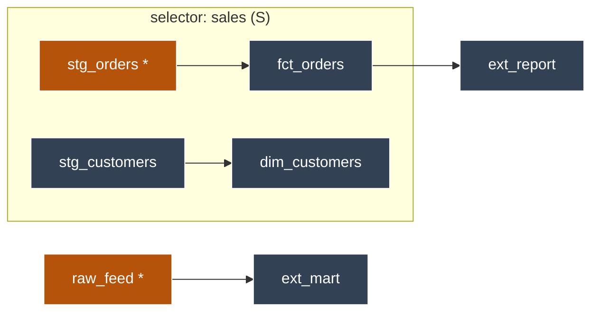
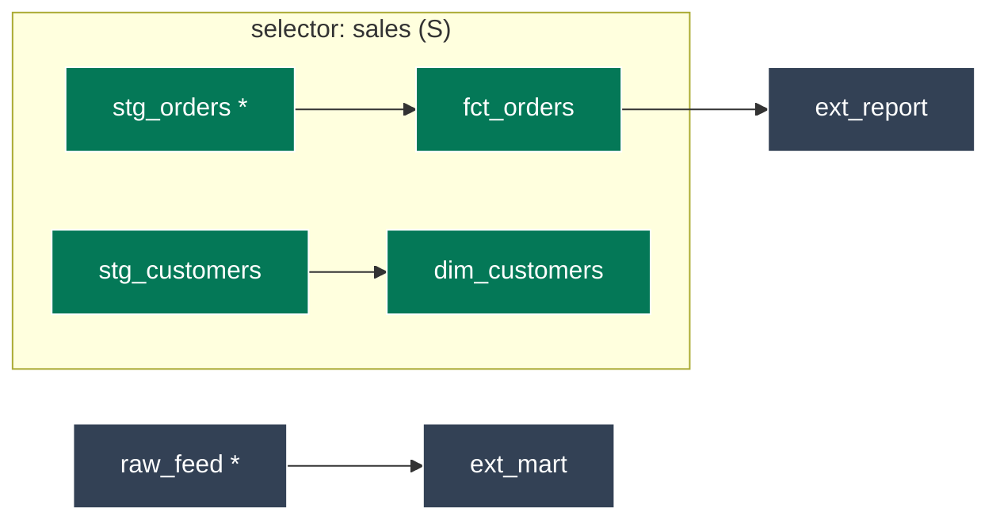
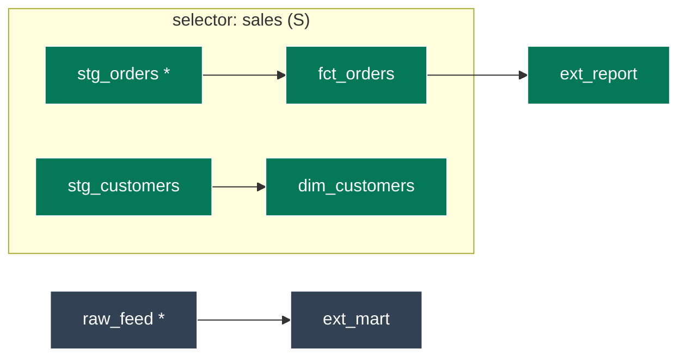
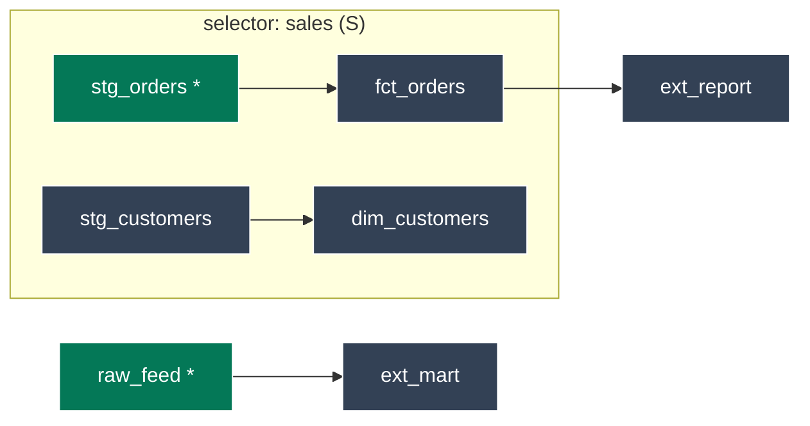
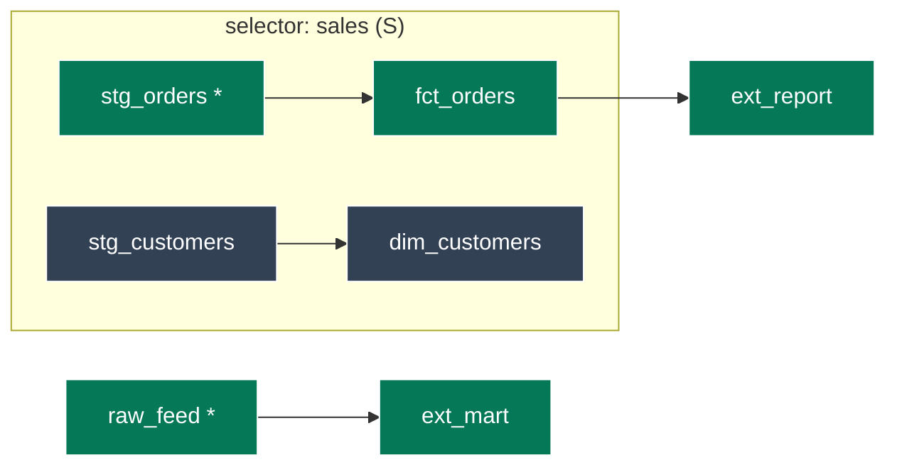
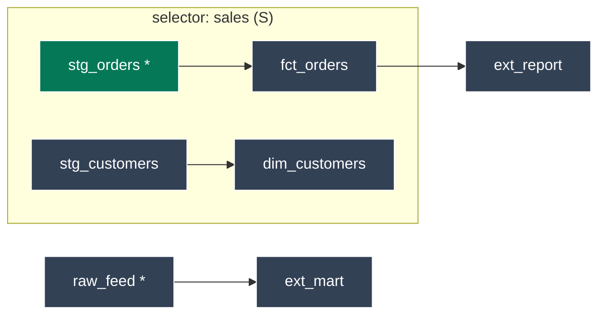
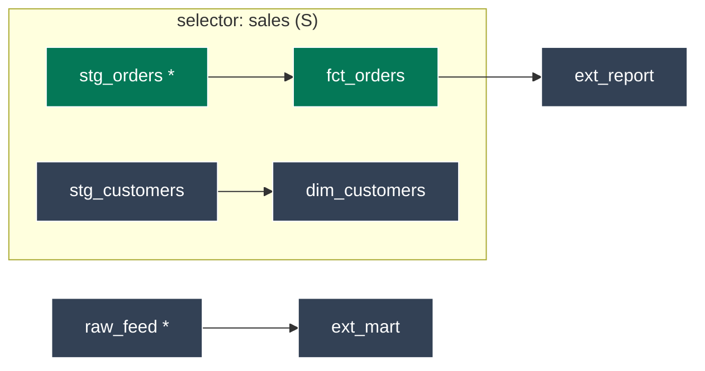
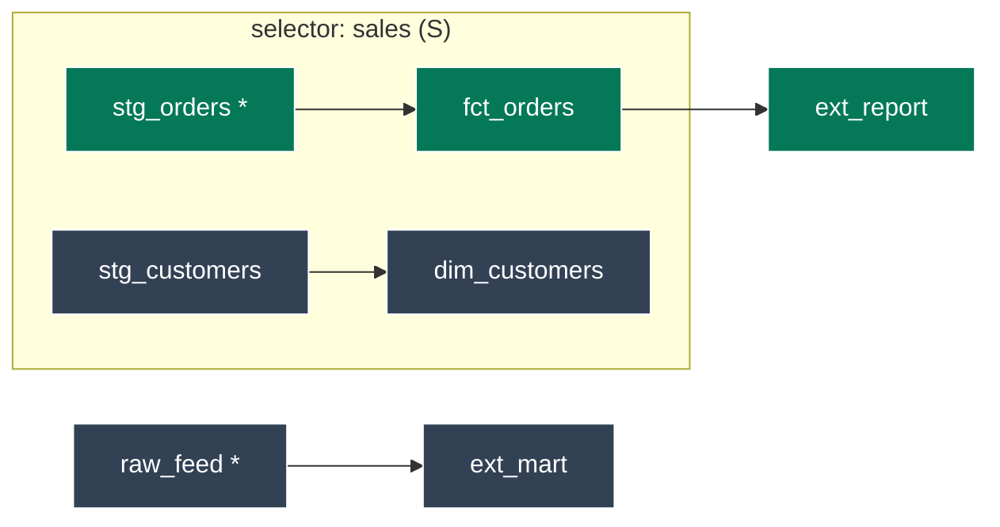
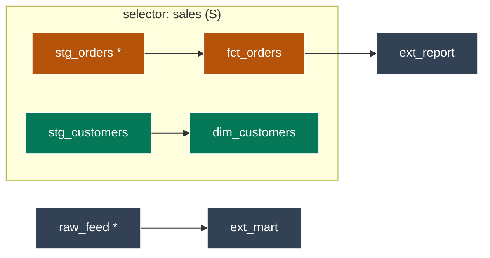

# `adaf ls` — a step-by-step guide

This guide walks every `adaf ls` flag permutation against ONE worked example DAG, so each "expected
output" is concrete. The diagrams colour-code the sets the scope flags resolve.

----

## The worked example

A product (the named selector **`sales`**) plus some models outside it. `*` marks a model that
**changed** vs the baseline (`state:modified`).



*The box is the product `S`. Amber nodes changed (`stg_orders` inside, `raw_feed` outside). `fct_orders`
is downstream of a change; `ext_report` is an out-of-product consumer of `fct_orders`.*

The six sets the flags resolve, on this DAG:

| Set | Meaning | Members |
|---|---|---|
| **S** | the selector's models | `stg_orders, stg_customers, fct_orders, dim_customers` |
| **S+** | S + all descendants (regardless of change) | `stg_orders, stg_customers, fct_orders, dim_customers, ext_report` |
| **M** | `state:modified` (changed, whole project) | `stg_orders, raw_feed` |
| **M+** | M + all descendants | `stg_orders, fct_orders, ext_report, raw_feed, ext_mart` |
| **S ∩ M** | changed-in-product | `stg_orders` |
| **(S ∩ M+)** | in-product, changed-or-downstream-of-change | `stg_orders, fct_orders` |
| **(S ∩ M+)+** | the above + ALL descendants (crosses the boundary) | `stg_orders, fct_orders, ext_report` |

----

## The six sets, colour-coded

Green = in the set. Slate = not in the set. The `S` box is drawn in every panel, so a **green node
outside the box** is a model the set reaches *beyond the product*.

### S — the selector



*Every model in the product — `adaf ls --all --selector sales`.*

### S+ — the selector plus all descendants



*The whole product plus everything downstream of it — `ext_report` joins (child of `fct_orders`),
crossing the boundary regardless of what changed. `adaf ls --all --selector sales --downstream`. Note
this differs from `(S ∩ M+)+`: S+ follows the WHOLE product downstream; `(S ∩ M+)+` follows only the
CHANGED part downstream.*

### M — state:modified (whole project)



*Just the changed models — note `raw_feed` is OUTSIDE the product (so M is not a subset of S).*

### M+ — state:modified plus descendants



*Each change plus everything downstream of it — spans both the product and outside it.*

### S ∩ M — changed-in-product (`--state-modified`)



*Only the changes that are also in the product — `raw_feed` drops out (not in S).*

### (S ∩ M+) — changed-or-downstream, in-product (`--state-modified-plus`)



*`fct_orders` joins (it is downstream of `stg_orders`); everything green is still INSIDE the box — the
canonical deferred-build seed.*

### (S ∩ M+)+ — then all descendants (`--state-modified-plus-plus`)



*`ext_report` is now green but sits OUTSIDE the box — this is the one mode that crosses the product
boundary to rebuild out-of-product consumers of a change.*

----

## `adaf ls` — step by step

`adaf ls` lists the model `.sql` files in scope (and `--flags` emits a `dbt build` selection instead).
Every command takes `--selector sales`; the scope flags are mutually exclusive.

| `adaf ls` flags | Scope | Models listed (this DAG) |
|---|---|---|
| `--all` | S | `stg_orders, stg_customers, fct_orders, dim_customers` |
| `--changed-only` (default) | git-changed ∩ S | the git diff ∩ S (here `stg_orders`) |
| `--state-modified` | S ∩ M | `stg_orders` |
| `--state-modified-plus` | (S ∩ M+) | `stg_orders, fct_orders` |
| `--state-modified-plus-plus` | (S ∩ M+)+ | `stg_orders, fct_orders, ext_report` |
| `--all --downstream 1` | S + 1 descendant hop | S + `ext_report` (child of `fct_orders`) |
| `--all --downstream` (bare) | S+ (all descendants) | `stg_orders, stg_customers, fct_orders, dim_customers, ext_report` |
| `--all --upstream 1` | S + 1 ancestor hop | S + any parents/sources |

Two distinctions worth internalising:

- **`--changed-only` is a git diff; `--state-modified` is a manifest comparison.** Git sees file edits; `state:modified` also catches a changed macro, an edited `config`, or a contract break, and ignores benign whitespace. They often agree, but only `--state-modified` is the faithful dbt notion.
- **`--state-modified-plus-plus` crosses the product boundary; `--downstream` crosses it from a *different* seed.** `plus-plus` expands descendants of `(S ∩ M+)`; `--downstream N` expands descendants of the base scope by N hops. Use `plus-plus` for "rebuild everything affected by an in-product change".

### `adaf ls --flags` — the emitted `dbt build` selection

| `adaf ls --flags` flags | dbt 1.12 (native) | dbt ≤1.11 / Fusion / Cloud CLI (backport) |
|---|---|---|
| `--state-modified-plus` | `--select selector:sales,state:modified+ --state <dir> --defer` | `--select stg_orders.sql fct_orders.sql --state <dir> --defer` |
| `--state-modified-plus-plus` | `--select stg_orders.sql+ fct_orders.sql+ --state <dir> --defer` (always paths) | identical |

The 1.12 native form uses the `selector:` method (probed, not version-guessed — see below). `plus-plus`
is never native: a `+` operator can only attach to a single selector, never to the *result* of an
intersection, so `(S ∩ M+)+` can't be one expression — adaf always emits `<path>+` atoms instead.

### `adaf ls --defer` — built / deferred subgroups

Add `--defer` and `adaf ls` keeps its existing groups (`selector models`, and any `--upstream` /
`--downstream`) but splits EACH one into two sub-sections under their own `-- … --` headers:

- **built** — the models in scope that are in `M+` (`state:modified+` vs `--defer-ref`). A deferred
  `dbt build` would rebuild these. This is the SAME set `--flags` seeds the build with, so the listing
  and the build can never disagree.
- **deferred** — everything else in scope. Its refs resolve to the baseline relations; dbt does not
  rebuild them.

On the worked DAG, `adaf ls --all --selector sales --defer` splits `S` by `M+`:



*Amber = built (in `M+`), green = deferred, slate = outside this scope.* The listing reads:

```text
== selector models (4) ==
  -- built (2) --
models/staging/stg_orders.sql
models/marts/fct_orders.sql
  -- deferred (2) --
models/staging/stg_customers.sql
models/marts/dim_customers.sql
```

The `-- … --` sub-headers go to STDERR (like the `== … ==` group titles), so STDOUT stays a clean,
pipeable path stream — built paths first, then deferred. `--bare` drops every header (groups and
subgroups alike) for a flat list. Without `--defer`, the groups render unsplit, exactly as before.

----

## Two engine gotchas

**The dbt Cloud CLI can't `--defer`.** Its `ls` has no `--state` flag (only `--no-defer` + Cloud-managed
state), so `--flags --defer` and `ls --defer` error against it. The defer machinery needs a **dbt-core**
binary on `PATH`; the version-matrix harness corroborates it under real dbt-core engines.

**`--flags` is engine-aware via a probe, not the version.** The matrix proved the `selector:` method
does NOT track the version: dbt-core 1.12 has it, but the 2.0 alpha and Fusion do not. So adaf runs a
one-off `dbt ls --select selector:NAME` probe (cached) and emits native only when it resolves; otherwise
the resolved-paths backport (which runs everywhere).

**`--state <dir>`** supplies a prebuilt baseline so `--state-modified` skips the git-worktree parse:

```sh
STATE=$(adaf defer-state --defer-ref main --target dev)   # build/cache the baseline once
adaf ls --selector sales --state-modified-plus --state "$STATE" --flags
```
