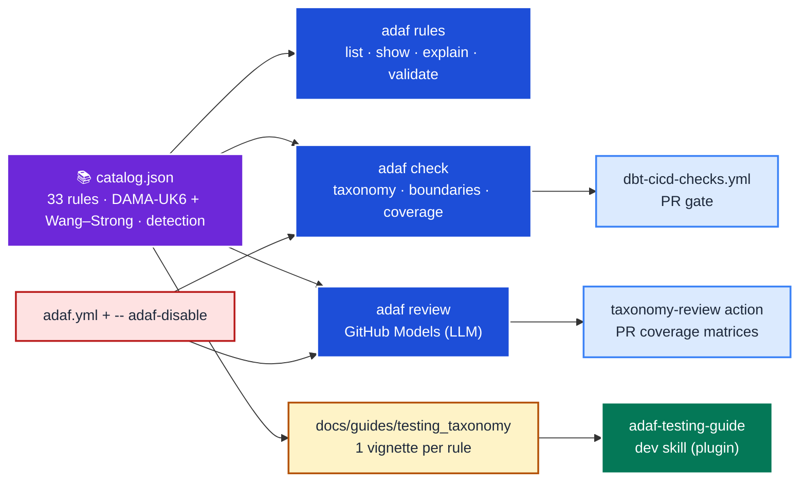

# ADAF — the Automated Data Assurance Framework

ADAF is the single home for this project's **dbt testing taxonomy**: the catalogue of data-quality
tests a model *should* carry, and the tooling that finds, judges, and helps close the gaps. One CLI
(`adaf`), one rule catalogue (the single source of truth), three surfaces (local CLI, CI, an agent
skill). See [ADR-0005](../arch/adr-0005-adaf-automated-data-assurance-framework.md) for *why*.

<!--TOC-->

- [ADAF — the Automated Data Assurance Framework](#adaf--the-automated-data-assurance-framework)
  - [The one idea: one catalogue, everything derived](#the-one-idea-one-catalogue-everything-derived)
  - [The three surfaces](#the-three-surfaces)
  - [Deterministic vs. LLM](#deterministic-vs-llm)
  - [Data-quality attribution](#data-quality-attribution)
  - [Managing false positives (suppression)](#managing-false-positives-suppression)
  - [The intentionally-broken fixture](#the-intentionally-broken-fixture)
  - [Where things live](#where-things-live)

<!--TOC-->

## The one idea: one catalogue, everything derived

`.github/cli/adaf/src/adaf/rules/catalog.json` defines all **33 rules** once. Every consumer derives
from it, so nothing can drift:



The catalogue's [`catalog.schema.json`](../../.github/cli/adaf/src/adaf/rules/catalog.schema.json)
validates it (`adaf rules validate`); the LLM reviewer injects the rule-code enum from it at call
time, so the model's allowed outputs can't drift; the deterministic detectors are bound to it by a
test (every `deterministic`-tagged rule must have a detector).

## The three surfaces

| Surface | How | What |
|---------|-----|------|
| **Local CLI** | `uv run --directory dbt-jaffleshop adaf …` | `rules` (inspect the catalogue), `check` (deterministic gates), `review` (LLM), `products` (lineage/boundaries + viewer) |
| **CI** | [`dbt-cicd-checks.yml`](../../.github/workflows/dbt-cicd-checks.yml) runs `adaf check all`; the [`testing-taxonomy-review`](../../.github/workflows/testing-taxonomy-review.yml) workflow runs `adaf review --post` | A sticky PR comment with the check summary, plus two coverage-matrix comments |
| **Agent skill** | `/adaf:adaf-testing-guide` (the [plugin](../../plugins/adaf/)) | A developer is guided to the right testing-taxonomy vignette for a scope of models — which tests to apply, why (DAMA dimension + cost class), which package — with the implementation grounded in current practice via web search. Reference-driven; does not invoke the CLI |

## Deterministic vs. LLM

Each rule's `detection` field routes it to the cheaper checker that can decide it:

- **`deterministic`** (MD-01 grain, TM-AU-01 freshness) → `adaf check taxonomy` gates it as a hard
  **blocker** (no LLM, no warehouse — just `manifest.json`).
- **`hybrid`** (MD-02 contracts, EN-01/EN-03 keys, …) → the detector flags a likely gap as an
  advisory **warning**; the LLM `review` judges whether it truly applies.
- **`llm`** (intent/anomaly rules) → only `adaf review` evaluates it.

`adaf rules list --detection deterministic` shows the gated set.

## Data-quality attribution

Every rule carries **two** dimensions (see the
[taxonomy README](testing_taxonomy/README.md#data-quality-dimensions-dama-uk6-primary--wangstrong-secondary)):
the **DAMA-UK6** primary (the operational lens you gate on) and the genuine **Wang & Strong (1996)**
secondary (the consumer-perception lens), via a documented crosswalk. `adaf rules show <CODE>`.

## Managing false positives (suppression)

The `hybrid` detectors are heuristics, so ADAF behaves like a linter — disable a rule per file or per
glob, always with a reason:

```sql
-- adaf-disable: MD-01 (synthetic spine — no natural grain to test)
```
```yaml
# adaf.yml
disable:
  - rules: [MD-02]
    paths: ["models/marts/metricflow_time_spine.sql"]
    reason: "generated spine — a contract adds no value"
```

`adaf rules explain <CODE>` prints the exact syntax. Suppressed findings never fail the gate but stay
auditable (counted; listed with `--show-passes`). Both the deterministic checks and the LLM review
honour them.

## The intentionally-broken fixture

The `dbt-jaffleshop` models keep deliberate gaps (`products`/`supplies`/`locations` without grain
tests, sources without freshness, no contracts, no exposures) so the checks, the review action, and
the agent skill always have something to catch. **Keep them broken.** The
[deepeval harness](../../.github/cli/adaf/evals/) encodes them as goldens; any "fix" applied while
demonstrating the skill must be git-reversible.

## Where things live

| Thing | Path |
|-------|------|
| The CLI + catalogue + tests | [`.github/cli/adaf/`](../../.github/cli/adaf/) |
| Rule vignettes (1 per rule) | [`docs/guides/testing_taxonomy/`](testing_taxonomy/) |
| The dev-skill plugin + marketplace | [`plugins/adaf/`](../../plugins/adaf/) · [`.claude-plugin/marketplace.json`](../../.claude-plugin/marketplace.json) |
| CI workflows | [`dbt-cicd-checks.yml`](../../.github/workflows/dbt-cicd-checks.yml) · [`testing-taxonomy-review.yml`](../../.github/workflows/testing-taxonomy-review.yml) |
| DeepEval evaluation | [`.github/cli/adaf/evals/`](../../.github/cli/adaf/evals/) |
| Maintainer rationale | [`.github/cli/adaf/CLAUDE.md`](../../.github/cli/adaf/CLAUDE.md) · [ADR-0005](../arch/adr-0005-adaf-automated-data-assurance-framework.md) |
