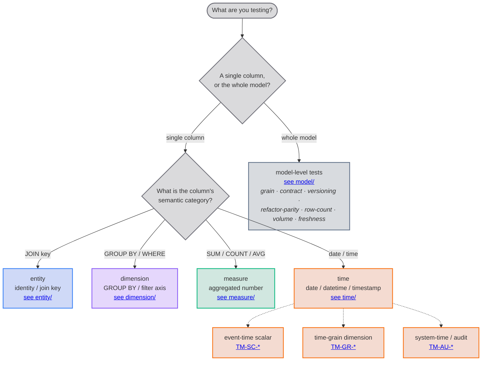
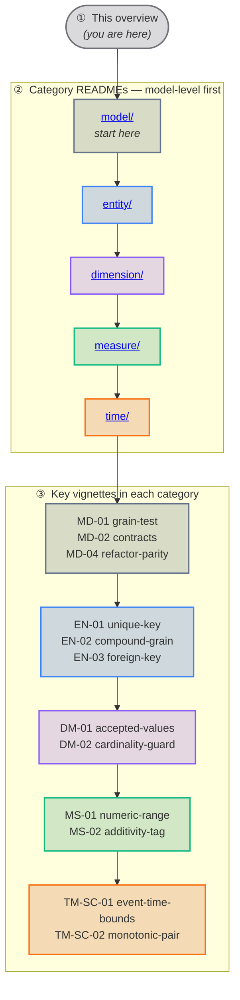

# Testing Taxonomy

Inspired by Martin Fowler's book [Refactoring](https://refactoring.com/), this guide breaks down the complex and expansive space of **data testing** into a catalog of *Vignette*'s.
Each with the same format:

- Symptoms
- Pattern
- Mechanics

Importantly the `Mechanics` sections are grounded in implementation specifics about:

- dbt native testing features:
    - [data tests](https://docs.getdbt.com/docs/build/data-tests)
    - [singular tests](https://docs.getdbt.com/docs/build/data-tests#singular-data-tests)
    - [generic tests](https://docs.getdbt.com/docs/build/data-tests#generic-data-tests)
    - [data unit tests](https://docs.getdbt.com/docs/build/unit-tests)
    - [model versioning](https://docs.getdbt.com/docs/collaborate/govern/model-versions)
    - [data contracts](https://docs.getdbt.com/docs/collaborate/govern/model-contracts)
- [`dbt-utils`](https://github.com/dbt-labs/dbt-utils)
- [`dbt-expectations`](https://github.com/metaplane/dbt-expectations)
- [`audit_helper`](https://github.com/dbt-labs/dbt-audit-helper)
- [`elementary`](https://docs.elementary-data.com/)

## Decision tree

Walk this tree for each thing you test. Ask heuristic 1 first — **whole model or one column?** — then, for a column, name its **semantic category** (heuristic 2).

A column can answer heuristic 2 **more than once** — `order_id` is both an entity (join key) and a `GROUP BY` axis — so take the **union** of the matching suites (see [§ Role multiplication](#role-multiplication)). The dotted branches under **time** are its three sub-roles: most time columns are event-time scalars; calendar/spine columns are time-grain dimensions; `loaded_at`-style columns are system-time / audit.

## Reading order

Read top-down in three tiers — orient before you dive in:

1. **This overview** (the root README) — you're reading it: the [two heuristics](#the-two-categorisation-heuristics), the [decision tree](#decision-tree), the [framework matrix](#framework-matrix).
2. **Each category's README, model-level first** — [`model/`](./model/README.md) → [`entity/`](./entity/README.md) → [`dimension/`](./dimension/README.md) → [`measure/`](./measure/README.md) → [`time/`](./time/README.md). Each frames the role before you read its rules.
3. **The key vignettes in each category** (model first):
    - **model** — [`MD-01-grain-test`](./model/MD-01-grain-test.md), [`MD-02-contracts`](./model/MD-02-contracts.md), [`MD-04-refactor-parity`](./model/MD-04-refactor-parity.md)
    - **entity** — [`EN-01-unique-key`](./entity/EN-01-unique-key.md) → [`EN-02-compound-grain`](./entity/EN-02-compound-grain.md) → [`EN-03-foreign-key-integrity`](./entity/EN-03-foreign-key-integrity.md)
    - **dimension** — [`DM-01-accepted-values`](./dimension/DM-01-accepted-values.md) → [`DM-02-cardinality-guard`](./dimension/DM-02-cardinality-guard.md)
    - **measure** — [`MS-01-numeric-range`](./measure/MS-01-numeric-range.md) → [`MS-02-additivity-tag`](./measure/MS-02-additivity-tag.md)
    - **time** — [`TM-SC-01-event-time-bounds`](./time/TM-SC-01-event-time-bounds.md) → [`TM-SC-02-monotonic-pair`](./time/TM-SC-02-monotonic-pair.md)

Once a project graduates to drift detection, the Elementary-backed anomaly vignettes (`DM-05`, `MS-05`, `TM-AU-03`, `MD-07`–`MD-10`) are the advanced follow-on.

## Vocabulary / glossary

The roles below are MetricFlow's names. Informal names plus the Kimball, MetricFlow, Data Vault, and Anchor equivalents are listed for cross-referencing.

| Canonical (this guide) | Informal | Kimball | MetricFlow | Data Vault | Anchor |
|------------------------|------------|---------|------------|------------|--------|
| **entity** | Identity | Surrogate key / FK / degenerate dim | `entity` (primary/foreign/natural) | Hub key / Link key | Anchor ID / Tie |
| **dimension** | Dimensional | Dimension attribute / junk dim | `dimension (categorical)` | Satellite attribute | Attribute / Knot |
| **measure** | Measure | Fact (additive/semi-additive/non-additive) | `measure` (sum/count/avg…) | Transactional satellite attribute | Attribute of event-anchor |
| **time** | Temporal | Date dimension + fact event timestamp | `dimension (time)` | `load_date`, `load_end_date` | `ChangedAt` |
| **time (sub: event-time scalar)** | Temporal — scalar | Fact event timestamp | Primary time dimension | n/a | n/a |
| **time (sub: time-grain dimension)** | Temporal — dimensional | Date dimension at chosen grain | Time dimension with `time_granularity` | n/a | n/a |
| **time (sub: system-time / audit)** | — | SCD2 `valid_from` / `valid_to` | Bitemporal load timestamp | `load_date` | `RecordedAt` |

## Role folders

| Folder | Role | Hue | What it covers |
|--------|------|-----|----------------|
| [`entity/`](./entity/README.md) | entity | Blue | JOIN keys: PKs, surrogate keys, FK integrity, compound grain, type stability, soft-delete scoping, hash-collision guards |
| [`dimension/`](./dimension/README.md) | dimension | Violet | GROUP BY axes: accepted values, cardinality bounds, mutual exclusivity, conformed dimensions, per-dim anomalies |
| [`measure/`](./measure/README.md) | measure | Emerald | Aggregated facts: numeric range, additivity tagging, currency pairing, distribution anomalies, NaN/Inf guards |
| [`time/`](./time/README.md) | time | Orange | Date/datetime columns: event-time bounds, monotonic pairs, freshness (fixed + learned-band anomalies), calendar spines, SCD2 quartet, timezone contracts |
| [`model/`](./model/README.md) | model-level | Slate | Cross-column concerns: grain test, contracts, versioning, refactor parity, unit tests, row-count band, volume anomaly, schema-change detection, automated column monitors, JSON-shape guards, exposure registration, semantic-model declaration |

## Vignette index

### entity/

- **EN-01** · [`EN-01-unique-key.md`](./entity/EN-01-unique-key.md) — single-column unique + not_null
- **EN-02** · [`EN-02-compound-grain.md`](./entity/EN-02-compound-grain.md) — `unique_combination_of_columns`
- **EN-03** · [`EN-03-foreign-key-integrity.md`](./entity/EN-03-foreign-key-integrity.md) — `relationships`
- **EN-04** · [`EN-04-soft-delete-scoped-fk.md`](./entity/EN-04-soft-delete-scoped-fk.md) — `relationships_where`
- **EN-06** · [`EN-06-type-stable-join.md`](./entity/EN-06-type-stable-join.md) — contract `data_type` matches across joined relations
- **EN-05** · [`EN-05-surrogate-collision-guard.md`](./entity/EN-05-surrogate-collision-guard.md) — natural-key uniqueness alongside surrogate uniqueness

### dimension/

- **DM-01** · [`DM-01-accepted-values.md`](./dimension/DM-01-accepted-values.md) — enum contract on a categorical
- **DM-02** · [`DM-02-cardinality-guard.md`](./dimension/DM-02-cardinality-guard.md) — `expect_column_unique_value_count_to_be_between`
- **DM-04** · [`DM-04-mutual-exclusivity.md`](./dimension/DM-04-mutual-exclusivity.md) — sibling boolean flags do not co-fire
- **DM-03** · [`DM-03-conformed-dimension.md`](./dimension/DM-03-conformed-dimension.md) — shared seed governs values across models
- **DM-05** · [`DM-05-dimension-anomalies.md`](./dimension/DM-05-dimension-anomalies.md) — Elementary per-dimension count anomalies

### measure/

- **MS-01** · [`MS-01-numeric-range.md`](./measure/MS-01-numeric-range.md) — `accepted_range` / `expect_column_values_to_be_between`
- **MS-02** · [`MS-02-additivity-tag.md`](./measure/MS-02-additivity-tag.md) — additive vs semi-additive vs non-additive (semantic-layer contract)
- **MS-03** · [`MS-03-currency-pairing.md`](./measure/MS-03-currency-pairing.md) — amount columns always travel with `currency_code`
- **MS-05** · [`MS-05-distribution-anomaly.md`](./measure/MS-05-distribution-anomaly.md) — mean/stdev anomaly detection
- **MS-04** · [`MS-04-nan-inf-guard.md`](./measure/MS-04-nan-inf-guard.md) — divide-by-zero / Inf / NaN traps

### time/

- **TM-SC-01** · [`TM-SC-01-event-time-bounds.md`](./time/TM-SC-01-event-time-bounds.md) — no future, no `1900-01-01` / `9999-12-31` sentinels
- **TM-SC-02** · [`TM-SC-02-monotonic-pair.md`](./time/TM-SC-02-monotonic-pair.md) — `shipped_at >= ordered_at`, `updated_at >= created_at`
- **TM-AU-01** · [`TM-AU-01-freshness-source-and-model.md`](./time/TM-AU-01-freshness-source-and-model.md) — source freshness + model recency
- **TM-GR-01** · [`TM-GR-01-calendar-spine.md`](./time/TM-GR-01-calendar-spine.md) — `sequential_values` on `date_day`
- **TM-AU-02** · [`TM-AU-02-scd2-quartet.md`](./time/TM-AU-02-scd2-quartet.md) — the four tests every Type-2 dim needs together
- **TM-AU-03** · [`TM-AU-03-freshness-anomalies.md`](./time/TM-AU-03-freshness-anomalies.md) — Elementary learned-band freshness / event-freshness anomalies
- **TM-SC-03** · [`TM-SC-03-timezone-contract.md`](./time/TM-SC-03-timezone-contract.md) — TIMESTAMP vs DATETIME contract on BigQuery

### model/

- **MD-01** · [`MD-01-grain-test.md`](./model/MD-01-grain-test.md) — the one test every model must have
- **MD-02** · [`MD-02-contracts.md`](./model/MD-02-contracts.md) — `contract.enforced: true` (shape, not content)
- **MD-03** · [`MD-03-versioning-cutover.md`](./model/MD-03-versioning-cutover.md) — ship `v=N+1` without breaking consumers
- **MD-04** · [`MD-04-refactor-parity.md`](./model/MD-04-refactor-parity.md) — `audit_helper.compare_and_classify_relation_rows`
- **MD-05** · [`MD-05-unit-tests.md`](./model/MD-05-unit-tests.md) — dbt 1.8 unit tests for branching SQL logic
- **MD-06** · [`MD-06-row-count-band.md`](./model/MD-06-row-count-band.md) — `expect_table_row_count_to_be_between`
- **MD-07** · [`MD-07-volume-anomaly.md`](./model/MD-07-volume-anomaly.md) — Elementary volume anomaly detection
- **MD-08** · [`MD-08-schema-changes.md`](./model/MD-08-schema-changes.md) — Elementary schema-change / baseline-drift detection on sources you don't own
- **MD-09** · [`MD-09-column-anomalies.md`](./model/MD-09-column-anomalies.md) — Elementary automated column monitors (null %, min/max/avg, zero-count)
- **MD-10** · [`MD-10-json-schema.md`](./model/MD-10-json-schema.md) — Elementary JSON-shape validation on semi-structured columns
- **MD-11** · [`MD-11-exposure.md`](./model/MD-11-exposure.md) — register downstream consumers (dashboards/ML/apps) via an `exposures:` block
- **MD-12** · [`MD-12-semantic-model.md`](./model/MD-12-semantic-model.md) — define metrics once via a `semantic_models:` block (MetricFlow entities/dimensions/measures)

## The two categorisation heuristics

Two questions decide which tests a thing needs. Answer them in order and the rest of the catalogue is a lookup.

### 1. Column-level or model-level?

> Is what you're testing a property of **one column**, or of the **whole model**?

- **Model-level** properties are about the table as a whole — its grain, its row count, its schema contract, its freshness, whether a refactor preserved every row. These live in [`model/`](./model/README.md).
- **Column-level** properties are about the values inside one column. These live in the four *role* folders, picked by the column's semantic category — heuristic 2.

A quick test: ask *"would this still make sense if the table had exactly one column?"* If yes — grain, row-count band, freshness — it's model-level. If it's about what's *in* a particular column, it's column-level.

### 2. What is the column's semantic category?

> For a column, name the role it plays in queries: **entity, dimension, measure, or time**.

The category is chosen by **what the column does in SQL**, not by its warehouse type — a `STRING` can be an entity (a join key) or a dimension (a `GROUP BY` axis), and they want different tests.

| Category | The column is… | …spotted in SQL by | Folder |
|----------|----------------|--------------------|--------|
| **entity** | an identity / join key | appears in `JOIN … ON` | [`entity/`](./entity/README.md) |
| **dimension** | a grouping / filtering axis | appears in `GROUP BY` / `WHERE` | [`dimension/`](./dimension/README.md) |
| **measure** | an aggregated number | wrapped in `SUM` / `COUNT` / `AVG` | [`measure/`](./measure/README.md) |
| **time** | a date / datetime / timestamp | date arithmetic, `DATE_TRUNC`, freshness | [`time/`](./time/README.md) |

The same column can answer **more than one** of these — take the **union** of the suites for every category it plays anywhere downstream (see [§ Role multiplication](#role-multiplication)).

Two supporting ideas make the heuristics above mechanical: the **grain** anchors heuristic 1, and **role multiplication** explains why heuristic 2 can have several answers for one column.

### The grain

The cornerstone model-level test.

> Every dbt model is defined by its **grain** — the tuple of columns whose combination uniquely identifies a row.

The grain is the answer to "what does one row mean?". It is almost always `Entity × {Entity | Dimension} × Time`. Examples:

| Model | Grain |
|-------|-------|
| `fct_orders` | `order_id` |
| `fct_order_items` | `order_id, line_number` |
| `fct_daily_active_users` | `user_id, date_day` |
| `fct_inventory_snapshot` | `warehouse_id, product_id, snapshot_date` |

**Rule:** every dbt model has exactly one `dbt_utils.unique_combination_of_columns` test naming its grain. If you cannot name the grain, the model isn't done. See [`model/MD-01-grain-test.md`](./model/MD-01-grain-test.md).

### Role multiplication

> Most columns play **more than one role** across the DAG.

`order_id` is an entity in `dim_orders`, a foreign key in `fct_order_items`, and a `GROUP BY` axis in `mart_orders_by_customer`. The test budget for a column is the **union** of the role-specific suites for every role it plays anywhere downstream. The taxonomy is a vocabulary for discovering that union, not a way to assign exactly one role per column.

## Framework matrix

When multiple packages can express the same intent, this matrix picks the canonical answer for this project. The order of preference is: **dbt core → dbt-utils → dbt_expectations → elementary → audit_helper**, climbing only when each lower tier cannot express what's needed.

| Concern | Reach for first | Escalate when |
|---------|-----------------|---------------|
| Single-column uniqueness | dbt core `unique` | Need to scope by `where:` → still core (config) |
| Composite-key uniqueness | `dbt_utils.unique_combination_of_columns` | Need `row_condition` → `dbt_expectations.expect_compound_columns_to_be_unique` |
| Single-column NOT NULL | dbt core `not_null` | Need conditional (`only when status='closed'`) → core with `where:` config |
| Enum membership | dbt core `accepted_values` | Mixed types or `row_condition` → `dbt_expectations.expect_column_values_to_be_in_set` |
| Numeric range | `dbt_utils.accepted_range` | Need `group_by` per partition → `dbt_expectations.expect_column_values_to_be_between` |
| Referential integrity | dbt core `relationships` | Soft-deletes / scoped → `dbt_utils.relationships_where` |
| Row count parity | `dbt_utils.equal_rowcount` | Tolerance % or grouped → `dbt_expectations.expect_table_row_count_to_equal_other_table` |
| Cross-column expression | `dbt_utils.expression_is_true` | Need group_by → `dbt_expectations` variant |
| Regex on string | `dbt_expectations.expect_column_values_to_match_regex` | (no maintained alternative) |
| Date gap detection | `dbt_utils.sequential_values` | Need explicit start/end dates → `dbt_expectations.expect_row_values_to_have_data_for_every_n_datepart` |
| Anomaly / drift detection | **`elementary`** (anomaly tests) | (don't escalate to dbt_expectations distributional tests — Elementary is the maintained path) |
| Column-level monitors (null %, min/max/avg, zero-count) | **`elementary`** (`all_columns_anomalies` / `column_anomalies`) | (table-wide safety net beyond per-column rules) |
| Semi-structured / JSON shape | **`elementary`** (`json_schema`) | (validate a JSON column against an expected shape; parse-time contract can't see inside it) |
| Freshness | source `freshness:` block | Model-level → `dbt_utils.recency`; learned band → `elementary.freshness_anomalies` |
| Refactor parity | `audit_helper.compare_and_classify_relation_rows` | (cheap pre-check first: `quick_are_relations_identical` on BQ/Snowflake) |
| Schema drift | dbt core `contract` (parse-time) | Source you don't own → `elementary.schema_changes` |
| Type guarantee | dbt core `contract` `data_type` | (DDL-level on table; preflight-only on view) |
| Branching SQL logic correctness | dbt 1.8 unit tests | (not a data test — different machinery) |
| Schema versioning | dbt core `versions` | (paired with `contract.enforced: true`) |

> **Maintenance flag (2026-05):** `dbt_expectations` was marked *"no longer actively supported"* on 2026-05-21. It is still installable and broadly used, but for any test where a maintained alternative exists, prefer that alternative. The only places this guide reaches for `dbt_expectations` are: regex-with-flags, `row_condition` versions of native tests, and gap-detection on a date column — none have first-class replacements.

## Cost classes

Vignettes mark their cost class. Use this to sequence what runs in CI vs. nightly vs. on-demand.

| Class | Meaning | Examples |
|-------|---------|----------|
| **free** | Compile-time only; no warehouse scan | dbt contracts, model versioning declarations |
| **cheap** | O(rows in detection window); usually under a partition | `unique` with `where: created_at >= …` |
| **scan-bound** | Full-table scan per run | unscoped `unique`, `equality` |
| **history-bound** | Reads/writes a metrics history table; first run is expensive, subsequent runs cheap | Elementary anomaly tests, `dbt_expectations` distributional tests |

## Data-quality dimensions (DAMA-UK6, primary) + Wang–Strong (secondary)

The orthogonal axis. Every vignette tags the **data-quality dimension(s)** it defends so reviewers
can spot coverage gaps. The catalogue (`adaf rules`) is the source of truth; each rule carries **two**
attributions and the vignette headers are derived from it:

- **DAMA-UK6 (primary)** — the [DAMA-UK "six primary dimensions"](https://www.dama.org) (2013), the
  operational vocabulary a reviewer gates on. This is the table below.
- **Wang–Strong (secondary)** — the genuine Wang & Strong (1996) consumer-perception dimensions,
  derived via a documented crosswalk in the catalogue. (Historically this section was mislabeled
  "Wang–Strong" while listing the DAMA-UK6 values;
  [ADR-0005](https://github.com/neozenith/dbt-gcp-jaffleshop/blob/main/docs/arch/adr-0005-adaf-automated-data-assurance-framework.md) corrected it.)

| DAMA-UK6 dimension | What it asserts | Wang–Strong (crosswalk) | Typical vignettes |
|-----------|-----------------|-------------------------|-------------------|
| **Uniqueness** | No duplicate rows / keys | Concise representation | `unique-key`, `compound-grain`, `surrogate-collision-guard` |
| **Completeness** | No missing values where required | Completeness | `unique-key` (not_null half), `dimension/accepted-values` (no nulls if forbidden) |
| **Validity** | Values are in the allowed domain | Believability | `accepted-values`, `numeric-range`, `event-time-bounds`, `timezone-contract` |
| **Consistency** | Cross-column / cross-table invariants hold | Representational consistency | `monotonic-pair`, `mutual-exclusivity`, `conformed-dimension`, `scd2-quartet` |
| **Accuracy** | Values match the real-world state | Accuracy | `currency-pairing`, `refactor-parity`, `volume-anomaly` |
| **Timeliness** | Data is current enough | Timeliness | `freshness-source-and-model`, `calendar-spine`, `volume-anomaly` |

> Inspect any rule's full dual attribution with `adaf rules show <CODE>` (or `adaf rules list --dama Validity`).

## Conventions

- **Folder naming uses singular nouns** (`entity/`, not `entities/`). A folder name is the role; the file inside is the pattern.
- **File naming uses imperative verbs / nouns of the pattern** (`EN-01-unique-key.md`, `MD-04-refactor-parity.md`).
- **Mermaid diagrams render natively on GitHub** — see [`templates/default.md`](https://github.com/neozenith/dbt-gcp-jaffleshop/blob/main/docs/guides/testing_taxonomy/templates/default.md) for the standard layout.
- **SQL examples target BigQuery** (the project's adapter). Where dialect matters (TIMESTAMP vs DATETIME, `regexp_instr` flags, partition pruning), the vignette calls it out.
- **YAML examples assume dbt 1.8+** — they use the `data_tests:` key (not `tests:`) and the `data-tests/` directory (not `tests/`).

## Template

See [`templates/default.md`](https://github.com/neozenith/dbt-gcp-jaffleshop/blob/main/docs/guides/testing_taxonomy/templates/default.md) for the structure every vignette follows.
