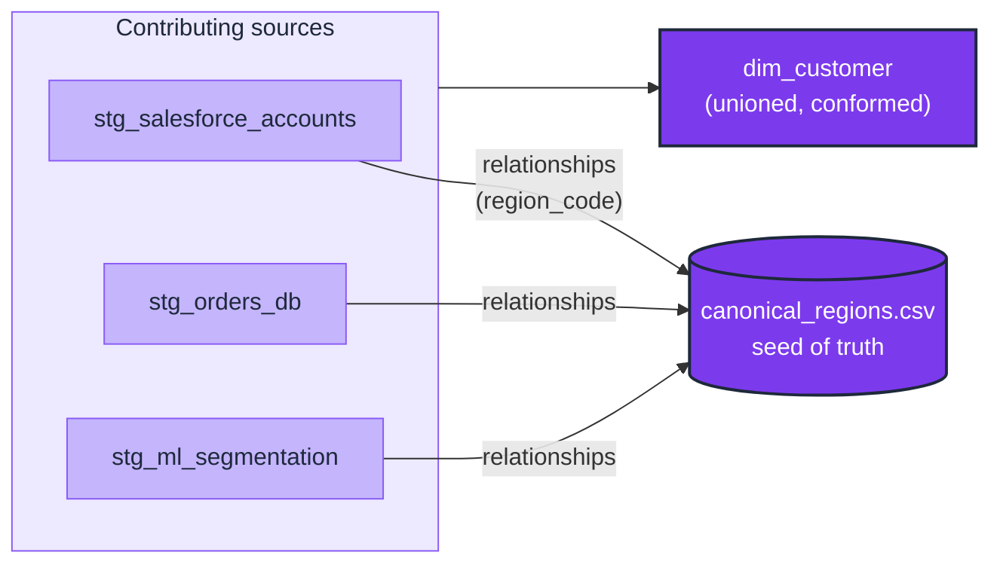

# DM-03 · Govern a shared dimension's values via a seed

| Rule | Role | DAMA-UK6 | Wang–Strong | Cost class |
| --- | --- | --- | --- | --- |
| DM-03 | dimension | Consistency | Representational consistency | cheap |

When the same dimension (`region`, `country`, `customer_segment`) appears across multiple staging models or sources, each may have a different value vocabulary. The canonical fix — Kimball's *conformed dimension* — pins the truth set in a `seeds/*.csv` and forces every staging model to `relationships` against it.

## Symptoms

- A unified `dim_customer` UNIONs two sources; the `region` column has 5 buckets (AMERICAS, EMEA, APAC, JAPAN, NA) where the business expects 4.
- An executive questions why Q3 reports show different region totals than a sibling report.
- Two staging models hand-roll different `accepted_values` lists for the same logical attribute, and they have already drifted.

## Pattern

> **Pattern name:** *Conformed Dimension Seed*
>
> Put the canonical values in a dbt seed (CSV). Every staging model that produces a value for that dimension has a `relationships` test against the seed. Drift is caught at the staging boundary, before the union mart sees it.

## Mechanics

### 1. Create the seed

```text
# seeds/canonical_regions.csv
region_code,region_name
NA,Americas
EMEA,Europe, Middle East & Africa
APAC,Asia Pacific
JAPAN,Japan
```

```yaml
# seeds/_seeds.yml
seeds:
  - name: canonical_regions
    config:
      column_types:
        region_code: string
        region_name: string
    columns:
      - name: region_code
        data_tests:
          - unique
          - not_null
```

### 2. Reference the seed from every contributing staging model

```yaml
# models/staging/stg_salesforce_accounts.yml
- name: region_code
  data_tests:
    - relationships:
        to: ref('canonical_regions')
        field: region_code

# models/staging/stg_orders_db.yml
- name: region_code
  data_tests:
    - relationships:
        to: ref('canonical_regions')
        field: region_code
```

A non-canonical value (e.g., `'AMER'` instead of `'NA'`) fails the staging test immediately, before flowing into the union.

### 3. Translate upstream values in the staging SQL

The fix is usually a SQL CASE in staging:

```sql
-- models/staging/stg_salesforce_accounts.sql
select
    account_id,
    case region
        when 'AMERICAS' then 'NA'
        when 'EMEA'     then 'EMEA'
        when 'APAC'     then 'APAC'
        when 'JAPAN'    then 'JAPAN'
    end as region_code,
    ...
from {{ source('salesforce', 'accounts') }}
```

Any value not in the CASE returns NULL, which the staging `relationships` test then catches as an orphan FK.

### 4. The mart layer no longer needs `accepted_values` — it has the FK

If `dim_customer.region_code` already passed `relationships` against the seed at staging, the mart inherits that guarantee. Adding `accepted_values` at the mart layer is redundant.

### 5. For Type-2 dim conformance, point at the SCD2 view

If the conformed dimension is itself SCD2 (regions occasionally rebrand), the seed becomes a model:

```yaml
- relationships:
    to: ref('dim_region')
    field: region_code
    config:
      where: "is_current = true"
```

Or use `dbt_utils.relationships_where` with a `to_condition`.

## Diagram



## Framework choice

| Option | Where it lives | When to pick |
|--------|----------------|--------------|
| dbt seed + `relationships` per staging model | dbt core | **Default.** Single source of truth; works for ~any number of values. |
| `accepted_values` duplicated in every model's YAML | dbt core | **Anti-pattern** when 3+ models reference the same set — drift is inevitable. |
| dbt model materialised from a seed-like source | dbt core | When the canonical set comes from a source system (e.g., a ref table in the OLTP DB), not a CSV. |
| `dbt_utils.cardinality_equality` | dbt-utils | When you want to assert two columns have the same set of values (e.g., a staging table and a seed should have identical distributions). |

## When NOT to use

- **The dimension appears in only one model.** Use `accepted_values` directly — a seed is over-engineering.
- **The dimension is high-cardinality** (country codes, currency codes have ~200 each). A seed still works, but the maintenance discipline matters — designate an owner.
- **The dimension genuinely diverges across sources by design** (different products legitimately have different category vocabularies). Use translation layers in staging without a single conformed set.

## See also

- [`DM-01-accepted-values.md`](./DM-01-accepted-values.md) — single-model variant
- [`../entity/EN-03-foreign-key-integrity.md`](../entity/EN-03-foreign-key-integrity.md) — the test mechanism (relationships) used here
- F.9 (Conformed-Dimension Drift) in the [semantic-taxonomy research](../README.md)
