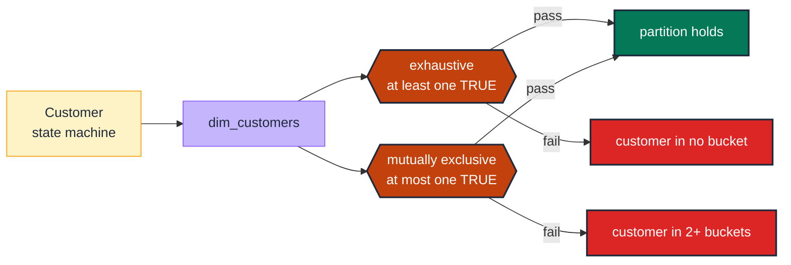

# DM-04 · Assert sibling flags do not co-fire

| Rule | Role | DAMA-UK6 | Wang–Strong | Cost class |
| --- | --- | --- | --- | --- |
| DM-04 | dimension | Consistency | Representational consistency | cheap |

When a model has sibling boolean flags (`is_active`, `is_archived`, `is_deleted`) that the business says must partition the universe, a row that is `is_active=TRUE AND is_archived=TRUE` is a contradiction. The expression-based test catches the contradiction in one line.

## Symptoms

- A "Customer Status" dashboard sums to 110% across active/archived/deleted segments.
- An entity appears in two segment buckets simultaneously after a state-machine bug.
- The total of "active customers" + "churned customers" exceeds total customers.

## Pattern

> **Pattern name:** *Sibling Flag Partition*
>
> When two or more boolean flags are meant to partition the universe (every row in exactly one), assert that the disjunction is true AND that no two flags are simultaneously true. Two expressions, both expressed via `dbt_utils.expression_is_true`.

## Mechanics

### 1. Identify the partition

Write down the business rule: *"Every customer is in exactly one of `is_active`, `is_archived`, `is_deleted`."* Two invariants follow:

- **Exhaustiveness:** at least one flag is true (no customer in zero buckets).
- **Mutual exclusivity:** at most one flag is true (no customer in two buckets).

### 2. Test exhaustiveness

```yaml
# models/marts/customers.yml
models:
  - name: customers
    data_tests:
      - dbt_utils.expression_is_true:
          expression: "is_active or is_archived or is_deleted"
          config:
            severity: error
```

### 3. Test mutual exclusivity

A clean SQL phrasing is "exactly one is true":

```yaml
      - dbt_utils.expression_is_true:
          expression: |
            cast(is_active as int64)
            + cast(is_archived as int64)
            + cast(is_deleted as int64)
            = 1
          config:
            severity: error
```

The `cast(bool as int64)` form is BigQuery-friendly. On Snowflake, `IIF(is_active, 1, 0)` works. Document the dialect choice in the model's `description:`.

### 4. For two-flag partitions, use a simpler `XOR`

When only two flags are involved (`is_subscriber`, `is_trial`):

```yaml
- dbt_utils.expression_is_true:
    expression: "is_subscriber != is_trial"    # XOR
```

### 5. Couple with `not_null` on each flag

A NULL boolean cannot satisfy either invariant — neither true nor false. Always `not_null` on every flag in the partition:

```yaml
columns:
  - name: is_active
    data_tests: [not_null]
  - name: is_archived
    data_tests: [not_null]
  - name: is_deleted
    data_tests: [not_null]
```

## Diagram



## Framework choice

| Option | Where it lives | When to pick |
|--------|----------------|--------------|
| `dbt_utils.expression_is_true` | dbt-utils | **Default.** Most flexible; expresses any boolean invariant. |
| `dbt_expectations.expect_column_pair_values_to_be_in_set` | dbt_expectations | Two-column pairs with an explicit allowed-pair list. Useful when the partition is the cross-product (allowed `(country, currency)` combinations). |
| `dbt_expectations.expect_multicolumn_sum_to_equal` | dbt_expectations | When the partition expresses as a numeric sum equality. |
| Refactor to a single `status` enum | model design | When the flags are mutually exclusive AND exhaustive, a single enum column is simpler. Pair with `accepted_values`. |

## When NOT to use

- **Flags are not meant to partition.** `is_premium` and `has_phone_number` are independent — both can be true; both can be false. This test would constantly fail.
- **The partition is large** (5+ flags). Promote to a single enum column. Adding more flags compounds the maintenance burden of the test expression.
- **Flag values are computed from the same upstream column** — the redundancy means the test cannot fail by construction. Test at the source instead.

## See also

- [`DM-01-accepted-values.md`](./DM-01-accepted-values.md) — the single-enum alternative
- [`../measure/MS-01-numeric-range.md`](../measure/MS-01-numeric-range.md) — for the numeric-sum-equals-1 variant
