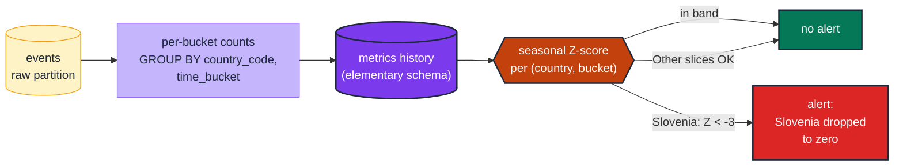

# DM-05 · Detect anomalies per dimension value

| Rule | Role | DAMA-UK6 | Wang–Strong | Cost class |
| --- | --- | --- | --- | --- |
| DM-05 | dimension | Accuracy + Timeliness | Accuracy + Timeliness | history-bound |

Total row count looks fine, but **one slice of a dimension** (one country, one tenant, one product category) has silently dropped to near-zero. A per-dimension anomaly test learns each slice's historical pattern and alerts when any slice diverges from its own history.

## Symptoms

- Daily row count is steady but the Slovenia revenue card on a dashboard reads $0 for a week.
- A multi-tenant fact table is "healthy" at the global level but one tenant's data has stopped landing.
- A scheduled extract for a single product line silently failed; downstream metrics for that line silently zero.

## Pattern

> **Pattern name:** *Per-Dimension Anomaly Detection*
>
> Group the row count by a low-cardinality dimension, then anomaly-detect each per-dimension time series independently. A drop in one slice fires even when the global count is normal.

## Mechanics

### 1. Install Elementary

```yaml
# packages.yml
packages:
  - package: elementary-data/elementary
    version: 0.23.1
```

```yaml
# dbt_project.yml
models:
  elementary:
    +schema: elementary
flags:
  source_freshness_run_project_hooks: true
vars:
  elementary_full_refresh: false
```

See the [Elementary research](../README.md) for full install steps including the `materialization_test_default` macro override required on dbt 1.8+.

### 2. Add the dimension-anomalies test

```yaml
# models/marts/events.yml
models:
  - name: events
    config:
      elementary:
        timestamp_column: loaded_at
    data_tests:
      - elementary.dimension_anomalies:
          arguments:
            dimensions:
              - country_code
              - event_type
            time_bucket: { period: hour, count: 4 }
            anomaly_sensitivity: 3
            anomaly_direction: drop          # only alert on disappearances
          config:
            tags: [elementary, anomaly]
            severity: warn
```

`anomaly_direction: drop` is usually what you want for per-dimension counts — a spike on one slice is rarely actionable; a disappearance is.

### 3. Suppress noisy small slices

`exclude_final_results` removes slices below a threshold from the alerting set — useful when long-tail values trigger false positives:

```yaml
- elementary.dimension_anomalies:
    arguments:
      dimensions: [country_code]
      exclude_final_results: "average < 100"   # don't alert on slices with <100 rows on average
```

### 4. Choose cardinality wisely

Dimension-anomalies is designed for **low-to-medium cardinality** (≤ ~50 values). For higher cardinality (per-user, per-product-sku), the number of series explodes and false positives dominate. Either:

- Pre-bucket the dimension to a coarser grain (`product_category` instead of `product_sku`)
- Switch to `column_anomalies` with a single representative metric

### 5. First run is the expensive one

Elementary maintains `data_monitoring_metrics` incrementally — the first build computes the full `training_period + detection_period` worth of buckets per dimension value. Subsequent builds only compute the new detection window. Plan to run the first build outside business hours on BigQuery.

## Diagram



## Framework choice

| Option | Where it lives | When to pick |
|--------|----------------|--------------|
| `elementary.dimension_anomalies` | elementary | **Default.** The maintained anomaly-detection path. |
| `dbt_expectations.expect_column_values_to_be_within_n_moving_stdevs` | dbt_expectations | When you can't add Elementary. The Z-score logic is simpler (no seasonality, no per-dim grouping). Maintenance flag applies. |
| Custom singular test with rolling-window SQL | dbt core | When you need bespoke seasonality / business-calendar logic Elementary doesn't model. |
| `accepted_values` + `cardinality-guard` | dbt core + dbt_expectations | When you don't need anomaly detection at all — just want "every expected value is present at least once". |

## When NOT to use

- **No history yet** (model is brand new). Anomaly detection needs ~2× the `training_period` of historical buckets. Start with `accepted_values` and graduate later.
- **High-cardinality dimensions** (10k+ values). Pre-bucket to a coarser grain or use column anomalies on a representative metric.
- **Cost-sensitive BigQuery setups** where the source table is unpartitioned. Anomaly tests scan the partition window each run; unpartitioned tables make this full-table.
- **Small datasets** where σ is dominated by noise. Z-scores on a slice with mean=5 and stdev=4 will fire constantly.

## See also

- [`DM-02-cardinality-guard.md`](./DM-02-cardinality-guard.md) — the deterministic alternative
- [`../model/MD-07-volume-anomaly.md`](../model/MD-07-volume-anomaly.md) — global (un-grouped) anomaly detection
- [`../model/MD-09-column-anomalies.md`](../model/MD-09-column-anomalies.md) — automated per-column monitors (the table-wide counterpart)
