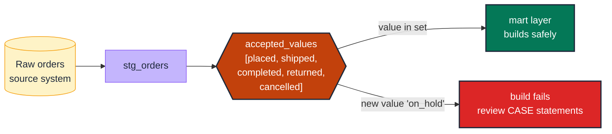

# Assert an enum contract on a categorical dimension

> **Rule:** DM-01 · **Role:** dimension · **DAMA-UK6:** Validity · **Wang–Strong:** Believability + Interpretability · **Cost class:** cheap

A categorical column has a finite, business-defined set of values. `accepted_values` pins that set. The day a new value sneaks in from the source, the test fails and the engineer reviews whether downstream CASE statements need updating.

## Symptoms

- `pending` orders count suddenly looks anomalously high — the source added a new `returned` status, and the mart's `CASE WHEN status = ...` lumped it nowhere visible.
- A status column's distinct values silently grew from 4 to 5 over a quarter.
- A boolean-ish text column has values `'YES'`, `'yes'`, `'Y'`, and `'true'` coexisting.

## Pattern

> **Pattern name:** *Closed-Set Enum*
>
> Pin the allowed set of values for the column. Apply at the staging layer (closest to ingestion) so a new value fires the test within one run, not after the mart layer rebuilds.

## Mechanics

### 1. Apply `accepted_values` at the staging layer

```yaml
# models/staging/stg_orders.yml
models:
  - name: stg_orders
    columns:
      - name: order_status
        data_tests:
          - accepted_values:
              values: ['placed', 'shipped', 'completed', 'returned', 'cancelled']
              quote: true
              config:
                severity: error
```

`quote: true` is the default for string enums. For integer/boolean enums set `quote: false`.

### 2. Tighten with a cardinality guard

`accepted_values` catches *unknown* values. It does NOT catch the case where a value is *missing* — if `'returned'` ever ships zero rows, the test still passes. Pair with a cardinality lower-bound:

```yaml
- accepted_values:
    values: ['placed', 'shipped', 'completed', 'returned', 'cancelled']
- dbt_expectations.expect_column_distinct_count_to_equal:
    value: 5
```

See [`cardinality-guard.md`](./cardinality-guard.md) for bounded ranges (`>= 4 AND <= 6`).

### 3. For nullable categoricals, decide the policy

- If NULL is invalid: add `not_null`.
- If NULL is the explicit "unknown" bucket: leave it; the test ignores NULLs by default.

```yaml
- accepted_values:
    values: ['placed', 'shipped', 'completed', 'returned', 'cancelled']
- not_null    # if the business rule forbids NULL
```

### 4. For boolean columns, model them as actual booleans

`accepted_values` on a boolean is the wrong test — the column type should constrain to `BOOL`. Use a contract:

```yaml
columns:
  - name: is_active
    data_type: bool
    constraints:
      - type: not_null    # if the third state is illegal
```

### 5. Catch case / whitespace drift

`accepted_values: ['USA', 'GBR']` doesn't catch `'usa'`. Either standardise in the staging SQL (`UPPER(TRIM(country_code))`) or add a casing test:

```yaml
- dbt_expectations.expect_column_values_to_have_consistent_casing:
    display_inconsistent_columns: true
```

### 6. Use a seed for the truth set when many models share it

If three different models reference the same `region` set, put the canonical values in `seeds/regions.csv` and use `relationships` against the seed. See [`conformed-dimension.md`](./conformed-dimension.md).

## Diagram



## Framework choice

| Option | Where it lives | When to pick |
|--------|----------------|--------------|
| `accepted_values` | dbt core | **Default.** Static list, simple. |
| `dbt_utils.not_accepted_values` | dbt-utils | Blocklist of known-bad sentinels (`'unknown'`, `'TBD'`, `''`). Pair with `accepted_values`. |
| `dbt_expectations.expect_column_values_to_be_in_set` | dbt_expectations | Need `row_condition` (e.g., `accepted_values` only when `is_active = TRUE`). Maintenance flag applies. |
| `dbt_expectations.expect_column_distinct_values_to_equal_set` | dbt_expectations | Strict set equality — every value in list must be present AND nothing else. Catches the "missing value" case. |
| `relationships` against a seed | dbt core | When the value list is large (~20+) or shared across many models. See [`conformed-dimension.md`](./conformed-dimension.md). |

## When NOT to use

- **High-cardinality categoricals** (country codes, currency codes, language codes — 100+ values). Use `relationships` against a seed instead. Maintaining a 200-element YAML list is unmaintainable.
- **User-generated free-text** (`comment`, `description`). This is not a dimension; it's a payload column.
- **Columns whose value set is genuinely open-ended** (new product categories appear monthly by business design). Use `cardinality-guard` instead — bound the count, not the values.
- **Boolean columns** — use the `BOOL` data type and a contract.

## See also

- [`cardinality-guard.md`](./cardinality-guard.md) — the count-based alternative
- [`conformed-dimension.md`](./conformed-dimension.md) — seed-driven enum for shared dimensions
- [`mutual-exclusivity.md`](./mutual-exclusivity.md) — when two sibling flags must partition the universe
