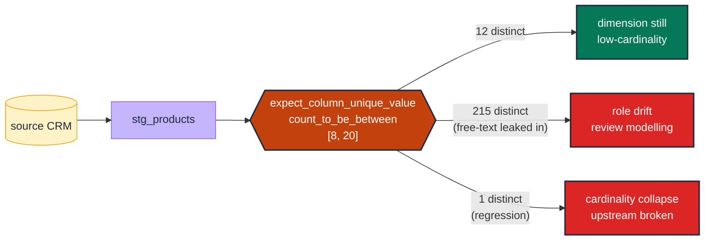

# Guard a dimension's cardinality with a bounded count

> **Rule:** DM-02 · **Role:** dimension · **DAMA-UK6:** Validity + Accuracy · **Wang–Strong:** Believability + Accuracy · **Cost class:** cheap

A dimension is defined by its low-to-medium cardinality. When that count drifts — a CRM admin enables a free-text "Other" field, a vendor adds 50 new product categories overnight — the column has effectively changed role. The cardinality guard detects the drift before it floods dashboards.

## Symptoms

- A `GROUP BY product_category` chart suddenly has 200 bars where it used to have 12.
- A `DISTINCT customer_segment` rollup that took 50ms now takes 4s.
- An `accepted_values` test maintenance burden becomes unbearable as the team keeps adding values to the list every sprint.

## Pattern

> **Pattern name:** *Bounded Cardinality*
>
> Pin the number of distinct values in a dimension to a tolerance band. If the count drifts outside the band, the column has changed semantics — it's either becoming high-cardinality (a stealth entity) or has degraded into free-text.

## Mechanics

### 1. Establish a historical baseline

Query the column's current distinct count and pick a band that allows growth without false positives. A growing dimension might be `[10, 15]` today and `[15, 25]` in six months.

```sql
select count(distinct product_category) from {{ ref('products') }};
-- result: 12
```

### 2. Apply the bounded test

```yaml
# models/marts/products.yml
models:
  - name: products
    columns:
      - name: product_category
        data_tests:
          - dbt_expectations.expect_column_unique_value_count_to_be_between:
              min_value: 8
              max_value: 20
              config:
                severity: warn   # warn during early calibration
```

### 3. Use `not_constant` to catch the opposite failure

A regression that makes everything the same value (`COALESCE(x, 'default')` gone wrong) collapses cardinality to 1. `dbt_utils.not_constant` catches this:

```yaml
- dbt_utils.not_constant
```

### 4. Use `not_null_proportion` for partial nullability

If 5% NULL is acceptable but 50% NULL is a regression:

```yaml
- dbt_utils.not_null_proportion:
    at_least: 0.90    # at least 90% non-null
    at_most: 1.00
```

### 5. For dimensions that grow predictably, switch to anomaly detection

A bounded test fires every time a single new value is added. If the dimension is *expected* to grow organically, an anomaly detector that learns the growth rate is less noisy:

```yaml
- elementary.column_anomalies:
    arguments:
      column_anomalies: [distinct_count]
      timestamp_column: loaded_at
      anomaly_sensitivity: 3
```

This learns the natural growth rate and fires only on Z-score outliers. See [`dimension-anomalies.md`](./dimension-anomalies.md).

## Diagram



## Framework choice

| Option | Where it lives | When to pick |
|--------|----------------|--------------|
| `dbt_expectations.expect_column_unique_value_count_to_be_between` | dbt_expectations | **Default for fixed bounds.** Maintenance flag applies. |
| `dbt_utils.not_constant` | dbt-utils | Just need to assert "more than one value exists" — catches cardinality-collapse only. |
| `dbt_utils.not_null_proportion` | dbt-utils | Bound the *fill rate* rather than the distinct count. |
| `elementary.column_anomalies` with `distinct_count` metric | elementary | When growth is expected and a fixed band would be too noisy. **Preferred for production over dbt_expectations.** |

## When NOT to use

- **You can enumerate the values** — use `accepted_values` directly. It catches the specific value too, not just the count.
- **The dimension is naturally high-cardinality** (`user_id`, `product_sku` at scale). That's an entity, not a dimension; this test doesn't apply.
- **Pre-launch, low-volume datasets** where any band is arbitrary. Wait until you have ~30 days of history before pinning a band.

## See also

- [`accepted-values.md`](./accepted-values.md) — when the value set is known
- [`dimension-anomalies.md`](./dimension-anomalies.md) — for distribution-aware variants
- [`../measure/distribution-anomaly.md`](../measure/distribution-anomaly.md) — the measure-side equivalent
