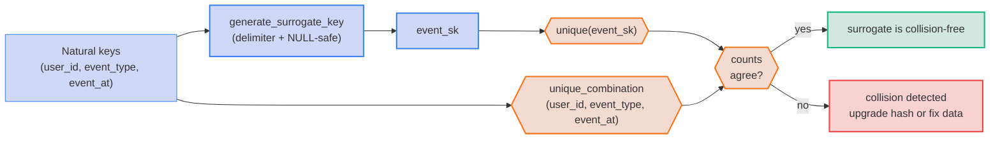

# EN-05 · Guard against surrogate-key hash collisions

| Rule | Role | DAMA-UK6 | Wang–Strong | Cost class |
| --- | --- | --- | --- | --- |
| EN-05 | entity | Uniqueness | Concise representation | scan-bound |

`MD5(a || b)` is a common surrogate-key pattern. Without a delimiter, `MD5('12' || 'AB')` and `MD5('1' || '2AB')` are the same string. `unique` on the surrogate passes — but two distinct logical events have collapsed to one key. The guard is **always test the natural-key tuple's uniqueness in addition to the surrogate's**.

## Symptoms

- A surrogate-key column passes `unique` but downstream metrics undercount by a tiny percentage that varies with data volume.
- Anomaly detection flags a "missing" event that, on inspection, *was* ingested — its surrogate collided with another row.
- A `dbt build --select state:modified` partial-run test passed; a full run reveals duplicates in the surrogate.

## Pattern

> **Pattern name:** *Twin-Key Assertion*
>
> Apply `unique` to the surrogate AND `unique_combination_of_columns` to the natural-key tuple it was generated from. The two tests agree if and only if the hash is collision-free for this dataset. Disagreement signals a hash collision.

## Mechanics

### 1. Use a collision-safe surrogate macro

`dbt_utils.generate_surrogate_key(['col_a', 'col_b'])` inserts a delimiter (`'-'`) between values and coalesces NULLs to a sentinel before hashing — both behaviours that prevent the F.10-style "no delimiter" bug. Use it instead of hand-rolled `MD5(...||...)`.

```sql
-- models/marts/event_facts.sql
select
    {{ dbt_utils.generate_surrogate_key(['user_id', 'event_type', 'event_at']) }} as event_sk,
    user_id,
    event_type,
    event_at,
    ...
from {{ ref('stg_events') }}
```

### 2. Test BOTH the surrogate AND the natural-key tuple

```yaml
models:
  - name: event_facts
    columns:
      - name: event_sk
        data_tests:
          - unique
          - not_null
    data_tests:
      - dbt_utils.unique_combination_of_columns:
          combination_of_columns:
            - user_id
            - event_type
            - event_at
```

If the natural-key tuple is unique but `event_sk` is not, you have a hash collision. If both pass, the surrogate is sound. If the natural-key tuple is *not* unique, the upstream data has duplicates and the surrogate is masking them.

### 3. Make hash-collision detection explicit with a singular test

A more direct phrasing — the surrogate's distinct count should equal the tuple's distinct count:

```sql
-- data-tests/event_sk_no_collisions.sql
{{ config(severity='error', tags=['surrogate']) }}

select
    count(distinct event_sk)                                  as n_surrogate,
    count(distinct concat(user_id, '|', event_type, '|', event_at)) as n_natural
from {{ ref('event_facts') }}
having count(distinct event_sk) != count(distinct concat(user_id, '|', event_type, '|', event_at))
```

If the test returns a row, the two counts differ; that's exactly a collision.

### 4. NULL-safe surrogates only

`MD5(NULL)` is NULL on most warehouses. A row with any NULL in its natural-key components produces a NULL surrogate; many NULL surrogates compare equal to each other in unexpected ways. The `dbt_utils` macro coalesces NULL to a sentinel string (`'_dbt_utils_surrogate_key_null_'`) before concatenating, which prevents this.

If you need to roll your own (e.g., a non-MD5 hash), reproduce that contract:

```sql
{# example custom surrogate that's null-safe #}
to_hex(sha256(cast(
    coalesce(cast(col_a as string), '_null_') || '|' ||
    coalesce(cast(col_b as string), '_null_')
as bytes))) as my_sk
```

## Diagram



## Framework choice

| Option | Where it lives | When to pick |
|--------|----------------|--------------|
| `unique` + `dbt_utils.unique_combination_of_columns` | dbt core + dbt-utils | **Default.** Twin-key assertion. |
| `dbt_utils.generate_surrogate_key` | dbt-utils | The canonical surrogate macro. Use this instead of `MD5(col_a \|\| col_b)`. |
| Singular test asserting `count(distinct sk) = count(distinct natural_tuple)` | dbt core | When you want the collision check phrased explicitly rather than implied by two passing tests. |
| SHA-256 instead of MD5 | model SQL | When the surrogate's collision probability matters for security or huge datasets (>10^9 rows). MD5 has ~50% collision probability at 2^64 rows; SHA-256 effectively never. |

## When NOT to use

- **Surrogate is generated by the warehouse** (e.g., `ROW_NUMBER() OVER (ORDER BY natural_key)`) — the surrogate is sequential, not hashed, so collisions are impossible by construction. Still test for stability across runs (the ordering must be deterministic).
- **Identity column is the natural key directly** (no hashing involved). The natural-key uniqueness IS the surrogate uniqueness.
- **Single-column surrogates** (e.g., `MD5(email)` where email is the only input). No concatenation, no delimiter bug — but still test both `unique(email_sk)` and `unique(email)` to detect upstream email duplicates.

## See also

- [`EN-01-unique-key.md`](./EN-01-unique-key.md) — the basic unique test
- [`EN-02-compound-grain.md`](./EN-02-compound-grain.md) — the natural-key tuple test
- F.10 in the [semantic-taxonomy research](../README.md) — the original "MD5 without delimiter" incident
