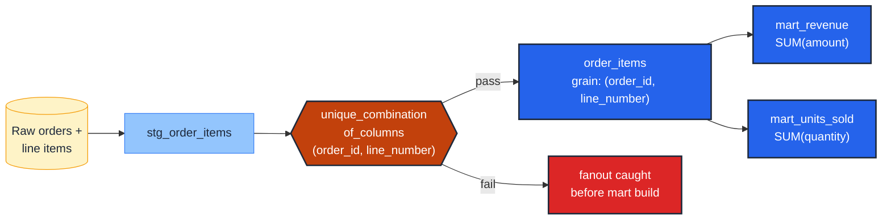

# Assert composite-key uniqueness (the grain test)

> **Role:** entity · **Wang–Strong dimension:** Uniqueness · **Cost class:** scan-bound

When the grain spans more than one column, `unique` cannot express it. The test of grain is `dbt_utils.unique_combination_of_columns` — and the rule is **every dbt model has exactly one of these, naming its grain**.

## Smell

- "One row per customer per day" but the row count is 1.3× expected.
- A fact table joined to two dimensions and the result has more rows than the fact alone.
- A nightly snapshot table has two rows for the same `(warehouse_id, product_id, snapshot_date)`.

## Pattern

> **Pattern name:** *Grain Test*
>
> Every model has a grain — the tuple of columns whose combination uniquely identifies a row. Assert that tuple's uniqueness with one model-level test. If you can't name the tuple, the model isn't done.

## Mechanics

### 1. Name the grain in the model description

The grain is documentation first, test second. Write it in the model's `description:` so reviewers can spot the contract without reading SQL.

```yaml
# models/marts/order_items.yml
models:
  - name: order_items
    description: |
      One row per (order_id, line_number). Grain is enforced by the
      unique_combination_of_columns test below.
```

### 2. Apply the test at the model level

```yaml
    data_tests:
      - dbt_utils.unique_combination_of_columns:
          combination_of_columns:
            - order_id
            - line_number
```

`combination_of_columns` is a list. Order is cosmetic (the test uses GROUP BY); list the columns in the same order the model description names them.

### 3. Apply NOT NULL to each grain component

A NULL in any grain column makes the row partially anonymous. The compound-uniqueness test still passes (NULLs group together), but downstream joins behave unpredictably. Pair the grain test with `not_null` on each component:

```yaml
    columns:
      - name: order_id
        data_tests:
          - not_null
      - name: line_number
        data_tests:
          - not_null
```

### 4. For time-component grains, ensure the time has the right precision

A grain of `(user_id, event_at)` where `event_at` is `TIMESTAMP` at microsecond precision is effectively all-unique by accident. If the intended grain is daily, truncate at the staging layer:

```sql
-- models/staging/stg_events.sql
select
    user_id,
    date_trunc(event_at, day) as event_date,
    ...
from {{ source('events', 'raw') }}
```

…and put the grain test on `(user_id, event_date)`.

### 5. Scope expensive grain checks

On a 10 B-row event table, the grain GROUP BY is the most expensive test in the project. Scope to recent partition:

```yaml
- dbt_utils.unique_combination_of_columns:
    combination_of_columns: [user_id, event_date]
    config:
      where: "event_date >= dateadd(day, -7, current_date)"
```

Run an unscoped variant nightly with `severity: warn` so older drift surfaces without blocking PRs.

## Diagram



## Framework choice

| Option | Where it lives | When to pick |
|--------|----------------|--------------|
| `dbt_utils.unique_combination_of_columns` | dbt-utils | **Default.** The maintained canonical test. |
| `dbt_expectations.expect_compound_columns_to_be_unique` | dbt_expectations | Need `row_condition` (e.g., scope to `is_current = true`) or `ignore_row_if: any_value_is_missing`. Maintenance flag applies. |
| Concatenated `unique` on `MD5(a \|\| b)` | dbt core | **Anti-pattern.** Hash collisions are real (see [`surrogate-collision-guard.md`](./surrogate-collision-guard.md)). Use the dbt-utils test. |
| `primary_key` constraint on multiple columns (model-level) | dbt core contracts | Documents intent at DDL; informational on BigQuery. Pair with the data test. |

## When NOT to use

- **Models with a single-column grain.** Use `unique` ([`unique-key.md`](./unique-key.md)) — composite tests on a single column are over-engineering.
- **Append-mode staging models** where the deduplication happens at the next layer. Test the deduped model, not the raw.
- **Wide compound keys (>6 columns)** — the GROUP BY becomes prohibitively expensive. Re-examine whether the model truly needs that grain; usually a synthesised surrogate is better, and you test that single column.

## See also

- [`unique-key.md`](./unique-key.md) — single-column variant
- [`../model/grain-test.md`](../model/grain-test.md) — the model-level "every model has a grain" rule
- [`../time/scd2-quartet.md`](../time/scd2-quartet.md) — the four-test combination for SCD2 dims, which includes a compound-grain test
