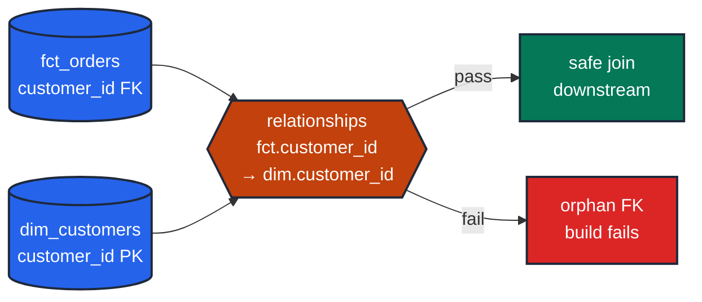

# Assert referential integrity on foreign keys

> **Rule:** EN-03 · **Role:** entity · **DAMA-UK6:** Consistency · **Wang–Strong:** Representational consistency · **Cost class:** scan-bound

dbt does not enforce foreign keys at the warehouse level. `relationships` is your FK constraint — it asserts every value in the child column has a match in the parent.

## Symptoms

- A LEFT JOIN from `fct_orders` to `dim_customers` produces NULL `customer_name` rows.
- `COUNT(DISTINCT customer_id)` differs between the fact and the dim.
- A dashboard shows orders attributed to "Unknown Customer".

## Pattern

> **Pattern name:** *FK-to-PK Relationship*
>
> For every foreign-key column in a fact (or child) table, assert it has a matching value in the parent (dim or root) table. Run the test on the child side, pointing at the parent.

## Mechanics

### 1. Identify the FK columns in the model

Every column that participates in a JOIN ON with another model is an FK. In a star schema, every `*_id` in a fact pointing at a dimension is one.

### 2. Apply `relationships` on the child column

```yaml
# models/marts/orders.yml
models:
  - name: orders
    columns:
      - name: customer_id
        data_tests:
          - relationships:
              to: ref('customers')
              field: customer_id
              config:
                severity: error
```

The compiled SQL is a LEFT JOIN from the child to the parent, returning rows where the parent side is NULL.

### 3. Pair with `not_null` on the FK

`relationships` filters out NULLs by default (`where {{ column_name }} is not null`). If NULL is also a failure, add `not_null`:

```yaml
- name: customer_id
  data_tests:
    - not_null
    - relationships:
        to: ref('customers')
        field: customer_id
```

If NULL is legitimate (e.g., `guest checkout` orders have `customer_id IS NULL`), keep `relationships` alone and document why nulls are valid.

### 4. Scope referential integrity when the join is conditional

If `fct_orders.customer_id` should only match `dim_customers` for non-guest orders, use [`soft-delete-scoped-fk.md`](./soft-delete-scoped-fk.md)'s `relationships_where`:

```yaml
- dbt_utils.relationships_where:
    to: ref('customers')
    field: customer_id
    from_condition: "order_status != 'guest_checkout'"
```

### 5. Add the parent-side `primary_key` constraint for symmetry

The parent's `unique` test is what makes the relationship meaningful. Without it, a duplicate in the parent would fan out the join even though `relationships` passes:

```yaml
# In dim_customers.yml
- name: customer_id
  constraints:
    - type: primary_key
      warn_unenforced: false
  data_tests:
    - unique
    - not_null
```

## Diagram



## Framework choice

| Option | Where it lives | When to pick |
|--------|----------------|--------------|
| `relationships` | dbt core | **Default.** Single FK, no scoping. |
| `dbt_utils.relationships_where` | dbt-utils | Need `from_condition` / `to_condition` (soft-deletes, guest checkouts). See [`soft-delete-scoped-fk.md`](./soft-delete-scoped-fk.md). |
| `foreign_key` constraint in model contract | dbt core | Documents intent; on BigQuery it's informational only — the test is what actually validates. |
| `cardinality_equality` | dbt-utils | When you want both "every FK has a PK" AND "every PK has at least one FK" (rare). |

## When NOT to use

- **Self-referential keys** where the root has no parent (employee.manager_id → employee.id with `manager_id IS NULL` for the CEO). `relationships` handles this by default (the `where IS NOT NULL` clause excludes the root), but be intentional.
- **Append-mode event tables that intentionally accept unknown referrers** (anonymous web traffic, pre-onboarding events). Use `relationships_where` to scope or document why orphans are valid.
- **Source-to-staging boundary.** Staging should be a thin rename of a source already validated upstream. Test at the *next* boundary where joins start (staging→intermediate or intermediate→mart).
- **Cross-warehouse joins where the parent isn't a dbt-managed model.** Use `source('...')` if the parent is a registered source; otherwise this test can't reach it.

## See also

- [`soft-delete-scoped-fk.md`](./soft-delete-scoped-fk.md) — when the FK only applies under certain conditions
- [`unique-key.md`](./unique-key.md) — the parent-side test that makes the FK meaningful
- [`type-stable-join.md`](./type-stable-join.md) — type-mismatch is silent join failure
