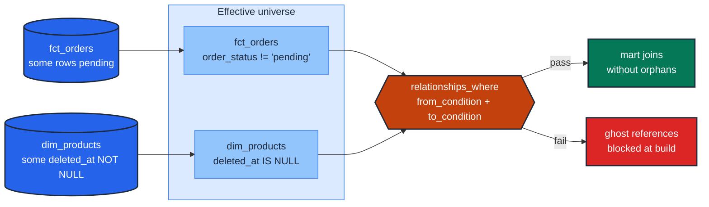

# EN-04 · Scope referential integrity around soft-deletes

> **Rule:** EN-04 · **Role:** entity · **DAMA-UK6:** Consistency · **Wang–Strong:** Representational consistency · **Cost class:** scan-bound

When the parent table soft-deletes rows (rather than physically removing them), the naive `relationships` test passes against the unfiltered parent, but the downstream join filters those rows out and produces ghost references. The fix is `relationships_where`.

## Symptoms

- The `relationships` test on `fct_orders.product_id` passes nightly.
- The mart `mart_orders_enriched` LEFT JOINs `dim_product WHERE deleted_at IS NULL`, and historical orders show `product_name = NULL`.
- Reporting buckets these as "Unknown Product" — silently mislabelling years of orders for products that were soft-deleted last quarter.

## Pattern

> **Pattern name:** *Scoped FK*
>
> When the consumer of a relation filters by `deleted_at IS NULL` (or any other condition), the FK integrity check must apply the **same filter** to the parent side. `dbt_utils.relationships_where` accepts a `to_condition:` for exactly this.

## Mechanics

### 1. Decide the canonical filter

Ask: "which rows does the downstream consumer treat as the valid universe?" This is almost always `deleted_at IS NULL`, `is_active = true`, or `status != 'archived'`. Pick one canonical form and document it.

### 2. Replace `relationships` with `relationships_where`

```yaml
# models/marts/orders.yml
models:
  - name: orders
    columns:
      - name: product_id
        data_tests:
          - dbt_utils.relationships_where:
              to: ref('products')
              field: product_id
              to_condition: "deleted_at is null"
```

`to_condition` filters the parent. `from_condition` filters the child (use it when the child also has scope, e.g., `order_status != 'pending'`).

### 3. Consider whether the dim should be SCD2 instead

A soft-deleted product whose historical orders should keep their name needs SCD2 history, not a soft-delete column. The right fix to F.11 in the wild is often "make `dim_product` SCD2" — see [`../time/scd2-quartet.md`](../time/scd2-quartet.md).

`relationships_where` then changes shape: you scope to `is_current = true` for current-state joins, or join through `(natural_key, valid_from)` for as-of joins.

### 4. Both `from_condition` and `to_condition` (double-sided scope)

When child has `'pending'` rows that have no FK yet AND parent has `deleted_at` soft-deletes:

```yaml
- dbt_utils.relationships_where:
    to: ref('products')
    field: product_id
    from_condition: "order_status != 'pending'"
    to_condition: "deleted_at is null"
```

Default for both is `"1=1"` (the no-op T-SQL-safe true literal). Leave them as default when scope doesn't apply.

## Diagram



## Framework choice

| Option | Where it lives | When to pick |
|--------|----------------|--------------|
| `dbt_utils.relationships_where` | dbt-utils | **Default.** Both-sided scoping; matches what consumers actually filter on. |
| `relationships` (with separate seed of "valid IDs") | dbt core | When the scoping rule is too dynamic for a YAML filter — extract the valid universe to a seed and `relationships` against the seed. |
| Make the parent SCD2 instead | model design | When historical referential correctness matters more than current-state speed. See [`../time/scd2-quartet.md`](../time/scd2-quartet.md). |

## When NOT to use

- **No soft-deletes exist on the parent.** Plain `relationships` is simpler and just as correct.
- **The scoping filter is complex enough to need a CTE.** Promote the filter to a separate model (`stg_active_products`) and do `relationships` against it.
- **You actually want the orphan check to fire on soft-deleted rows** — that's a different smell: "we soft-delete but downstream still references". `relationships` (unscoped) would surface the issue intentionally.

## See also

- [`foreign-key-integrity.md`](./foreign-key-integrity.md) — the unscoped version
- [`../time/scd2-quartet.md`](../time/scd2-quartet.md) — the structural fix for "historical orders need historical product names"
