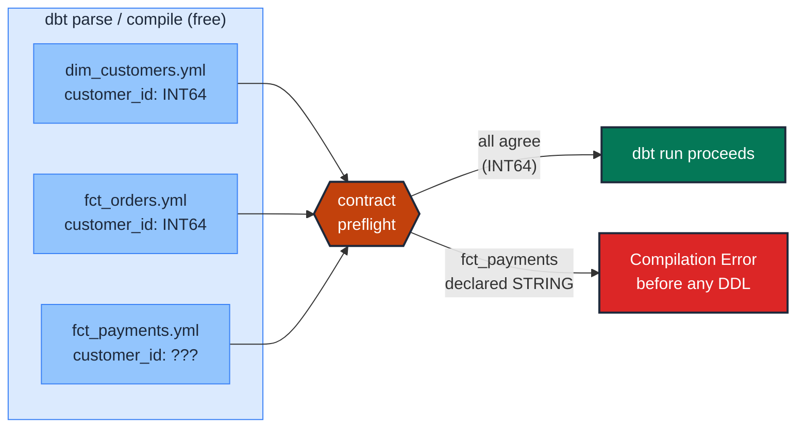

# Lock the join column's data type via contract

> **Role:** entity · **Wang–Strong dimension:** Validity · **Cost class:** free (compile-time)

A `customer_id` that is `INT64` in `dim_customers` but `STRING` in `fct_orders` produces silent join failures on Snowflake (implicit cast may or may not match), zero matches on Postgres, and a runtime error on BigQuery. A model contract with explicit `data_type` catches this at parse time, before any DDL or data scan.

## Smell

- A join that used to work now produces zero matches in production.
- A BigQuery query errors with `No matching signature for operator = for argument types: INT64, STRING`.
- A Snowflake mart's row count drops by ~5% after a vendor change; investigation finds `customer_id` is now coming in as zero-padded strings.

## Pattern

> **Pattern name:** *Type-Stable Join*
>
> Declare the `data_type` of every JOIN-key column in every model that participates, via `contract.enforced: true`. The contract's preflight check fails at compile time if any model returns the column with a different type.

## Mechanics

### 1. Identify the joined columns across models

For each entity column, list every model where it appears as a join key. `customer_id` typically appears in `dim_customers`, `fct_orders`, `fct_payments`, `mart_customer_360`. All of them must agree on type.

### 2. Enforce the contract on each model

```yaml
# models/marts/customers.yml
models:
  - name: customers
    config:
      contract:
        enforced: true
    columns:
      - name: customer_id
        data_type: int64        # canonical type for the join key
        constraints:
          - type: not_null
        data_tests:
          - unique
          - not_null

# models/marts/orders.yml
models:
  - name: orders
    config:
      contract:
        enforced: true
    columns:
      - name: customer_id
        data_type: int64        # MUST match dim_customers
        constraints:
          - type: not_null
        data_tests:
          - relationships:
              to: ref('customers')
              field: customer_id
```

### 3. Use explicit precision for numeric types

On BigQuery, `NUMERIC` defaults to `(38, 9)`. If the join is on a numeric key with specific precision, declare it:

```yaml
- name: amount_key
  data_type: numeric(38, 2)
```

The contract preflight compares precision; otherwise type-alias normalisation may silently coerce `numeric` and `numeric(38, 2)` as equivalent (see [`../model/contracts.md`](../model/contracts.md) §5.3).

### 4. For nullable join columns, use the same nullability everywhere

```yaml
# In all models that use customer_id as join key
- name: customer_id
  data_type: int64
  constraints:
    - type: not_null          # OR omit on every model — but agree
```

A model declaring `not_null` while another doesn't is a real divergence: the nullable side may join through to a NULL key in the not-null side and silently match nothing.

### 5. CI gate against schema drift

```bash
dbt build --select state:modified.contract --state ./prod-manifest --warn-error
```

This selector fires when any contract column's `data_type` changes vs production. Couple with `WARN_ERROR_OPTIONS` to make it a hard build failure.

## Diagram



The check is **free** — no warehouse scan, no rows read. The cost is paid only in YAML maintenance.

## Framework choice

| Option | Where it lives | When to pick |
|--------|----------------|--------------|
| `contract.enforced: true` with `data_type` | dbt core | **Default.** The canonical, free, parse-time check. |
| `dbt_expectations.expect_column_values_to_be_of_type` | dbt_expectations | When the model can't have a contract (e.g., ephemeral materialization) and you need a runtime check. Maintenance flag applies. |
| `dbt_expectations.expect_column_values_to_be_in_type_list` | dbt_expectations | During a migration window where two types are temporarily acceptable. |

## When NOT to use

- **Staging models (`stg_*`) and intermediate models (`int_*`).** Contracts on internal models are usually overkill; they force YAML maintenance on every refactor without meaningful downstream protection.
- **Models materialised as `view` where the only consumer is another dbt model.** The contract preflight still runs on views and validates shape, but if the consumer is another contracted model, the contract on the consumer side is what matters.
- **Models with `ephemeral` or `materialized_view` materializations** — contracts aren't supported on these (see [`../model/contracts.md`](../model/contracts.md) §4).

## See also

- [`../model/contracts.md`](../model/contracts.md) — the full contract reference
- [`unique-key.md`](./unique-key.md) — the test side of "key is well-formed"
- [`foreign-key-integrity.md`](./foreign-key-integrity.md) — once types agree, content must too
