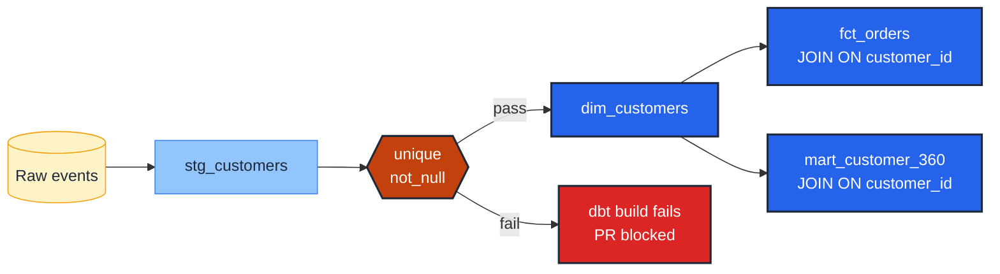

# Assert single-column uniqueness and non-null

> **Rule:** EN-01 · **Role:** entity · **DAMA-UK6:** Uniqueness + Completeness · **Wang–Strong:** Concise representation + Completeness · **Cost class:** cheap (scan-bound only if unscoped)

Every entity column that uniquely identifies a row at this model's grain must carry both `unique` and `not_null`. Together they are the most basic — and most frequently under-applied — defence against join fanout.

## Symptoms

- A KPI doubles overnight after an upstream backfill.
- A LEFT JOIN's right-side row count becomes >1 per left-side row without explanation.
- `SELECT customer_id, COUNT(*) FROM dim_customers GROUP BY customer_id HAVING COUNT(*) > 1` returns rows in production.

## Pattern

> **Pattern name:** *Unique-Key Pair*
>
> Apply `unique` and `not_null` together on every column that is the grain of its model. The pair detects duplicates AND the null-as-implicit-duplicate failure mode.

## Mechanics

### 1. Identify the grain column

The grain of `dim_customers` is `customer_id`. The grain of `dim_products` is `product_id`. If the model has a single-column grain, this vignette covers it; if composite, see [`compound-grain.md`](./compound-grain.md).

### 2. Apply both tests in YAML

```yaml
# models/marts/customers.yml
models:
  - name: customers
    columns:
      - name: customer_id
        description: "Surrogate key. Grain of the model."
        data_tests:
          - unique
          - not_null
```

### 3. Scope expensive tests with `where:`

On a 10 B-row event table, an unscoped `unique` scan can cost dollars per run. Scope to the recent partition:

```yaml
- unique:
    config:
      where: "ingested_at >= dateadd(day, -7, current_date)"
- not_null:
    config:
      where: "ingested_at >= dateadd(day, -7, current_date)"
```

The trade-off: drift in older partitions is no longer caught daily. Pair with a nightly unscoped run if needed.

### 4. Pair with a contract constraint for defence in depth

On BigQuery, the `not_null` constraint *is* enforced at DDL (REQUIRED mode); the `unique` constraint is informational. The contract catches schema drift; the test catches content drift. See [`../model/contracts.md`](../model/contracts.md).

```yaml
- name: customer_id
  data_type: int64
  constraints:
    - type: not_null              # Enforced on BigQuery (REQUIRED mode)
    - type: primary_key
      warn_unenforced: false      # Informational on BigQuery; suppress log noise
  data_tests:
    - unique                      # Compensates for BQ not enforcing PK uniqueness
    - not_null                    # Belt-and-braces with the constraint
```

### 5. Capture failing rows for forensics

When `unique` fails, you want the duplicate rows on hand for the post-mortem.

```yaml
- unique:
    config:
      store_failures: true
      store_failures_as: view
      severity: error
```

The failing rows land in `<target_schema>_dbt_test__audit` as a view.

## Diagram



The test sits between staging and marts. A duplicate `customer_id` would fan out **both** downstream joins; the gate blocks the build before that happens.

## Framework choice

| Option | Where it lives | When to pick |
|--------|----------------|--------------|
| `unique` / `not_null` | dbt core | **Default.** Cheap, idiomatic, well-supported. |
| `dbt_expectations.expect_column_values_to_be_unique` | dbt_expectations | Only when you need `row_condition` and a `where:` config isn't enough. (Maintenance flag: package unmaintained since 2026-05-21.) |
| `unique` with `config.where:` | dbt core | Partition-scoped uniqueness without dropping the test. **Preferred over dbt_expectations.** |
| `primary_key` constraint in a model contract | dbt core | Documents intent at DDL level; **not** a substitute for the data test on BigQuery (informational only). |

## When NOT to use

- **Append-mode incremental events** where transient duplicates are expected mid-run (the deduplicated mart, downstream, gets the test).
- **Staging models that are a thin renaming layer over a source already trusted to be unique** — test at the next layer up where joins start.
- **Columns the business has explicitly modelled as nullable** (e.g., `external_partner_id` on a model that mixes internal and external customers). Apply `unique` alone; let `not_null` be replaced by a documented business rule.
- **Wide event tables where the cost of an unscoped `unique` is prohibitive** — scope with `where:` to the current partition and accept that older drift is caught nightly, not per-run.

## See also

- [`compound-grain.md`](./compound-grain.md) — when the grain spans multiple columns
- [`surrogate-collision-guard.md`](./surrogate-collision-guard.md) — `unique` alone is not enough for hash surrogates
- [`../model/contracts.md`](../model/contracts.md) — the constraint side of defence in depth
- [`../model/grain-test.md`](../model/grain-test.md) — the model-level grain test that complements this
