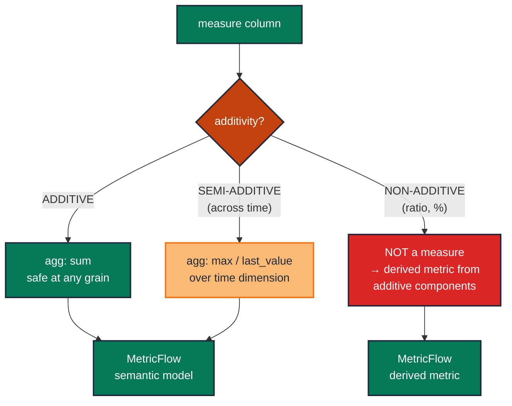

# Tag a measure's additivity and enforce it in the semantic layer

> **Role:** measure · **Wang–Strong dimension:** Consistency · **Cost class:** free (declaration) + runtime (cross-grain reconciliation)

A `quantity` summed across time is correct. An `account_balance` summed across time is 30× the actual balance. A `gross_margin_pct` summed at all is a meaningless number. Tests alone cannot prevent the misuse — the fix is to *declare the additivity* in the semantic layer (MetricFlow) and let the layer pick the right aggregation.

## Smell

- Reported month-end inventory = ~30× the true value (daily inventory snapshots summed instead of last-day-of-month).
- A dashboard shows "Average unit price" computed as `SUM(unit_price) / N` instead of weighted by `quantity`.
- Procurement nearly cancels a shipment based on the bogus "we have plenty" number.

## Pattern

> **Pattern name:** *Additivity-Tagged Measure*
>
> Classify every measure as additive / semi-additive / non-additive. Declare the classification in a MetricFlow `semantic_model` with the correct `agg` per measure. The semantic layer then enforces "you can't `SUM` a non-additive measure across the wrong dimension" — not by failing a test, but by computing the metric correctly.

## Mechanics

### 1. Classify each measure

For every measure column in a fact, write down the classification. Document it in the model's `description:` so reviewers see it.

```yaml
# models/marts/inventory_snapshot.yml
models:
  - name: inventory_snapshot
    description: |
      Daily inventory grain: (warehouse_id, product_id, snapshot_date).

      Measures:
        - quantity_on_hand:    SEMI-ADDITIVE on time. Use MAX(snapshot_date) or LAST_VALUE.
        - quantity_received:   ADDITIVE.
        - unit_cost:           NON-ADDITIVE. Recompute from cost / quantity, never sum.
```

### 2. Declare the semantic model

```yaml
# models/marts/_semantic_models.yml
semantic_models:
  - name: inventory
    model: ref('inventory_snapshot')
    entities:
      - name: warehouse_id
        type: foreign
      - name: product_id
        type: foreign
    dimensions:
      - name: snapshot_date
        type: time
        type_params:
          time_granularity: day
    measures:
      - name: quantity_on_hand
        agg: max               # semi-additive: take MAX, not SUM, at any time aggregation
        expr: quantity_on_hand
        agg_time_dimension: snapshot_date
      - name: quantity_received
        agg: sum               # additive
        expr: quantity_received
      # NON-ADDITIVE measures (like unit_cost) do NOT appear as raw measures —
      # they're computed as ratio metrics from additive components:
      #   metric: avg_unit_cost = sum(total_cost) / sum(quantity_received)
```

### 3. Define ratio metrics for non-additive concepts

Don't expose `gross_margin_pct` as a measure. Expose `revenue` and `cost` as additive measures and define the ratio as a metric:

```yaml
# models/marts/_metrics.yml
metrics:
  - name: gross_margin_pct
    description: "Gross margin as (revenue - cost) / revenue"
    type: derived
    type_params:
      expr: "(revenue - cost) / nullif(revenue, 0)"
      metrics: [revenue, cost]
```

The ratio is recomputed at every aggregation level — never summed.

### 4. Reconcile cross-grain sums as a singular test

The classic Kimball check: child grain sums to parent grain.

```sql
-- data-tests/order_total_reconciles_to_line_items.sql
{{ config(severity='error', tags=['reconciliation']) }}

with line_sum as (
    select
        order_id,
        sum(line_total) as line_items_sum
    from {{ ref('order_items') }}
    group by order_id
),
orders as (
    select order_id, order_total from {{ ref('orders') }}
)
select o.order_id, o.order_total, l.line_items_sum
from orders o
inner join line_sum l using (order_id)
where abs(o.order_total - l.line_items_sum) > 0.01
```

A returned row signals the parent-vs-child disagreement.

### 5. Document the warning in the column meta

If a downstream BI tool ignores the semantic layer (legacy Tableau, raw SQL), at least annotate the column so a reviewer can spot misuse:

```yaml
- name: quantity_on_hand
  description: "Inventory on hand at snapshot_date. SEMI-ADDITIVE: do NOT SUM across snapshot_date."
  meta:
    additivity: semi-additive-time
```

## Diagram



## Framework choice

| Option | Where it lives | When to pick |
|--------|----------------|--------------|
| MetricFlow `semantic_models` + `metrics` | dbt core | **Default.** The maintained path for correct aggregation. |
| Documentation-only via column `meta:` + `description:` | dbt core | When the project hasn't adopted MetricFlow yet — minimal effort, no enforcement. |
| Singular reconciliation test | dbt core | Cross-grain sum-equals check. Complements the semantic layer, doesn't replace it. |
| `dbt_utils.expression_is_true` model-level | dbt-utils | Inline reconciliation invariants (`subtotal + tax = total`). |

## When NOT to use

- **The model has no aggregation downstream** (the measure is only ever read row-by-row). Additivity doesn't matter.
- **The project hasn't adopted MetricFlow.** Use the documentation-only path; tag the column meta so a future MetricFlow migration is easier.
- **Single-table dashboards where SQL authors are aware of the trap.** Convention can substitute for enforcement in small teams — but write it down somewhere durable.

## See also

- [`numeric-range.md`](./numeric-range.md) — bound the values themselves
- [`../model/refactor-parity.md`](../model/refactor-parity.md) — for the cross-grain reconciliation pattern
- F.7 + F.8 in the [semantic-taxonomy research](../README.md) — semi-additive / non-additive incident write-ups
