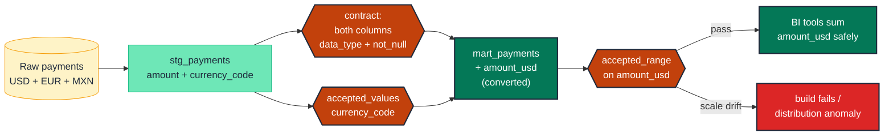

# Pair every amount column with a currency column

> **Role:** measure · **Wang–Strong dimension:** Validity + Accuracy · **Cost class:** free (contract) + cheap (test)

A column called `amount` can be a 5% silent revenue inflation waiting to happen. The day a new payment processor sends MXN amounts into a table where every other row was USD, every `SUM(amount)` query becomes a lie. The pattern: amount columns always travel with a `currency_code`, and every model contracts both.

## Smell

- Total revenue inflates by ~5% over several weeks; investigation finds Mexican rows were summed at 1:1 instead of converted.
- The same metric reports different numbers in two BI tools because one is currency-aware and one is not.
- A monthly reconciliation against the finance ledger drifts by exactly the foreign-currency proportion of revenue.

## Pattern

> **Pattern name:** *Amount + Currency Pair*
>
> Every monetary measure column has a sibling `currency_code` column declared on the same model. Both columns are contracted (`data_type` + `not_null`). The amount has a range test scoped to the canonical currency; the currency has an `accepted_values` test pinning the allowed set. A canonical `*_usd_cents` (or `*_usd`) column is materialised for downstream summability.

## Mechanics

### 1. Contract both columns

```yaml
# models/staging/stg_payments.yml
models:
  - name: stg_payments
    config:
      contract:
        enforced: true
    columns:
      - name: amount
        data_type: numeric(38, 2)
        constraints:
          - type: not_null
      - name: currency_code
        data_type: string
        constraints:
          - type: not_null
        data_tests:
          - accepted_values:
              values: ['USD', 'EUR', 'GBP', 'JPY', 'MXN', 'AUD']
              quote: true
```

### 2. Materialise a canonical-unit column at the mart layer

A foreign-currency `amount` can never be safely summed alongside a USD `amount`. Convert at the boundary:

```sql
-- models/marts/payments.sql
select
    payment_id,
    amount as amount_native,
    currency_code,
    case currency_code
        when 'USD' then amount
        when 'EUR' then amount * {{ ref('fx_rates') }}.eur_to_usd
        when 'GBP' then amount * {{ ref('fx_rates') }}.gbp_to_usd
        -- ...
    end as amount_usd
from {{ ref('stg_payments') }}
left join {{ ref('fx_rates') }} using (payment_date)
```

### 3. Test the canonical-unit column's range, not the native one

```yaml
- name: amount_usd
  data_type: numeric(38, 2)
  data_tests:
    - dbt_utils.accepted_range:
        min_value: 0          # if no refunds are expected here
    - not_null
```

The native `amount` is unbounded (one EUR vs one USD differs by ~10%). Range-test the canonical column.

### 4. Scope ranges to currency when keeping the native amount

If `amount_native` must be range-tested too (e.g., to catch fat-finger digits before conversion):

```yaml
- name: amount
  data_tests:
    - dbt_utils.accepted_range:
        max_value: 1000000
        config:
          where: "currency_code = 'USD'"
    - dbt_utils.accepted_range:
        max_value: 100000000     # JPY has ~100x the per-unit value of USD
        config:
          where: "currency_code = 'JPY'"
```

### 5. Add a distribution anomaly on the canonical column

A scale drift (cents-vs-dollars at source) is a 100× shift — `expect_column_mean_to_be_between` with a tight historical band catches it next run:

```yaml
- name: amount_usd
  data_tests:
    - dbt_expectations.expect_column_mean_to_be_between:
        min_value: 30
        max_value: 100
```

See [`distribution-anomaly.md`](./distribution-anomaly.md) for the learned-band variant.

## Diagram



## Framework choice

| Option | Where it lives | When to pick |
|--------|----------------|--------------|
| Contract + `accepted_values` + `accepted_range` on a `_usd` column | dbt core + dbt-utils | **Default.** Defence in depth. |
| `dbt_expectations.expect_column_pair_values_to_be_in_set` | dbt_expectations | When `(currency_code, amount_range)` pairs must be enumerated. Maintenance flag applies. |
| `dbt_expectations.expect_column_mean_to_be_between` | dbt_expectations | Catches scale drift (cents-vs-dollars). |
| `elementary.column_anomalies` with `average` / `sum` metrics | elementary | Production-grade learned-band drift detection. **Preferred over dbt_expectations.** |

## When NOT to use

- **Single-currency project** with a hard guarantee at ingest that no foreign currency will ever land. (Still recommended to pin via `accepted_values: [USD]` so the day this assumption breaks, the test catches it.)
- **Cross-currency by design** (a payment-processor data model where the native amount IS the meaningful measure). Don't materialise a canonical column; document the design.
- **The "amount" isn't money** (a `score`, `count`, `latency_ms`). Currency pairing doesn't apply.

## See also

- [`numeric-range.md`](./numeric-range.md) — the range half
- [`distribution-anomaly.md`](./distribution-anomaly.md) — scale-drift detection
- F.3 (The Currency Catastrophe) in the [semantic-taxonomy research](../README.md)
