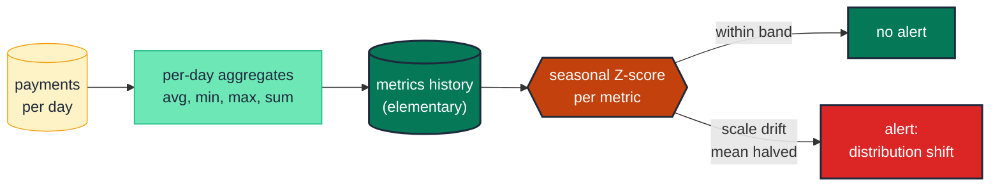

# Detect distribution drift in a measure column

> **Role:** measure · **Wang–Strong dimension:** Accuracy · **Cost class:** history-bound

A range test catches a single bad row; a distribution test catches a fleet of slightly-off rows. The day a system migration silently changes a column from cents to dollars, every row passes individual range tests — but the mean halves. A learned-band Z-score detector fires within one run.

## Smell

- A measure column's mean shifts by ~50% overnight after a vendor system change; no individual row is "wrong" but the aggregate is.
- An `accepted_range` of `[0, 10_000_000]` was set wide to avoid false positives, and now a real drift slipped through because every row is still in range.
- An exec asks "why is the average order value 30% lower this quarter" and nobody noticed until the QBR.

## Pattern

> **Pattern name:** *Learned-Band Distribution Anomaly*
>
> Periodically compute aggregate statistics (mean, stdev, percentile, sum, distinct count) on the measure column, store the history, and alert when the latest period's value is more than N standard deviations from the training mean. Elementary maintains the history table incrementally so subsequent runs are cheap.

## Mechanics

### 1. Decide which metrics matter

For most monetary measures: `average`, `min`, `max`, `sum`. For categorical-ish measures (counts, scores): `null_percent`, `distinct_count`. Don't enable all metrics on every measure — costs compound.

### 2. Add `elementary.column_anomalies`

```yaml
# models/marts/payments.yml
models:
  - name: payments
    config:
      elementary:
        timestamp_column: payment_date
    columns:
      - name: amount_usd
        data_tests:
          - elementary.column_anomalies:
              arguments:
                column_anomalies:
                  - average
                  - min
                  - max
                  - sum
                time_bucket: { period: day, count: 1 }
                anomaly_sensitivity: 3
                anomaly_direction: both
              config:
                tags: [elementary, anomaly]
                severity: warn
```

### 3. Use seasonality if applicable

Daily revenue often has a weekly seasonality (weekends differ from weekdays). The training set should respect that:

```yaml
- elementary.column_anomalies:
    arguments:
      column_anomalies: [sum]
      time_bucket: { period: day, count: 1 }
      training_period: { period: day, count: 28 }
      seasonality: day_of_week     # compare Mondays to Mondays
      anomaly_sensitivity: 3
```

With `day_of_week`, the effective training set is the last 4 same-weekday buckets (`28 / 7 = 4`). Increase `training_period` if 4 is too few.

### 4. Suppress small-magnitude changes

A 3σ drift on a measure with tiny absolute values is noise. Set `ignore_small_changes`:

```yaml
- elementary.column_anomalies:
    arguments:
      column_anomalies: [average]
      ignore_small_changes:
        spike_failure_percent_threshold: 25   # only alert if pct change > 25%
        drop_failure_percent_threshold: 25
```

### 5. Combine with a static range test for the "obvious" cases

A learned-band detector takes ~14 days of history to be useful; a static `accepted_range` test fires from day one. Keep both — they catch different failure modes:

```yaml
- name: amount_usd
  data_tests:
    - dbt_utils.accepted_range:                    # bounded for catastrophic values
        min_value: 0
        max_value: 1000000
    - elementary.column_anomalies:                 # learned band for drift
        arguments:
          column_anomalies: [average, sum]
```

## Diagram



## Framework choice

| Option | Where it lives | When to pick |
|--------|----------------|--------------|
| `elementary.column_anomalies` | elementary | **Default.** Maintained, incremental, supports seasonality + per-dimension grouping. |
| `dbt_expectations.expect_column_values_to_be_within_n_moving_stdevs` | dbt_expectations | Simpler Z-score on a date-bucketed column; no seasonality. Maintenance flag applies. |
| `dbt_expectations.expect_column_mean_to_be_between` (static) | dbt_expectations | Fixed-band sanity check when you know the long-term mean. Doesn't adapt to growth. |
| `dbt_utils.expression_is_true` checking pct change vs lookback | dbt-utils | When you want bespoke logic Elementary doesn't express (e.g., "today's mean is within 50% of yesterday's"). |

## When NOT to use

- **Brand-new model with no history.** Anomaly tests need ~2× `training_period` of buckets to be useful. Use static `accepted_range` until history accumulates.
- **Very-low-volume tables** (≤ 100 rows per bucket). Z-scores on small samples are dominated by noise.
- **Measures with deliberate seasonal/promotional spikes** that don't fit `day_of_week` or `hour_of_day`. The detector will alert on every promo. Either disable for those windows or use `anomaly_exclude_metrics` to filter the training set.

## See also

- [`numeric-range.md`](./numeric-range.md) — the static-band complement
- [`../dimension/dimension-anomalies.md`](../dimension/dimension-anomalies.md) — the per-dimension variant
- [`../model/volume-anomaly.md`](../model/volume-anomaly.md) — model-level (count) version
