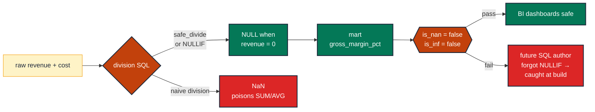

# Guard against NaN and Inf in computed measures

> **Role:** measure · **Wang–Strong dimension:** Validity · **Cost class:** cheap

A ratio measure like `gross_margin_pct = (revenue - cost) / revenue` will produce NaN when `revenue = 0` (BigQuery, Snowflake) or Inf when the numerator overflows. Both propagate silently through every `SUM`/`AVG` downstream — corrupting a metric, hiding a region, returning empty cells in a dashboard.

## Smell

- A region disappears from a dashboard after one of its rows produced NaN.
- A summary metric is "null" with no apparent cause; the source data is populated.
- An `AVG()` returns NaN; a single row's NaN poisoned the entire aggregation.

## Pattern

> **Pattern name:** *NaN/Inf Guard*
>
> Catch the bad row at source (`NULLIF` the denominator before dividing). Then test the output column for any remaining NaN/Inf — the test exists to detect future divisions that escape the `NULLIF` discipline.

## Mechanics

### 1. Fix the source: `NULLIF(denominator, 0)`

The structural fix lives in the model SQL, not the test:

```sql
-- models/marts/orders.sql
select
    order_id,
    revenue,
    cost,
    (revenue - cost) / nullif(revenue, 0) as gross_margin_pct,  -- NULL, not NaN, when revenue = 0
    ...
from {{ ref('order_aggregates') }}
```

NULL is benign: `AVG()` ignores NULLs; `SUM()` ignores NULLs; downstream filters that say `WHERE gross_margin_pct > 0` simply exclude these rows. NaN is the opposite — it poisons everything.

### 2. Test for residual NaN/Inf

Even with `NULLIF`, a future SQL author may add another division and forget. The test is the canary:

```yaml
# models/marts/orders.yml
models:
  - name: orders
    columns:
      - name: gross_margin_pct
        data_tests:
          - dbt_utils.expression_is_true:
              expression: "is_nan(gross_margin_pct) = false"
              config:
                severity: error
          - dbt_utils.expression_is_true:
              expression: "is_inf(gross_margin_pct) = false"
              config:
                severity: error
```

**Dialect notes:**

- BigQuery: `IS_NAN(x)`, `IS_INF(x)` are documented predicates.
- Snowflake: `EQUAL_NULL(x, 'NaN'::FLOAT)` for NaN; manual check vs `'inf'::FLOAT` for Inf.
- Postgres: `x = 'NaN'` works because Postgres compares NaN literally.

### 3. Test the value range too

NaN/Inf is one failure; a 50% margin (`0.5`) is in range, but `-300` is not. Pair with `accepted_range`:

```yaml
- dbt_utils.accepted_range:
    min_value: -1                # accept some negative margin (losses) but bound it
    max_value: 1                 # 100% margin upper bound
```

### 4. For BigQuery, prefer `SAFE_DIVIDE`

BigQuery has a native idiom that avoids the `NULLIF` boilerplate:

```sql
safe_divide(revenue - cost, revenue) as gross_margin_pct
```

`SAFE_DIVIDE(x, 0)` returns NULL, not NaN — same effect as `NULLIF`, less typing.

### 5. Document the convention in the model description

```yaml
- name: orders
  description: |
    Margin ratios are NULL when the denominator is zero. They are never NaN or Inf —
    that's enforced by the is_nan / is_inf data tests.
```

## Diagram



## Framework choice

| Option | Where it lives | When to pick |
|--------|----------------|--------------|
| `dbt_utils.expression_is_true` with `is_nan` / `is_inf` | dbt-utils | **Default.** Two simple expressions; dialect-specific function names. |
| `dbt_expectations.expect_column_values_to_not_match_regex` against `'NaN\|Infinity'` | dbt_expectations | Cross-dialect — when the dialect's `IS_NAN` semantics differ. Maintenance flag applies. |
| `SAFE_DIVIDE` (BigQuery) / `NULLIF(...)` (everyone) at source | model SQL | **Structural fix.** Always preferable to a runtime test. |
| `accepted_range` with sensible bounds | dbt-utils | Catches NaN/Inf by coincidence (most NaN comparisons fail the range), but not deterministic — pair with explicit checks. |

## When NOT to use

- **No division / no float exponentiation in the model.** NaN/Inf can't appear from integer columns or sums.
- **The column is declared `NUMERIC`/`DECIMAL` not `FLOAT`** — fixed-precision types don't have NaN/Inf representation. (Caveat: division-by-zero on `NUMERIC` raises an error instead of producing NaN — the build fails loudly, which is also fine.)
- **The mart is downstream of a model that already enforces this guard.** Test at the boundary where the division happens; don't duplicate downstream.

## See also

- [`numeric-range.md`](./numeric-range.md) — the value-bounded complement
- [`distribution-anomaly.md`](./distribution-anomaly.md) — for detecting "the metric silently changed" after a NaN incident
- F.7 (The Divide-by-Zero NaN Plague) in the [semantic-taxonomy research](../README.md)
