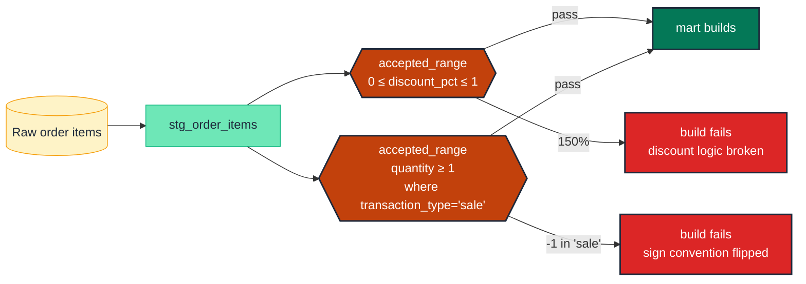

# Pin a measure's numeric bounds

> **Rule:** MS-01 · **Role:** measure · **Wang–Strong dimension:** Validity · **Cost class:** cheap

Most measures have a knowable bound: amounts are non-negative, percentages are between 0 and 1, counts are non-negative integers. A range test catches the row that violates the bound — a fat-finger zero, a sign-flip after a vendor migration, a discount that exceeded 100%.

## Symptoms

- A discount column has `discount_pct = 1.5` (150%) and downstream pricing calculations silently negative.
- A `quantity` column shows `-1` for "returns" but only in some rows; the convention silently flipped.
- A single `order_total = 999_999_999` row blows out the daily revenue metric.

## Pattern

> **Pattern name:** *Accepted Range*
>
> Pin the [min, max] band for every measure column. Treat the bound as a documentation contract: changing the bound is a deliberate review event, not silent acceptance.

## Mechanics

### 1. Apply `accepted_range` for the simple cases

```yaml
# models/marts/order_items.yml
models:
  - name: order_items
    columns:
      - name: discount_pct
        data_tests:
          - dbt_utils.accepted_range:
              min_value: 0
              max_value: 1
              inclusive: true
              config:
                severity: error
      - name: quantity
        data_tests:
          - dbt_utils.accepted_range:
              min_value: 1                # no zero-quantity line items
              inclusive: true
```

Either bound is optional — `min_value: 0` alone enforces a non-negative floor.

### 2. Scope the bound by a dimension when the rule is conditional

`quantity` is non-negative for sales but negative for refunds:

```yaml
- name: quantity
  data_tests:
    - dbt_utils.accepted_range:
        min_value: 0
        config:
          where: "transaction_type = 'sale'"
    - dbt_utils.accepted_range:
        max_value: 0
        config:
          where: "transaction_type = 'refund'"
```

### 3. Pair with the contract for precision

`FLOAT` (BigQuery `FLOAT64`) is the wrong type for money — `0.1 + 0.2 ≠ 0.3`. Declare `NUMERIC` with explicit precision in the contract:

```yaml
- name: amount
  data_type: numeric(38, 2)
  data_tests:
    - dbt_utils.accepted_range:
        min_value: 0
```

The contract pins the type at compile; the data test pins the value at runtime.

### 4. Use `expression_is_true` for cross-column ranges

If a measure depends on another column (`discount_amount <= subtotal`):

```yaml
- dbt_utils.expression_is_true:
    expression: "discount_amount <= subtotal"
```

### 5. Watch for NULL handling

`accepted_range` ignores NULLs (the comparison `NULL >= 0` is NULL, not FALSE). If NULL is also a failure, add `not_null` alongside:

```yaml
- not_null
- dbt_utils.accepted_range:
    min_value: 0
```

## Diagram



## Framework choice

| Option | Where it lives | When to pick |
|--------|----------------|--------------|
| `dbt_utils.accepted_range` | dbt-utils | **Default.** Single-column, fixed bounds. |
| `dbt_expectations.expect_column_values_to_be_between` | dbt_expectations | Need `group_by` (per-partition bounds) or `row_condition`. Maintenance flag applies. |
| `dbt_utils.expression_is_true` | dbt-utils | Bound depends on another column (`amount <= credit_limit`). |
| `numeric(p, s)` `data_type` in a contract | dbt core | Catches precision-loss type changes at parse time. **Always pair with a range test for content drift.** |
| `dbt_expectations.expect_column_max_to_be_between` / `_min_to_be_between` | dbt_expectations | Bound the aggregate, not every row — useful for "max revenue this period should be ≤ historical max + 20%". |

## When NOT to use

- **The measure has no knowable bound** (e.g., raw event counts that legitimately span 6 orders of magnitude). Use [`distribution-anomaly.md`](./distribution-anomaly.md) instead.
- **Pre-launch / low-data periods.** Any bound picked from a small sample is arbitrary — use `severity: warn` and tighten over time.
- **The column is semi-additive or non-additive.** A range test alone doesn't address the semantic-layer problem of "this column must not be SUMmed". See [`additivity-tag.md`](./additivity-tag.md).

## See also

- [`distribution-anomaly.md`](./distribution-anomaly.md) — when bounds vary with time and you need a learned band
- [`currency-pairing.md`](./currency-pairing.md) — ranges are meaningless if units drift
- [`../model/contracts.md`](../model/contracts.md) — the precision side of the defence in depth
