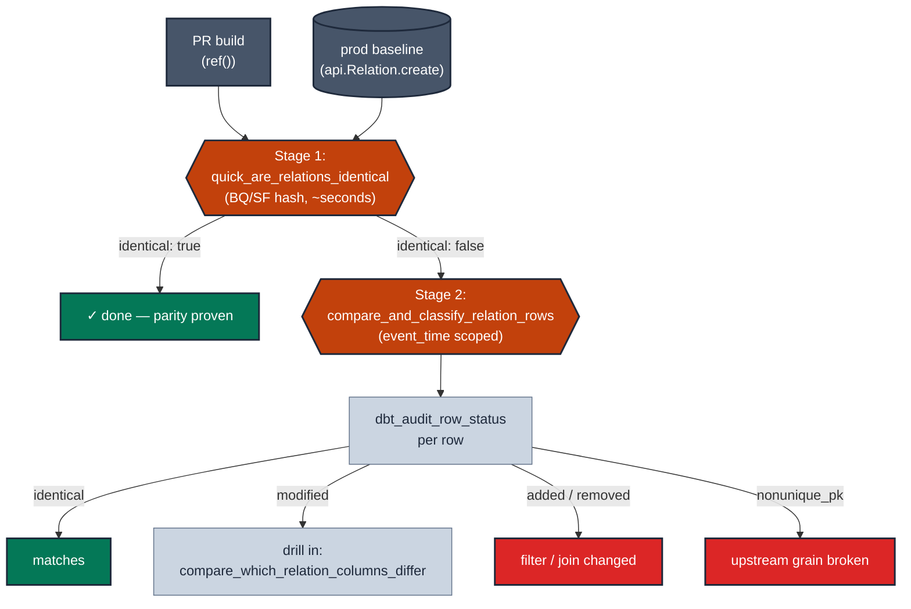

# MD-04 · Prove refactor parity with audit_helper

| Rule | Role | DAMA-UK6 | Wang–Strong | Cost class |
| --- | --- | --- | --- | --- |
| MD-04 | model-level | Accuracy | Accuracy | scan-bound |

You are refactoring a model — rewriting the SQL to be cleaner / faster / cheaper. The output is supposed to be identical. The question every reviewer asks: "how do you *know* it's identical?". `audit_helper`'s `compare_and_classify_relation_rows` is the answer.

## Symptoms

- You rewrote the SQL of a 12-CTE mart into 4 cleaner CTEs. Row counts match. But are the *values* identical?
- A vendor SQL migration moved 50 models from Redshift to BigQuery. How do you prove parity?
- A refactor PR has been open for 3 weeks because no one can confidently sign off that the output didn't change.

## Pattern

> **Pattern name:** *Hash-then-Classify Parity*
>
> Two-stage validation. First, run the cheap `quick_are_relations_identical` (BigQuery / Snowflake hash-based). If it returns `false`, run the expensive `compare_and_classify_relation_rows` to attribute the difference to `identical` / `modified` / `added` / `removed` / `nonunique_pk` rows.

## Mechanics

### 1. Stage 1: cheap hash check (BQ / Snowflake)

```sql
-- data-tests/parity_check_fct_orders_hash.sql
{{ config(severity='warn', tags=['parity']) }}

with check as (
    {{ audit_helper.quick_are_relations_identical(
        a_relation=ref('fct_orders'),
        b_relation=api.Relation.create(
            database='dbt_db', schema='analytics_prod', identifier='fct_orders'
        )
    ) }}
)
select * from check
where not are_tables_identical
```

If this test passes, you're done — the two tables are bag-equal (multiset-equal). No further investigation needed.

### 2. Stage 2: classify the differences

```sql
-- data-tests/parity_check_fct_orders_classify.sql
{{ config(severity='warn', tags=['parity']) }}

with audit as (
    {{ audit_helper.compare_and_classify_relation_rows(
        a_relation=ref('fct_orders'),
        b_relation=api.Relation.create(
            database='dbt_db', schema='analytics_prod', identifier='fct_orders'
        ),
        primary_key_columns=['order_id'],
        event_time='order_date',         -- bound to PR's date window vs prod
        sample_limit=20
    ) }}
)
select * from audit
where dbt_audit_row_status in ('added', 'removed', 'modified', 'nonunique_pk')
```

`dbt_audit_row_status` has five values:
- `identical` — same PK + same row content in both
- `modified` — same PK, different content (this is what hash-equality missed)
- `added` — PK only in PR build
- `removed` — PK only in prod
- `nonunique_pk` — same PK appears multiple times (silent broken invariant)

### 3. Use `event_time` to scope the window

Without `event_time`, comparing a 30-day PR build against a 5-year prod table produces millions of phantom `removed` rows. `event_time` runs an introspective query to find the overlap window and clips both sides:

```jinja
{{ audit_helper.compare_and_classify_relation_rows(
    a_relation=ref('fct_orders'),
    b_relation=api.Relation.create('dbt_db', 'analytics_prod', 'fct_orders'),
    primary_key_columns=['order_id'],
    event_time='order_date'           -- essential for CI scoping
) }}
```

### 4. Drill into the offending columns

Once `compare_and_classify_relation_rows` flags `modified` rows, find out *which columns* differ:

```sql
-- data-tests/parity_check_fct_orders_columns.sql
{{ audit_helper.compare_which_relation_columns_differ(
    a_relation=ref('fct_orders'),
    b_relation=api.Relation.create('dbt_db', 'analytics_prod', 'fct_orders'),
    primary_key_columns=['order_id'],
    event_time='order_date'
) }}
```

Returns one row per column with `has_difference: true | false`. Then for each column with differences, drill in with `compare_column_values`:

```jinja
{{ audit_helper.compare_column_values(
    a_query="select order_id, total_amount from " ~ ref('fct_orders'),
    b_query="select order_id, total_amount from dbt_db.analytics_prod.fct_orders",
    primary_key='order_id',
    column_to_compare='total_amount'
) }}
```

Output buckets rows into `perfect match` / `both null` / `null in a only` / `null in b only` / `missing from a` / `missing from b` / `values do not match` with counts and percentages.

### 5. The CI flow: defer to prod

```bash
# Pull production manifest
aws s3 cp s3://bucket/prod/manifest.json ./prod-manifest/manifest.json

# Build only modified + parents in PR schema; everything else defers to prod
dbt build --select state:modified+ --defer --state ./prod-manifest --target ci

# Run parity tests
dbt test --select tag:parity --target ci
```

The parity tests' `a_relation=ref('fct_orders')` resolves to the CI schema (the PR build); `b_relation` points at the production identifier explicitly.

### 6. Severity ramp

Start with `severity: warn` during the refactor — you'll see classifications you expect (some `modified` rows from a deliberate bug fix). Flip to `severity: error` once the diff matches your spec, then merge.

## Diagram



## Framework choice

| Option | Where it lives | When to pick |
|--------|----------------|--------------|
| `audit_helper.quick_are_relations_identical` | audit_helper | **Stage 1.** BQ + Snowflake only. Cheapest sanity check. |
| `audit_helper.compare_and_classify_relation_rows` | audit_helper | **Stage 2.** Distinguishes modified/added/removed/nonunique. Replaces legacy `compare_relations`. |
| `audit_helper.compare_which_relation_columns_differ` | audit_helper | Drill into which columns drive the `modified` status. |
| `audit_helper.compare_column_values` | audit_helper | Single-column quantification of disagreement. |
| `audit_helper.compare_row_counts` | audit_helper | Cheapest possible smoke test — wrap in a tolerance check. |
| `dbt_utils.equality` | dbt-utils | Pre-existing alternative; less informative output (no row classification). |

## When NOT to use

- **You don't have a baseline to compare against.** A green-field model has no "before"; parity is undefined.
- **The refactor explicitly changes the output.** Use a snapshot of "expected" output as the `b_relation` (e.g., a hand-built CSV seed of the expected rows after the change).
- **The model is too large to scan twice.** Use `event_time` to bound the comparison window or sample with a `where:` filter.
- **Adapter isn't BQ/Snowflake** for stage 1 — `quick_are_relations_identical` raises a compile error. Skip stage 1 and go straight to stage 2.

## See also

- [`MD-03-versioning-cutover.md`](./MD-03-versioning-cutover.md) — for breaking-change refactors that need a new version
- [`MD-01-grain-test.md`](./MD-01-grain-test.md) — the `nonunique_pk` classification surfaces grain failures
