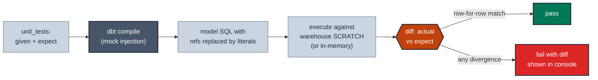

# MD-05 · Test branching SQL logic with unit tests

| Rule | Role | DAMA-UK6 | Wang–Strong | Cost class |
| --- | --- | --- | --- | --- |
| MD-05 | model-level | Accuracy | Accuracy | free (no warehouse scan) |

dbt 1.8 introduced **unit tests** — tests that assert "this SQL transformation, given specific mock inputs, produces this specific expected output." They are distinct from data tests, which check real data. Use unit tests when the SQL has branching logic (`CASE`, regex, window functions, complex joins) that can break on edge cases real data may not exercise.

## Symptoms

- A `CASE WHEN order_status IN (...) AND amount > 0 THEN ... ELSE ... END` that you can't reason about without running it.
- A regression that bucketed an edge case wrong (a return that should have become a refund, but the CASE arm fell through to "unknown") was caught three weeks after deploy.
- A regex extracts an email domain — works on `'user@gmail.com'`, fails on `'user@subdomain.example.com'`.

## Pattern

> **Pattern name:** *Logic Unit Test*
>
> For every branching arm in the model SQL, construct a minimal input row that exercises that arm and assert the expected output. Pin non-deterministic inputs (e.g., `current_date`) via `overrides`. Run with `dbt test --select test_type:unit`.

## Mechanics

### 1. Identify the branches

Read the model SQL. List the conditions that produce different outputs:

```sql
-- example: dim_customer_metrics.sql
case
    when status = 'churned' and last_order_date < current_date - interval 90 day then 'lost'
    when status = 'active' and total_orders > 0 then 'engaged'
    when status = 'active' and total_orders = 0 then 'dormant'
    else 'unknown'
end as customer_segment
```

Four branches: `lost`, `engaged`, `dormant`, `unknown`. Need four input rows + one for the `unknown` fall-through.

### 2. Write the unit test YAML

```yaml
# models/marts/dim_customer_metrics.yml
unit_tests:
  - name: test_segment_logic
    description: "Each branch of the segment CASE returns the expected value"
    model: dim_customer_metrics
    given:
      - input: ref('stg_customers')
        rows:
          - { customer_id: 1, status: 'churned', last_order_date: '2024-01-01', total_orders: 5 }
          - { customer_id: 2, status: 'active',  last_order_date: '2026-01-01', total_orders: 3 }
          - { customer_id: 3, status: 'active',  last_order_date: '2026-01-01', total_orders: 0 }
          - { customer_id: 4, status: 'pending', last_order_date: '2026-01-01', total_orders: 1 }
    overrides:
      macros:
        current_date: "'2026-05-27'::date"     # pin the "now"
    expect:
      rows:
        - { customer_id: 1, customer_segment: 'lost'     }
        - { customer_id: 2, customer_segment: 'engaged'  }
        - { customer_id: 3, customer_segment: 'dormant'  }
        - { customer_id: 4, customer_segment: 'unknown'  }
```

### 3. Mock every `ref()` / `source()` the model uses

If the model joins three other models, all three must be mocked in `given:`. The unit test runs the model SQL against the mocked inputs — no warehouse is touched.

### 4. Use `format: csv` or `format: sql` for wide inputs

For tables with many columns, inline YAML rows become unwieldy:

```yaml
given:
  - input: ref('stg_customers')
    format: csv
    rows: |
      customer_id,status,last_order_date,total_orders
      1,churned,2024-01-01,5
      2,active,2026-01-01,3
```

Or `format: sql`:

```yaml
given:
  - input: ref('stg_customers')
    format: sql
    rows: |
      select 1 as customer_id, 'churned' as status, date '2024-01-01' as last_order_date, 5 as total_orders
      union all
      select 2, 'active', date '2026-01-01', 3
```

### 5. Pin non-determinism

```yaml
overrides:
  macros:
    current_date: "'2026-05-27'::date"
  vars:
    my_threshold: 100
  env_vars:
    DBT_ENV: 'test'
```

Without this, `current_date` resolves to the warehouse session's clock — tests pass today and fail tomorrow.

### 6. Run unit tests

```bash
dbt test --select test_type:unit             # all unit tests
dbt test --select dim_customer_metrics,test_type:unit   # one model's unit tests
dbt build --select dim_customer_metrics      # builds + runs unit tests BEFORE the data test
```

In `dbt build`, unit tests run **before** the model materialises — a failure stops the build immediately.

## Diagram



## Framework choice

Unit tests are dbt-core 1.8+ only. There's no package alternative. The decision is just *whether* to write unit tests for this model.

| Approach | When |
|----------|------|
| YAML-only inline rows | **Default.** Up to ~10 columns × ~10 rows. |
| `format: csv` rows | Wide tables (many columns). |
| `format: sql` rows | When you need expressions in the mock (e.g., `now() - interval 1 day`). |
| Skip unit tests | Pure pass-through staging; no branching logic. |

## When NOT to use

- **Pure pass-through staging models** (`select * from source` with renames). No transformation logic to assert.
- **Models whose value is the *scale* of the join, not the logic.** A unit test with 3 mocked rows doesn't tell you whether a 10B-row warehouse join is correct. Use data tests on real data.
- **As a substitute for data tests.** Unit tests assert "the SQL is correct"; data tests assert "the data conforms". You usually want both.
- **Pre-dbt-1.8 projects.** Feature isn't available.

## See also

- [`MD-04-refactor-parity.md`](./MD-04-refactor-parity.md) — for refactors where the logic is unchanged but the SQL is rewritten
- [`../time/TM-SC-03-timezone-contract.md`](../time/TM-SC-03-timezone-contract.md) — uses unit tests to lock timezone bucketing
