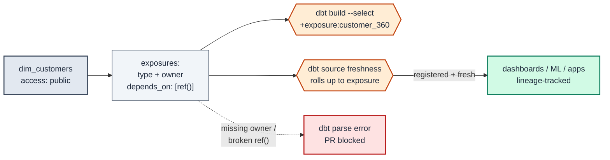

# MD-11 · Register downstream consumers via an exposure

| Rule | Role | DAMA-UK6 | Wang–Strong | Cost class |
| --- | --- | --- | --- | --- |
| MD-11 | model-level | Completeness | Interpretability + Completeness | free (compile-time) |

A published, consumer-facing model is consumed by things dbt cannot see — a Looker dashboard, a reverse-ETL sync, an ML feature pipeline. An **exposure** declares those consumers *inside* the dbt project so the lineage graph is complete: impact analysis reaches them, source freshness rolls up to them, and a failing test names the dashboard it breaks. Without it, the consumer is invisible to the DAG and the first warning anyone gets is the consumer breaking in production.

## Symptoms

- A column on `dim_customers` is refactored; CI is green because no dbt model `ref()`s it — but a Tableau dashboard bound to it silently goes blank.
- The data team can't answer "what breaks if we drop this mart?" because half the consumers live outside dbt.
- A stakeholder asks "is the data behind this dashboard fresh as of this morning?" and there is no machine-checkable answer.

## Pattern

> **Pattern name:** *Registered Consumer*
>
> Every consumer-facing model declares an `exposures:` entry naming the downstream artifact, its `type`, its `owner`, and its `depends_on` models. The exposure makes the external consumer a first-class node in the DAG, so `dbt build --select +exposure:*` rebuilds everything it needs and `dbt source freshness` propagates to it.

## Mechanics

### 1. Decide which consumers get an exposure

Declare an exposure for anything *outside* the dbt project that depends on a model:

- BI dashboards and reports (`type: dashboard` / `analysis`).
- Reverse-ETL / operational syncs and apps (`type: application`).
- ML feature pipelines and notebooks (`type: ml` / `notebook`).

**Don't** declare exposures for internal `ref()` dependencies — dbt already tracks those in the DAG. Exposures are for the edges that leave dbt.

### 2. Declare the exposure

```yaml
# models/marts/_marts__exposures.yml
exposures:
  - name: customer_360_dashboard
    label: "Customer 360 (Tableau)"
    type: dashboard                    # dashboard | notebook | analysis | ml | application
    maturity: high                     # high | medium | low
    url: https://tableau.internal/views/customer360
    description: >
      Executive customer health board. Refreshed nightly off dim_customers
      and fct_orders. Owned by Customer Success analytics.

    depends_on:
      - ref('dim_customers')
      - ref('fct_orders')

    owner:
      name: Dana Lee
      email: dana.lee@example.com
```

`name` must be unique and is a valid node selector; `type` and `owner.email` are **required** — dbt raises a parse error without them. `depends_on` is the load-bearing field: it is what wires the external consumer into the lineage graph.

### 3. Use the exposure in selection and lineage

```bash
# Build everything the dashboard depends on, and nothing else
dbt build --select +exposure:customer_360_dashboard

# What would I break if I changed dim_customers? (exposures now show up)
dbt ls --select dim_customers+ --resource-type exposure

# Roll source freshness up to the consumer
dbt source freshness && dbt build --select +exposure:customer_360_dashboard
```

The exposure renders in `dbt docs` lineage, so a reviewer sees the dashboard hanging off the mart and knows a breaking change has a named owner to notify.

### 4. Gate it in CI

```bash
# Fail the PR if a model an exposure depends on was modified without review
dbt ls --select state:modified+ --resource-type exposure --state ./prod-manifest
```

Pipe the result into a required reviewer / Slack notification so the exposure's `owner` is looped in before a breaking change to its upstream merges. Pair with [`MD-02-contracts.md`](./MD-02-contracts.md) (`contract.enforced: true`) on every model an exposure depends on — the exposure says *who* consumes it, the contract says *what shape* they rely on.

### 5. Keep `maturity` honest

`maturity: high` signals "production, treat changes as breaking"; `low` signals "experimental, churn expected". Reviewers use it to calibrate how much ceremony (versioning, deprecation windows) a change to the upstream model needs. See [`MD-03-versioning-cutover.md`](./MD-03-versioning-cutover.md).

## Diagram



## Framework choice

Exposures are dbt-core only — no package alternative exists. The choice is how much governance you wire around them.

| Adoption tier | What it gives you |
|---------------|-------------------|
| **No exposure** | External consumers are invisible to the DAG. Lowest friction, zero impact analysis. |
| **`exposures:` with `depends_on` + `owner`** | Consumers appear in lineage and `dbt docs`; a named owner to notify. Recommended baseline. |
| **+ `dbt build --select +exposure:*`** | One command rebuilds exactly what a consumer needs. |
| **+ `state:modified+ --resource-type exposure` in CI** | A change to an upstream model flags the affected exposure for owner review before merge. |
| **+ source `freshness:`** | "Is the dashboard's data fresh?" becomes a machine-checkable answer. See [`../time/TM-AU-01-freshness-source-and-model.md`](../time/TM-AU-01-freshness-source-and-model.md). |

## When NOT to use

- **Internal `ref()` dependencies between dbt models.** dbt already tracks these; an exposure would be redundant noise.
- **Throwaway / ad-hoc queries** with no durable downstream consumer — there is nothing stable to register.
- **Consumers you cannot name an owner for.** An exposure without a real `owner` is a lie that defeats the notification purpose; fix the ownership gap first.
- **Models still in heavy development** (`maturity: low` churn) where the consumer relationship hasn't stabilised — register it once the consumer is real.

## See also

- [`MD-02-contracts.md`](./MD-02-contracts.md) — exposures name *who* consumes; contracts lock *what shape* they rely on
- [`MD-03-versioning-cutover.md`](./MD-03-versioning-cutover.md) — when a registered consumer forces a versioned breaking change
- [`MD-12-semantic-model.md`](./MD-12-semantic-model.md) — the other "publish to consumers" declaration: metrics via the semantic layer
- [`../time/TM-AU-01-freshness-source-and-model.md`](../time/TM-AU-01-freshness-source-and-model.md) — freshness that rolls up to an exposure
