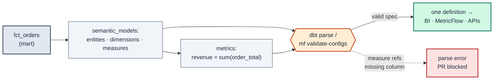

# MD-12 · Define metrics once via a semantic model

| Rule | Role | DAMA-UK6 | Wang–Strong | Cost class |
| --- | --- | --- | --- | --- |
| MD-12 | model-level | Consistency | Representational consistency + Concise representation | free (compile-time) |

When the same number — "revenue", "active customers", "average order value" — is hand-rolled in five dashboards, the five definitions drift and the CFO gets five answers. A **semantic model** declares a mart's entities, dimensions, and measures once, and metrics are defined on top of them, so every consumer of the semantic layer (BI tools, MetricFlow, the dbt Cloud APIs) computes the metric the same way. The definition is validated at parse time, before anyone queries it.

## Symptoms

- Two dashboards both show "revenue" and disagree by 3% — one includes tax, the other doesn't, and nobody can say which is "correct".
- A new analyst re-implements `active_customers` with a subtly different filter; it ships because no test compares it to the canonical definition.
- "Average order value" is `SUM(amount)/COUNT(*)` in one report and `AVG(amount)` in another — both look plausible, neither is governed.

## Pattern

> **Pattern name:** *Single Metric Definition*
>
> A mart exposes a `semantic_models:` entry declaring its `entities`, `dimensions`, and `measures`; `metrics:` are defined as expressions over those measures. The semantic layer becomes the one place a metric is defined, and MetricFlow guarantees every query against it aggregates consistently.

## Mechanics

### 1. Pick the marts that back metrics

Declare a semantic model for marts that are **queried as facts** through the semantic layer:

- Fact / transactional marts (`fct_orders`, `fct_sessions`) that back KPIs.
- Marts whose numbers are reported in more than one place.

**Don't** declare semantic models for `stg_*` / `int_*` models, or marts that are only ever joined upstream — the overhead has no payoff until the model is a metric source.

### 2. Declare the semantic model

```yaml
# models/marts/_marts__semantic_models.yml
semantic_models:
  - name: orders
    description: "Order fact — one row per order."
    model: ref('fct_orders')
    defaults:
      agg_time_dimension: ordered_at

    entities:
      - name: order
        type: primary
        expr: order_id
      - name: customer
        type: foreign
        expr: customer_id

    dimensions:
      - name: ordered_at
        type: time
        type_params:
          time_granularity: day
      - name: status
        type: categorical

    measures:
      - name: order_total
        description: "Gross order amount, tax inclusive."
        agg: sum
        expr: amount
      - name: order_count
        agg: count
        expr: order_id
```

`entities` (primary/foreign/natural) are the join keys; `dimensions` are the `GROUP BY` axes; `measures` are the aggregatable numbers with their `agg` baked in. The `agg_time_dimension` anchors time-based aggregation.

### 3. Define metrics over the measures

```yaml
# models/marts/_marts__metrics.yml
metrics:
  - name: revenue
    label: "Revenue"
    type: simple
    type_params:
      measure: order_total            # references the measure above — defined ONCE

  - name: average_order_value
    label: "Average Order Value"
    type: ratio
    type_params:
      numerator: order_total
      denominator: order_count
```

`average_order_value` is now governed: it is `revenue / order_count` by construction, not whatever each analyst typed.

### 4. Validate at parse time

```bash
dbt parse                              # MetricFlow validates the semantic graph
mf validate-configs                    # explicit semantic-layer validation
mf query --metrics revenue --group-by metric_time__month   # smoke-test a metric
```

`dbt parse` fails if a measure references a column the model doesn't produce, if an entity `expr` is missing, or if a metric points at a non-existent measure — the definition can't drift away from the underlying model silently.

### 5. Pair measures with their additivity contract

A semantic model is where additivity lives: a `sum` measure is additive across every dimension, but a snapshot balance is semi-additive (not summable across time). Tag it so consumers don't sum what can't be summed — see [`../measure/MS-02-additivity-tag.md`](../measure/MS-02-additivity-tag.md), the column-level companion to this whole-model declaration.

## Diagram



## Framework choice

Semantic models and metrics are dbt-core + MetricFlow only — no package alternative. The choice is how much of the metric estate you bring under the semantic layer.

| Adoption tier | What it gives you |
|---------------|-------------------|
| **No semantic model** | Metrics live in BI tools / ad-hoc SQL; definitions drift per consumer. Lowest friction, highest inconsistency. |
| **`semantic_models:` (entities + dimensions + measures)** | Aggregation and grain declared once and parse-validated. Recommended baseline for fact marts. |
| **+ `metrics:`** | Named, reusable metric definitions queried identically everywhere. |
| **+ `mf validate-configs` in CI** | A metric pointing at a deleted measure/column fails the build, not the dashboard. |
| **+ saved queries / exports** | Pre-defined metric+dimension bundles materialised for downstream consumers. |

## When NOT to use

- **Staging / intermediate models.** The semantic layer sits on top of marts; semantic models on `stg_*` are premature.
- **Marts no metric is computed from** — a pure lookup / dimension table that is only ever joined has nothing to aggregate.
- **One-off / exploratory numbers** with no second consumer. The governance only pays off when a metric is defined-once-used-many.
- **Projects not using the dbt Semantic Layer / MetricFlow at all.** Without a consuming surface, the YAML is overhead with no enforcement payoff — reach for [`MS-01-numeric-range.md`](../measure/MS-01-numeric-range.md)-style content tests instead.

## See also

- [`../measure/MS-02-additivity-tag.md`](../measure/MS-02-additivity-tag.md) — the column-level additivity contract a measure carries
- [`MD-11-exposure.md`](./MD-11-exposure.md) — the other "publish to consumers" declaration: registering downstream artifacts
- [`MD-02-contracts.md`](./MD-02-contracts.md) — lock the shape of the mart the semantic model sits on
- [`MD-01-grain-test.md`](./MD-01-grain-test.md) — the grain the semantic model's `entities` must match
