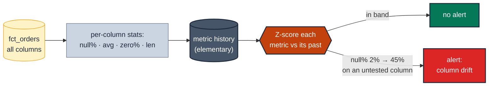

# MD-09 · Watch every column with automated monitors

> **Rule:** MD-09 · **Role:** model-level · **DAMA-UK6:** Completeness + Accuracy · **Wang–Strong:** Completeness + Accuracy · **Cost class:** history-bound

Hand-written tests defend the columns you thought about. The ones you didn't — a payload field that quietly went 40% null, an `amount` whose average halved after a unit change — drift unwatched. Elementary's column-anomaly tests apply a standard battery of statistical monitors (null rate, min/max, average, zero-count, string length…) across **all or a selected set** of a model's columns, learning each metric's normal range and firing on deviation. It's the safety net beneath the per-column rules, not a replacement for them.

---

## Symptoms

- A column nobody wrote a test for slid from ~2% null to ~45% null over a fortnight; every per-column rule passed because none covered it.
- An upstream unit change halved a measure's average; the values are still "valid" (positive, in range), so [`numeric-range.md`](./numeric-range.md) never fired.
- A free-text field's average length tripled after a form change, breaking a downstream truncation — no deterministic test existed for "length looks normal".

## Pattern

> **Pattern name:** *Table-Wide Monitor Battery*
>
> Run a fixed set of column-level statistics (null %, zero %, min, max, average, stdev, string length) on every column each run, store the history, and Z-score each metric against its own past. One config line covers a whole table; the engine finds the drift you didn't predict.

## Mechanics

### 1. Elementary is already installed (prod-only)

Reuse the setup from [`volume-anomaly.md`](./volume-anomaly.md).

### 2. Cover the whole table with `all_columns_anomalies`

```yaml
# models/marts/fct_orders.yml
models:
  - name: fct_orders
    config:
      elementary:
        timestamp_column: ordered_at
    data_tests:
      - elementary.all_columns_anomalies:
          arguments:
            column_anomalies:
              - null_count
              - null_percent
              - average
              - zero_count
            exclude_prefix: _fivetran     # skip plumbing columns
            training_period: { period: day, count: 28 }
            anomaly_sensitivity: 3
          config:
            tags: [elementary, anomaly]
            severity: warn
```

One block monitors every column for the listed metrics. `exclude_prefix` / `exclude_regexp` keep plumbing columns out of the battery.

### 3. Pin a single high-value column with `column_anomalies`

When one column deserves tighter, named monitoring (a headline measure, a critical key's null rate), use the single-column form so its failure reads clearly in the report:

```yaml
    columns:
      - name: order_total
        data_tests:
          - elementary.column_anomalies:
              arguments:
                column_anomalies: [average, min, max, standard_deviation]
                anomaly_sensitivity: 2.5    # stricter on the headline measure
```

### 4. Let it complement, not replace, the deterministic rules

The monitor battery is probabilistic and prod-only. Keep the cheap deterministic guards (`not_null`, `accepted_range`, `accepted_values`) on the columns whose contract you actually know — they run everywhere, fail fast, and give an exact reason. MD-09 catches the *unforeseen*; the per-column rules encode the *known*.

### 5. Control cost on BigQuery

Each metric scans the detection window. Match `timestamp_column` to the partition key, prune the column list to what matters, and keep `elementary_full_refresh: false`.

## Diagram



## Framework choice

| Option | Where it lives | When to pick |
|--------|----------------|--------------|
| `not_null` / `accepted_range` / `accepted_values` | dbt core / dbt-utils | **First, always**, on columns whose contract you know. Deterministic, runs in every env, exact reason. |
| `elementary.column_anomalies` | elementary | One named high-value column needs learned-band statistical monitoring. |
| `elementary.all_columns_anomalies` | elementary | **This rule.** Table-wide safety net across columns you didn't hand-write rules for. |
| `dbt_expectations` distributional tests | dbt_expectations | (unmaintained — prefer Elementary for new anomaly work). |

## When NOT to use

- **As a substitute for known contracts.** If you know `status` is an enum, write `accepted_values` — don't outsource a known rule to a probabilistic monitor that only runs in prod.
- **Narrow tables fully covered by per-column rules.** The battery adds history cost for no new coverage.
- **High-variance early-stage tables.** Every metric looks anomalous; the noise drowns the signal until history stabilises.
- **Dev / CI.** Elementary is prod-only here.

## See also

- [`../measure/distribution-anomaly.md`](../measure/distribution-anomaly.md) — the single-measure distribution version (MS-05)
- [`../dimension/dimension-anomalies.md`](../dimension/dimension-anomalies.md) — per-dimension count anomalies (DM-05)
- [`row-count-band.md`](./row-count-band.md) / [`volume-anomaly.md`](./volume-anomaly.md) — table-grain volume guards (MD-06 / MD-07)
