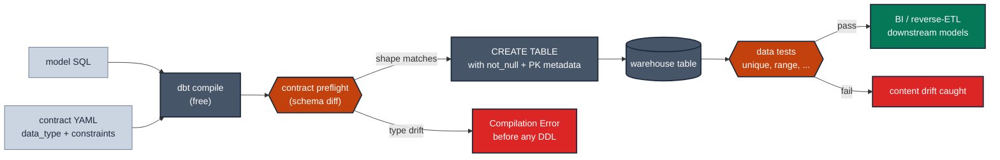

# Lock the model's schema shape via contract

> **Rule:** MD-02 · **Role:** model-level · **DAMA-UK6:** Validity · **Wang–Strong:** Believability + Representational consistency · **Cost class:** free (compile-time)

A model contract declares the column names, data types, and constraints of a model — and enforces them at parse/compile time, before any DDL. It catches the silent type-drift bug that data tests can't see, because data tests only run *after* the schema has already drifted.

## Symptoms

- A staging model is rewritten to cast `id` as `STRING` instead of `INT64`. Downstream marts still build. The BI tool's cached metadata says `INT64`. Reports break a week later.
- A vendor changes the upstream `amount` from `NUMERIC(10,2)` to `FLOAT64`. Sums look approximately right but reconciliation is off by pennies.
- A column is silently dropped from a model; downstream `ref('model').col` fails at compile time — but the PR that dropped it merged.

## Pattern

> **Pattern name:** *Shape Contract*
>
> Apply `contract.enforced: true` on every public-facing model. Declare `data_type` and `constraints` for every column. The contract's preflight check fails the build at parse time if any column's name or type drifts.

## Mechanics

### 1. Decide which models get contracts

Apply contracts to:

- Models declared in an `exposures:` block (downstream BI / reverse-ETL).
- Public models (`access: public`) or cross-team `protected`.
- Models that downstream consumers `ref()` from another dbt project (mesh).
- Models you are about to version.

**Don't apply contracts** to internal `stg_*` / `int_*` models — overkill, slows iteration.

### 2. Enable enforcement and declare column types

```yaml
# models/marts/customers.yml
models:
  - name: customers
    config:
      materialized: table
      contract:
        enforced: true
    columns:
      - name: customer_id
        data_type: int64
        constraints:
          - type: not_null              # Enforced (REQUIRED mode on BQ)
          - type: primary_key
            warn_unenforced: false       # Informational on BQ; suppress log noise
        data_tests:
          - unique
          - not_null
      - name: email
        data_type: string
        constraints:
          - type: not_null
      - name: lifetime_value
        data_type: numeric(38, 2)        # Explicit precision; don't trust default
      - name: created_at
        data_type: timestamp             # NOT datetime — UTC semantics
```

### 3. Understand the BigQuery enforcement matrix

| Constraint | BigQuery enforcement |
|-----------|----------------------|
| `not_null` | **Enforced** as `REQUIRED` column mode |
| `primary_key` | Definable, **NOT enforced** (informational, used by query planner) |
| `foreign_key` | Definable, **NOT enforced** |
| `unique` | **NOT DEFINABLE** — will error |
| `check` | **NOT SUPPORTED** — emits warning |

**Consequence:** on BigQuery, the contract catches schema drift but **does not catch content duplicates**. Always pair `primary_key` constraint with `unique` data test.

### 4. Explicit precision for `NUMERIC`

```yaml
- name: amount
  data_type: numeric(38, 2)    # NOT just "numeric" — default is (38, 9)
```

The default `NUMERIC` on BQ is `(38, 9)`, but explicit precision protects against accidental scale drift. See [`../entity/type-stable-join.md`](../entity/type-stable-join.md).

### 5. Suppress the "informational" warning flood

By default, every non-enforced constraint emits a warning per run. On a project with many contracted models, this is noise. Set `warn_unenforced: false` once you've consciously accepted that PK/FK are informational on BQ.

### 6. Wire into CI to detect breaking contract changes

```bash
dbt build --select state:modified.contract --state ./prod-manifest --warn-error
```

This selector fires when any contract column's `data_type` changes vs production. Couple with `WARN_ERROR_OPTIONS` to make it a hard build failure. See [`versioning-cutover.md`](./versioning-cutover.md) for how to handle the failure (bump a version).

## Diagram



## Framework choice

Contracts are dbt-core only — no package alternative exists. The choice is whether to use them at all and how aggressively.

| Adoption tier | What it gives you |
|---------------|-------------------|
| **No contract** | YAML documents columns; nothing enforced. Lowest friction, lowest protection. |
| **`enforced: true` with `data_type` only** | Parse-time schema drift detection. Recommended baseline for public models. |
| **+ `not_null` constraints** | DDL-level NOT NULL on BQ; runtime row insert fails on NULL. |
| **+ `primary_key` / `foreign_key` constraints** | Documents intent at DDL; informational on BQ. Use `warn_unenforced: false`. |
| **+ Versioning** | Ready for breaking-change governance. See [`versioning-cutover.md`](./versioning-cutover.md). |

## When NOT to use

- **Internal staging / intermediate models.** YAML maintenance overhead exceeds the protection.
- **Models in heavy active development.** Contracts create friction during exploration; add them once the shape stabilises.
- **`materialized_view` or `ephemeral`.** Contracts are not supported on these materializations.
- **Python models.** Contracts are SQL-only.
- **Models with `WITH RECURSIVE`** on BigQuery — documented limitation.

## See also

- [`versioning-cutover.md`](./versioning-cutover.md) — how to evolve a contract safely
- [`../entity/type-stable-join.md`](../entity/type-stable-join.md) — the cross-model type-stability case
- [`../time/timezone-contract.md`](../time/timezone-contract.md) — TIMESTAMP vs DATETIME contract
