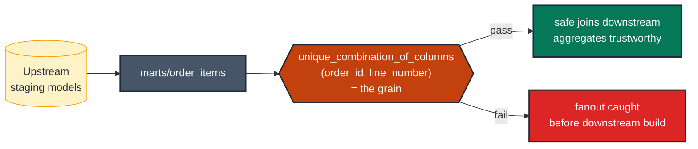

# The one test every model must have: the grain test

> **Role:** model-level · **Wang–Strong dimension:** Uniqueness · **Cost class:** scan-bound

Every dbt model has a **grain** — the tuple of columns whose combination uniquely identifies a row. If the grain breaks, every downstream join fans out and every aggregate is wrong. This is the single most important test in the entire taxonomy.

## Smell

- A reviewer asks "what's the grain of this model?" and three engineers give three different answers.
- A downstream join unexpectedly fans out and nobody knows where the duplicate came from.
- Aggregates double after an upstream backfill.

## Pattern

> **Pattern name:** *Grain Test*
>
> Every dbt model has **exactly one** model-level test that names its grain. The test is `dbt_utils.unique_combination_of_columns`. The columns named in the test are the canonical definition of "what one row of this model means".

## Mechanics

### 1. Name the grain in the model description

The grain is documentation first, test second. Future engineers reading the YAML should see the grain before reading the SQL.

```yaml
# models/marts/order_items.yml
models:
  - name: order_items
    description: |
      One row per (order_id, line_number). Grain is asserted by the test below.
      A duplicate (order_id, line_number) signals an upstream double-snapshot
      or a deduplication step that didn't deduplicate.
```

### 2. Apply the grain test at the model level

```yaml
    data_tests:
      - dbt_utils.unique_combination_of_columns:
          combination_of_columns:
            - order_id
            - line_number
```

For single-column grains, use `unique` at the column level instead — there's no benefit to wrapping a one-element list:

```yaml
    columns:
      - name: order_id
        data_tests:
          - unique
          - not_null
```

### 3. Pair with `not_null` on every grain component

```yaml
    columns:
      - name: order_id
        data_tests: [not_null]
      - name: line_number
        data_tests: [not_null]
```

A NULL in a grain column makes the row partially anonymous. The compound-uniqueness test still passes (NULLs group together in GROUP BY), but the row's identity is broken downstream.

### 4. For time-component grains, ensure the time precision matches the intent

A grain of `(user_id, event_at)` where `event_at` is `TIMESTAMP` at microsecond precision is effectively all-unique by accident. If the intended grain is daily, truncate at the staging layer:

```sql
select user_id, date_trunc(event_at, day) as event_date, ...
```

…and put the grain test on `(user_id, event_date)`.

### 5. Scope expensive grain checks

On a 10 B-row event table the grain test is the most expensive test in the project. Scope to recent partition:

```yaml
- dbt_utils.unique_combination_of_columns:
    combination_of_columns: [user_id, event_date]
    config:
      where: "event_date >= dateadd(day, -7, current_date)"
```

Run an unscoped variant nightly with `severity: warn`.

### 6. The grain test is also the model's contract

If you adopt model contracts, the grain test pairs with a `primary_key` constraint on the same columns. On BigQuery the constraint is informational (not enforced); the test is what actually validates. See [`contracts.md`](./contracts.md).

```yaml
config:
  contract:
    enforced: true
constraints:
  - type: primary_key
    columns: [order_id, line_number]
    warn_unenforced: false
data_tests:
  - dbt_utils.unique_combination_of_columns:
      combination_of_columns: [order_id, line_number]
```

## Diagram



## Framework choice

| Option | Where it lives | When to pick |
|--------|----------------|--------------|
| `dbt_utils.unique_combination_of_columns` | dbt-utils | **Default for composite-key grains.** |
| `unique` + `not_null` at column level | dbt core | **Default for single-column grains.** Cheaper, idiomatic. |
| `dbt_expectations.expect_compound_columns_to_be_unique` | dbt_expectations | Need `row_condition` (e.g., grain check only when `is_current = true`). Maintenance flag applies. |
| `primary_key` contract constraint | dbt core | Pair with the data test. Informational on BigQuery. |

## When NOT to use

- **Staging models that are passthrough renames over a source already validated upstream.** Test at the next layer.
- **Append-only event tables where transient duplicates are expected mid-run.** Test the deduplicated mart.
- **Ephemeral materializations.** No materialised table to GROUP BY against.

> ⚠️ **There are very few legitimate reasons not to have a grain test.** Most models that lack one have an unclaimed grain — which is a bug, not a design choice.

## See also

- [`../entity/compound-grain.md`](../entity/compound-grain.md) — entity-side framing of the same test
- [`../entity/unique-key.md`](../entity/unique-key.md) — single-column variant
- [`contracts.md`](./contracts.md) — the constraint side of the same idea
