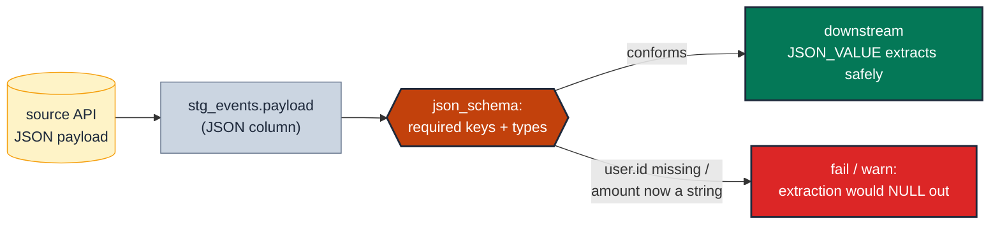

# MD-10 · Validate a JSON column against an expected shape

> **Rule:** MD-10 · **Role:** model-level · **DAMA-UK6:** Validity · **Wang–Strong:** Believability + Interpretability · **Cost class:** cheap

A `data_type` contract can pin a column as `JSON` or `STRING` — but it stops at the cell boundary. It cannot assert that the JSON *inside* still has a `user.id` integer and a `currency` string. When an upstream API drops a key or retypes a nested field, the column type is unchanged and every contract passes while downstream `JSON_VALUE(...)` extractions quietly return NULL. Elementary's `json_schema` test validates each value against a declared JSON schema so the inside of the column is contracted too.

---

## Symptoms

- An events payload dropped its nested `user.id` field; `JSON_VALUE(payload, '$.user.id')` started returning NULL and a downstream join silently lost half its rows.
- A partner API changed `amount` inside the JSON from a number to a quoted string; a `CAST(... AS NUMERIC)` began coercing or erroring.
- A new enum value appeared inside a JSON `status` key that no downstream `CASE` handles, so events fell through to an "unknown" bucket.

## Pattern

> **Pattern name:** *Inside-the-Cell Contract*
>
> Declare the JSON schema the column's values must satisfy (required keys, types, optionally enums) and validate every row against it. The dbt contract guards the column's type; this guards the structure within it.

## Mechanics

### 1. Identify the JSON (or stringified-JSON) column

On BigQuery the column may be native `JSON` or a `STRING` holding serialised JSON. Both are testable; note which, because the extraction functions differ.

### 2. Declare the expected schema and test it

```yaml
# models/staging/stg_events.yml
models:
  - name: stg_events
    columns:
      - name: payload
        data_type: json                 # the contract pins the cell type…
        data_tests:
          - elementary.json_schema:      # …this pins what's inside it
              arguments:
                schema:
                  type: object
                  required: [event_type, user]
                  properties:
                    event_type: { type: string }
                    user:
                      type: object
                      required: [id]
                      properties:
                        id: { type: integer }
                    currency: { type: string }
              config:
                tags: [elementary, json]
                severity: warn
```

The test flags any row whose `payload` is missing a required key or whose nested type doesn't match.

### 3. Scope and ramp like any row-level test

This is a **cheap**, row-level validity check (no metrics history), so it runs in CI as well as prod. Start `severity: warn` while you confirm the schema matches reality, scope with a `where:` to a recent partition on huge event tables, and `store_failures_as: view` to capture the offending payloads for the post-mortem.

### 4. Pair with the column contract, don't replace it

Keep the `data_type: json` (or `string`) contract — it catches the column being dropped or retyped wholesale at parse time. `json_schema` catches the subtler "type held, structure moved" case at runtime. Defence in depth, same as [`contracts.md`](./contracts.md) describes for the rest of the model.

## Diagram



## Framework choice

| Option | Where it lives | When to pick |
|--------|----------------|--------------|
| `contract` `data_type: json` | dbt core | **Always** — pins the *cell* type at parse time. Necessary but not sufficient. See [`contracts.md`](./contracts.md). |
| `elementary.json_schema` | elementary | **This rule.** Validate required keys / nested types *inside* the JSON. Cheap, row-level, runs everywhere. |
| `dbt_utils.expression_is_true` on `JSON_VALUE(...)` | dbt-utils | A one-off invariant on a single extracted key when a full schema is overkill. |
| `elementary.schema_changes` | elementary | The *relation's* columns drifting, not the JSON inside one column (MD-08). |

## When NOT to use

- **The column isn't semi-structured.** A plain scalar is already covered by `data_type` + the relevant role suite.
- **A single key is all you care about.** Extract it and test with `expression_is_true` rather than maintaining a whole JSON schema.
- **The payload is intentionally schemaless** (an arbitrary metadata bag with no contract). There's nothing stable to assert; validate the specific keys you extract downstream instead.

## See also

- [`contracts.md`](./contracts.md) — the cell-level type contract this sits inside (MD-02)
- [`schema-changes.md`](./schema-changes.md) — drift of the *relation's* columns rather than within one (MD-08)
- [`../dimension/accepted-values.md`](../dimension/accepted-values.md) — enum validation once a JSON key is extracted to a column (DM-01)
