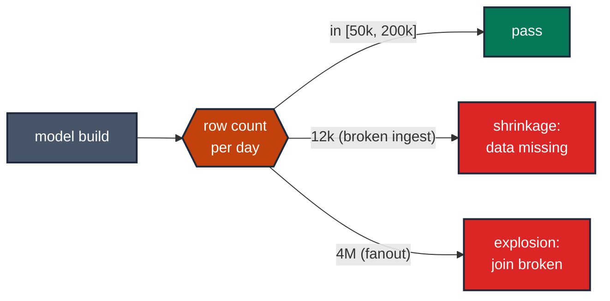

# MD-06 · Bound the model's row count

> **Rule:** MD-06 · **Role:** model-level · **DAMA-UK6:** Accuracy + Completeness · **Wang–Strong:** Accuracy + Completeness · **Cost class:** cheap

The model is supposed to have between 50,000 and 5,000,000 rows per day. The bound catches both kinds of failure: shrinkage (broken ingest, an overly-strict filter) and explosion (fanout from a bad join).

## Symptoms

- A mart that's "always around 100k rows" has 18k rows today after a partition got dropped upstream.
- An aggregation table 30× its usual size — a fanout slipped past the grain test.
- A daily metric reads "12 active users" because most of the data didn't land.

## Pattern

> **Pattern name:** *Row Count Band*
>
> Pin `[min_rows, max_rows]` on every materialised table whose volume is roughly stable. Use a generous band initially (`severity: warn`) and tighten over time. Pair with `volume-anomaly` once history accumulates for a learned variant.

## Mechanics

### 1. Establish the band from history

Query the daily row count for the last 30-90 days, pick floor and ceiling that leave headroom:

```sql
select date_trunc(loaded_at, day) as day, count(*) as n
from {{ ref('events') }}
group by day
order by day desc
limit 90;
```

A model with `n ∈ [80k, 120k]` gets band `[50k, 200k]` — comfortable while still catching catastrophe.

### 2. Apply `expect_table_row_count_to_be_between`

```yaml
# models/marts/events.yml
models:
  - name: events
    data_tests:
      - dbt_expectations.expect_table_row_count_to_be_between:
          min_value: 50000
          max_value: 200000
          config:
            severity: warn   # while calibrating; flip to error once stable
```

### 3. Scope to a recent partition for cost AND accuracy

Counting an entire fact table that grows over time gives a moving target. Scope to one day:

```yaml
- dbt_expectations.expect_table_row_count_to_be_between:
    min_value: 50000
    max_value: 200000
    row_condition: "event_date = current_date - interval 1 day"
```

This way the band is "per day", not "total ever".

### 4. Group by partition for multi-tenant

If the model is multi-tenant, a global band misses single-tenant failures. Use `group_by`:

```yaml
- dbt_expectations.expect_table_row_count_to_be_between:
    min_value: 100
    max_value: 100000
    group_by: [tenant_id]
    row_condition: "event_date = current_date - interval 1 day"
```

Each tenant's count is checked against the band; one tenant going dark fires.

### 5. Pair with `dbt_utils.equal_rowcount` for between-model parity

When two models should have a known ratio of row counts:

```yaml
data_tests:
  - dbt_utils.equal_rowcount:
      compare_model: ref('stg_events')        # 1:1 to staging
```

Or for known multipliers:

```yaml
- dbt_expectations.expect_table_row_count_to_equal_other_table_times_factor:
    compare_model: ref('events')
    factor: 7         # weekly rollup = 7× daily
```

### 6. Graduate to anomaly detection once stable

Fixed bands are calibration toil. Once you have ~30 days of history, switch to `elementary.volume_anomalies`:

```yaml
- elementary.volume_anomalies:
    arguments:
      timestamp_column: event_date
      time_bucket: { period: day, count: 1 }
      anomaly_sensitivity: 3
```

See [`volume-anomaly.md`](./volume-anomaly.md).

## Diagram



## Framework choice

| Option | Where it lives | When to pick |
|--------|----------------|--------------|
| `dbt_expectations.expect_table_row_count_to_be_between` | dbt_expectations | **Default for fixed bands.** Maintenance flag applies. |
| `dbt_utils.equal_rowcount` | dbt-utils | Between-model parity. |
| `dbt_utils.fewer_rows_than` | dbt-utils | Strict-subset assertion. |
| `elementary.volume_anomalies` | elementary | **Preferred over fixed bands** once history accumulates. Learned band. |
| Singular test with `COUNT(*) BETWEEN ...` | dbt core | When you don't want the dbt_expectations dependency. |

## When NOT to use

- **Brand-new models** with no history — any band is arbitrary. Use `severity: warn` for the first 30 days.
- **Models with high-variance growth** (early-stage product, marketing-burst-driven). A fixed band will fire constantly; jump straight to anomaly detection.
- **Daily snapshot tables** where the row count is *supposed* to grow monotonically. Use a separate test for the day-over-day delta instead of a fixed total.

## See also

- [`volume-anomaly.md`](./volume-anomaly.md) — learned-band variant
- [`grain-test.md`](./grain-test.md) — fanout cause, of which explosion is the symptom
- [`../dimension/dimension-anomalies.md`](../dimension/dimension-anomalies.md) — per-dimension version
