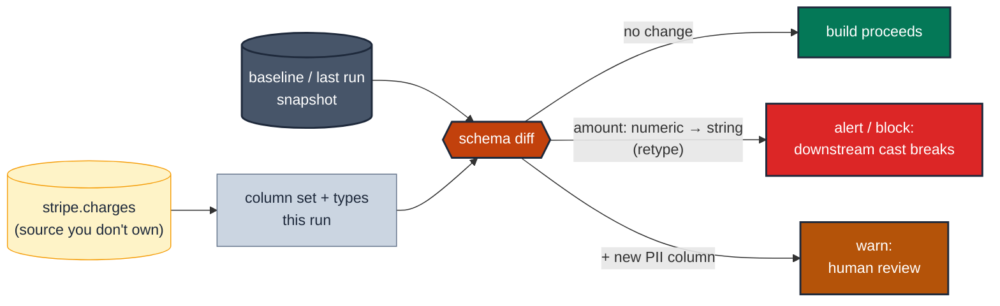

# Detect schema drift on sources you don't own

> **Rule:** MD-08 · **Role:** model-level · **Wang–Strong dimension:** Validity · **Cost class:** history-bound

A dbt `contract` ([`contracts.md`](./contracts.md)) pins the shape of a model **you build** — it fails at parse time if one of *your* columns drifts. It cannot see a column that an **upstream source you don't own** added, dropped, or retyped, because that change happens outside your DAG's compiled SQL. Elementary's schema-change tests watch a source (or model) relation's actual column set and types over time and fire when they move.

---

## Symptoms

- A SaaS export silently renamed `customer_email` to `email`; your staging model kept compiling (it `select *`s) but the downstream `email` column is now all NULL and nobody noticed for a week.
- An upstream team changed an `amount` column from `NUMERIC` to `STRING`; your casts started coercing and a measure quietly went to zero.
- A new column appeared in a source table carrying PII you're now inadvertently materialising into a downstream mart.

## Pattern

> **Pattern name:** *Source Schema Watch*
>
> Snapshot the column set and data types of a relation you don't control, store the snapshot, and alert when columns are added, removed, or retyped versus the last run (drift) or versus a declared baseline (contract-style). The parse-time contract guards your output; this guards your input.

## Mechanics

### 1. Elementary is already installed (prod-only)

Reuse the Elementary setup from [`volume-anomaly.md`](./volume-anomaly.md). These tests live on **sources**, which is where un-owned drift enters the project.

### 2. Watch for drift vs the previous run with `schema_changes`

```yaml
# models/staging/_sources.yml
sources:
  - name: stripe
    tables:
      - name: charges
        data_tests:
          - elementary.schema_changes:
              config:
                tags: [elementary, schema]
                severity: warn
```

`schema_changes` compares the relation's current columns/types against the previous run's snapshot and flags any add / drop / type-change. Use it when you have no fixed expectation — you just want to know *when* the shape moved.

### 3. Pin a contract-style baseline with `schema_changes_from_baseline`

When you *do* have an expectation, enumerate the columns and let Elementary fail on any deviation. `enforce_types: true` makes it a type contract too:

```yaml
      - name: charges
        columns:
          - name: id
            data_type: string
          - name: amount
            data_type: numeric
          - name: currency
            data_type: string
        data_tests:
          - elementary.schema_changes_from_baseline:
              arguments:
                enforce_types: true
              config:
                fail_on_added: true     # a surprise new column is also a signal
                severity: warn
```

This is the closest thing to a dbt contract for a relation you don't build — it asserts the input shape rather than the output shape.

### 4. Route severity by blast radius

A **dropped or retyped** column that a downstream model references is a `blocker` — it will corrupt or null a result. A **newly added** column is usually `warn` (often benign, occasionally a PII or cost surprise worth a human glance).

## Diagram



## Framework choice

| Option | Where it lives | When to pick |
|--------|----------------|--------------|
| `contract.enforced: true` | dbt core | For models **you build** — parse-time, free, no history. Always prefer where it applies. See [`contracts.md`](./contracts.md). |
| `elementary.schema_changes` | elementary | A source you don't own; alert on *any* drift vs the last run. |
| `elementary.schema_changes_from_baseline` | elementary | A source you don't own but *do* have a fixed expectation for; `enforce_types: true` makes it a type contract. |

## When NOT to use

- **The relation is a model you build.** Use a real dbt `contract` — it's free, parse-time, and doesn't need a metrics history.
- **A genuinely free-form landing table** where columns are *expected* to churn every load (a raw event sink). The test would fire constantly; validate downstream after you've imposed a shape.
- **Dev / CI.** Elementary is prod-only here, and a source's schema isn't exercised against seeds.

## See also

- [`contracts.md`](./contracts.md) — the parse-time contract for models you own (MD-02)
- [`json-schema.md`](./json-schema.md) — drift *inside* a single semi-structured column (MD-10)
- [`../entity/type-stable-join.md`](../entity/type-stable-join.md) — type drift on a specific join key
