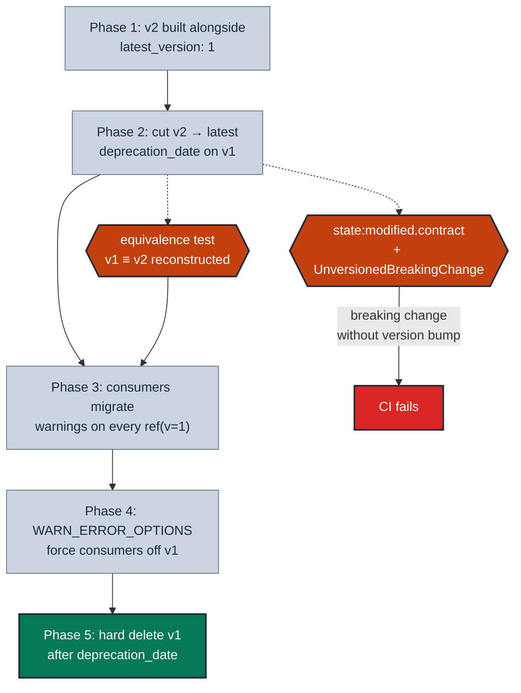

# Ship a breaking change via versioning

> **Rule:** MD-03 · **Role:** model-level · **DAMA-UK6:** Consistency · **Wang–Strong:** Representational consistency · **Cost class:** free (declaration)

When a public model needs a renamed column, dropped column, or grain change, **don't break consumers** — ship a new version. Keep the old version live during a deprecation window so downstream BI tools, reverse-ETL jobs, and ML feature stores can migrate at their own pace.

## Symptoms

- A column on `dim_customers` needs to be renamed to align with the new naming convention. Five dashboards bind to the old name.
- A grain change is needed (`one row per order` → `one row per order line`) but two teams' marts depend on the current grain.
- A `customer_name` column should be split into `first_name` + `last_name`, and downstream feature stores cache the schema.

## Pattern

> **Pattern name:** *Versioned Cutover*
>
> Add a new version (`v=N+1`) alongside the existing version. Update YAML to register both. Notify consumers; let them opt-in to the new version with `ref('model', v=N+1)`. After validation, flip `latest_version`, add a `deprecation_date` to the old version. After the window, hard-delete the old version.

## Mechanics

### 1. Confirm preconditions

- `access: public` (or cross-team `protected`).
- `contract.enforced: true` — without contracts, "breaking change" is undefined.
- You have a way to enumerate downstream consumers (`dbt ls --select +dim_customers`, exposures, or external tracking).

### 2. Build v2 alongside v1

```text
models/marts/customers/
├── dim_customers.yml
├── dim_customers_v1.sql    # the old SQL, renamed
└── dim_customers_v2.sql    # the new SQL
```

```sql
-- dim_customers_v2.sql
select
  customer_id,
  split_part(customer_name, ' ', 1) as first_name,
  split_part(customer_name, ' ', 2) as last_name,
  customer_lifetime_value
from {{ ref('int_customers_aggregated') }}
```

### 3. Update YAML — keep v1 as latest during preview

```yaml
models:
  - name: dim_customers
    access: public
    latest_version: 1                  # KEEP v1 as latest during preview window
    config:
      group: customer_success
      materialized: table
      contract:
        enforced: true
    columns:                           # top-level = v2 shape (the new one)
      - name: customer_id
        data_type: int
        constraints: [{ type: not_null }]
        data_tests: [unique, not_null]
      - name: first_name
        data_type: string
      - name: last_name
        data_type: string
      - name: customer_lifetime_value
        data_type: numeric

    versions:
      - v: 1
        columns:
          - include: []                # v1 doesn't inherit top-level
          - name: customer_id
            data_type: int
            constraints: [{ type: not_null }]
            data_tests: [unique, not_null]
          - name: customer_name        # the OLD column
            data_type: string
          - name: customer_lifetime_value
            data_type: numeric
      - v: 2
        # inherits all of top-level → first_name + last_name shape
```

### 4. Add an equivalence test

Prove that v2 can reconstruct v1's semantics. See [`refactor-parity.md`](./refactor-parity.md) for the audit_helper-based pattern.

```sql
-- data-tests/dim_customers_v1_v2_equivalence.sql
{{ config(severity='warn', tags=['version-equivalence']) }}


  select customer_id, customer_name, customer_lifetime_value
  from {{ ref('dim_customers', v=1) }}



  select
    customer_id,
    first_name || ' ' || last_name as customer_name,
    customer_lifetime_value
  from {{ ref('dim_customers', v=2) }}


with diff as (
  {{ audit_helper.compare_and_classify_query_results(
       a_query=v1, b_query=v2_reconstructed,
       primary_key_columns=['customer_id'],
       columns=['customer_id', 'customer_name', 'customer_lifetime_value']
  ) }}
)
select * from diff
where dbt_audit_row_status in ('added', 'removed', 'modified', 'nonunique_pk')
```

### 5. Cut v2 to latest with a deprecation window

```yaml
    latest_version: 2
    versions:
      - v: 1
        deprecation_date: "2026-09-01 00:00:00.00+00:00"
        columns:
          - include: []
          # ...same v1 columns...
      - v: 2
```

Now `ref('dim_customers')` resolves to v2. Consumers still on v1 see warnings:

```
[WARNING]: Found a reference to dim_customers.v1, which is slated for
deprecation on '2026-09-01T00:00:00+00:00'. Consider migrating to
{{ ref('dim_customers') }} (resolves to dim_customers.v2).
```

### 6. Promote warnings to CI errors as the date approaches

```yaml
# dbt_project.yml
flags:
  warn_error_options:
    include:
      - DeprecatedReference
      - UpcomingReferenceDeprecation
      - UnversionedReference
      - UnversionedBreakingChange
```

This converts the warning to a hard CI failure, forcing remaining consumers off v1 before the deprecation date.

### 7. Hard delete after the window

After 2026-09-01: delete `dim_customers_v1.sql`, remove the `v: 1` block from YAML, drop the warehouse relation. With `contract.enforced: true`, dbt refuses to delete the model until `deprecation_date` has passed — a safety net.

## Diagram



## Framework choice

Versioning is dbt-core only. The choice is the *cadence* and *aggressiveness*.

| Approach | When |
|----------|------|
| Single SQL file per version | **Default.** `dim_customers_v1.sql`, `dim_customers_v2.sql`. |
| `defined_in:` to remap | When the version's SQL lives elsewhere (e.g., during a folder reorganisation). Documented as "not recommended unless justified". |
| `config: { enabled: false }` (soft delete) | When you want the YAML preserved as documentation but the build to skip. |
| Drop the version entry entirely (hard delete) | After the deprecation window. The cleanest end-state. |

## When NOT to use

- **Internal models** (staging, intermediate, single-team-consumed). Just refactor.
- **Non-breaking changes** (add a column, fix internal logic, change a description). Don't bump a version for these — dbt explicitly says not to.
- **Models without an enforced contract.** Versioning works mechanically without contracts, but the "breaking" definition is unclear without them.
- **High-frequency change cadence.** dbt recommends bumping versions **~1–2× per year per public model**. If you're versioning more often, the model isn't stable enough to be public yet.

## See also

- [`contracts.md`](./contracts.md) — the foundation versioning builds on
- [`refactor-parity.md`](./refactor-parity.md) — the equivalence test pattern
