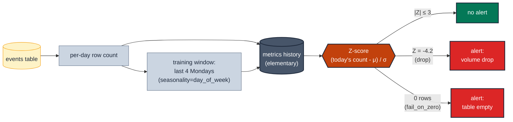

# MD-07 · Detect volume anomalies with a learned band

> **Rule:** MD-07 · **Role:** model-level · **DAMA-UK6:** Accuracy + Timeliness · **Wang–Strong:** Accuracy + Timeliness · **Cost class:** history-bound

A fixed row-count band ([`row-count-band.md`](./row-count-band.md)) catches catastrophes; a learned-band anomaly detector catches the more subtle "today's count is 40% below the seasonal trend". Elementary maintains the metrics history incrementally, so subsequent runs only scan the detection window.

## Symptoms

- A model's daily row count quietly drifted from ~100k to ~70k over a quarter; no fixed band would have fired.
- A holiday week's volume looks "anomalous" against a generic 14-day mean but is actually normal for that week-of-year — too many false positives from a naive Z-score.
- A multi-day backfill silently doubled the table's volume for two days; row-count band didn't catch it because the count was within the wide band.

## Pattern

> **Pattern name:** *Seasonal-Z Volume Anomaly*
>
> Bucket rows by a timestamp column, compute per-bucket counts, store the history, and Z-score the latest bucket against the same-day-of-week training window. Fire when |Z| > `anomaly_sensitivity`. The detector adapts to growth and seasonality; fixed bands do not.

## Mechanics

### 1. Install Elementary

```yaml
# packages.yml
packages:
  - package: elementary-data/elementary
    version: 0.23.1
```

```yaml
# dbt_project.yml
models:
  elementary:
    +schema: elementary
flags:
  source_freshness_run_project_hooks: true
vars:
  elementary_full_refresh: false
```

Plus the `materialization_test_default` override macro for dbt 1.8+ (see the Elementary research). Run `dbt deps && dbt run --select elementary`.

### 2. Add `volume_anomalies` to the model

```yaml
# models/marts/events.yml
models:
  - name: events
    config:
      elementary:
        timestamp_column: event_date
    data_tests:
      - elementary.volume_anomalies:
          arguments:
            time_bucket: { period: day, count: 1 }
            training_period: { period: day, count: 28 }
            seasonality: day_of_week        # compare Mondays to Mondays
            anomaly_sensitivity: 3
            anomaly_direction: both
            fail_on_zero: true              # empty bucket = failure
          config:
            tags: [elementary, anomaly]
            severity: warn
```

`fail_on_zero: true` is the critical flag for "tables that should never be empty". A `volume_anomalies` test without it cannot catch "the entire partition is missing" because zero has no Z-score.

### 3. Suppress noise on small swings

```yaml
- elementary.volume_anomalies:
    arguments:
      ignore_small_changes:
        spike_failure_percent_threshold: 25
        drop_failure_percent_threshold: 25
```

Don't alert on `|Z| > 3` if the absolute change is < 25%.

### 4. Pair with model-level recency

`volume_anomalies` doesn't detect "the table is fresh but always has the same data". Pair with [`../time/freshness-source-and-model.md`](../time/freshness-source-and-model.md):

```yaml
- dbt_utils.recency:
    datepart: hour
    field: event_date
    interval: 24
- elementary.volume_anomalies:
    arguments:
      time_bucket: { period: day, count: 1 }
```

### 5. Control cost on BigQuery

Anomaly tests scan the detection window each run; on huge tables, this is dollars per run. Optimisations:

- Match `timestamp_column` to the partition key. Otherwise BQ can't prune.
- Set `detection_delay` to skip the in-progress current partition (avoids reprocessing).
- Use `where_expression` to push category filters into the partition predicate.
- Keep `elementary_full_refresh: false` so a project-wide `--full-refresh` doesn't torch the metrics history.

```yaml
- elementary.volume_anomalies:
    arguments:
      time_bucket: { period: day, count: 1 }
      detection_delay: { period: day, count: 1 }    # skip today (in progress)
      where_expression: "event_type IN ('view', 'click')"
```

### 6. Tune `anomaly_sensitivity` empirically

Elementary materialises `anomaly_threshold_sensitivity` — a view that shows what each historical alert would score at different sensitivities. Use it to pick `anomaly_sensitivity: 2.5` (strict), `3` (default), or `4` (loose) based on alert noise vs miss rate.

## Diagram



## Framework choice

| Option | Where it lives | When to pick |
|--------|----------------|--------------|
| `elementary.volume_anomalies` | elementary | **Default.** Maintained, incremental, seasonality-aware. |
| `elementary.dimension_anomalies` | elementary | When the table is OK globally but a slice may go dark. See [`../dimension/dimension-anomalies.md`](../dimension/dimension-anomalies.md). |
| `dbt_expectations.expect_table_row_count_to_be_between` | dbt_expectations | Fixed-band variant. Maintenance flag applies. Lower setup cost; less adaptive. |
| `dbt_expectations.expect_column_values_to_be_within_n_moving_stdevs` | dbt_expectations | Simpler Z-score on a row-level numeric column (not row counts). Maintenance flag applies. |
| `dbt_utils.recency` | dbt-utils | Different question: "is the latest row recent enough?" not "is today's volume normal?" |

## When NOT to use

- **Less than ~2× `training_period` of history** (≥ 56 days for `training_period: 28d`). Use fixed-band [`row-count-band.md`](./row-count-band.md) until history accumulates.
- **High-variance tables** (early-stage product, marketing burst, sporadic batch loads). The detector fires constantly — adapt with `ignore_small_changes` or wait.
- **Cost-sensitive BigQuery without partitioning.** Each anomaly run is a full table scan; switch to fixed-band or partition the source.
- **Reference tables** (countries, products) that don't have a row-count time series.

## See also

- [`row-count-band.md`](./row-count-band.md) — fixed-band complement / fallback
- [`../dimension/dimension-anomalies.md`](../dimension/dimension-anomalies.md) — per-slice version
- [`../measure/distribution-anomaly.md`](../measure/distribution-anomaly.md) — same engine on measure columns
