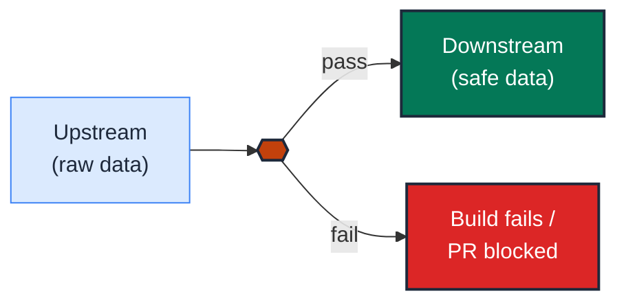

# {{ rule code }} · {{ Vignette Title — imperative, present tense }}

| Rule | Role | DAMA-UK6 | Wang–Strong | Cost class |
| --- | --- | --- | --- | --- |
| {{ rule code from rules.json — e.g. EN-01 }} | {{ entity \| dimension \| measure \| time \| model }} | {{ Completeness \| Uniqueness \| Timeliness \| Validity \| Accuracy \| Consistency }} | {{ Believability \| Concise representation \| Representational consistency \| Interpretability \| Accuracy \| Timeliness \| Completeness }} | {{ free \| cheap \| scan-bound \| history-bound }} |

One-paragraph headline. State the failure mode in business terms, then the test that prevents it. Avoid jargon in this paragraph — it should be readable to a data PM. Keep to ≤4 sentences.

---

## Symptoms

The symptom that prompts this vignette. Phrased as **what a user notices in production**, not what is wrong in the SQL.

- The dashboard shows…
- A KPI silently drops/inflates by N%…
- A join fans out without warning…
- The CFO calls because…

Concrete, observable, business-facing. Two or three bullets at most.

## Pattern

The named pattern that addresses the smell. **One sentence**, then a short justification.

> **Pattern name:** *{{ memorable short name, e.g. "Compound Grain Test" }}*
>
> One- or two-sentence statement of what the pattern asserts and why it works.

## Mechanics

Step-by-step recipe to apply the pattern. Each step has a heading and code where applicable. Aim for ≤6 steps.

### 1. {{ first step — e.g., "Name the grain" }}

Prose explaining the step. Reference specific YAML or SQL constructs.

```yaml
# models/marts/<model>.yml
models:
  - name: <model>
    columns:
      - name: <column>
        data_tests:
          - <test>:
              <arg>: <value>
              config:
                severity: error
```

### 2. {{ second step — e.g., "Add the test" }}

```sql
-- data-tests/<assertion>.sql (if singular)
{{ config(severity='error', tags=['<tag>']) }}

select <failing-rows>
from {{ ref('<model>') }}
where <invariant violated>
```

### 3. {{ scope it }}

Use `where:` config to scope to a partition; use `severity: warn` while ramping; use `store_failures_as: view` to capture the failing rows for forensics.

```yaml
- <test>:
    config:
      where: "created_at >= dateadd(day, -7, current_date)"
      store_failures: true
      store_failures_as: view
```

## Diagram

A single Mermaid diagram that shows **what the test prevents** — the bad-data shape and the good-data shape, side-by-side, with the test as the gate.

Use the role's canonical hue family (see `../README.md` → "Color palette"):

| Role | Primary fill | Stroke | Subgraph fill |
|------|--------------|--------|---------------|
| entity | `#2563eb` | `#1e40af` | `#dbeafe` |
| dimension | `#7c3aed` | `#6d28d9` | `#ede9fe` |
| measure | `#059669` | `#047857` | `#d1fae5` |
| time | `#ea580c` | `#c2410c` | `#fff7ed` |
| model | `#475569` | `#334155` | `#f1f5f9` |
| error / fail | `#dc2626` | `#b91c1c` | `#fecaca` |
| pass / ok | `#059669` | `#047857` | `#d1fae5` |



## Framework choice

A short matrix telling the reader **which package's test to reach for** and why. Always present alternatives so the choice is informed.

| Option | Where it lives | When to pick |
|--------|----------------|--------------|
| `<test>` | dbt core | Default; covers single-column simple case. |
| `<test>` | dbt-utils | Need composite or `group_by`. |
| `<test>` | dbt_expectations | Need `row_condition` or distributional check. |
| `<test>` | elementary | Need anomaly detection on history. |
| `<test>` | audit_helper | Need to diff against another relation. |
| contract / version | dbt core | Catches schema drift at parse time; complement to the test, not a replacement. |

> **Maintenance status (2026-05):** `dbt_expectations` is officially unmaintained as of 2026-05-21. Use it where it has no replacement, but prefer Elementary for new anomaly/distributional work.

## When NOT to use

The negative space. Explicitly name the scenarios where this pattern is overkill, expensive, or actively counterproductive. **At least three bullets** — avoid mealy-mouthed "use with discretion" non-advice.

- The model is `stg_*` and only has one consumer.
- The column is permitted to be sparse by business rule (e.g., `cancelled_at`).
- The data volume makes the test cost prohibitive (the test scans 5 TB daily; the value lost from a missed regression is less than the scan cost).

## See also

- [`<sibling vignette>`](../<role>/<sibling>.md) — closely related pattern
- [`<cross-role vignette>`](../<other-role>/<vignette>.md) — when this column plays a second role
