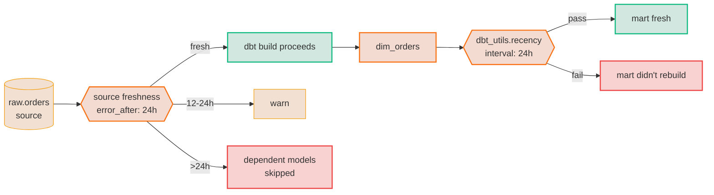

# TM-AU-01 · Assert freshness at source and at model

| Rule | Role | DAMA-UK6 | Wang–Strong | Cost class |
| --- | --- | --- | --- | --- |
| TM-AU-01 | time (system-time / audit) | Timeliness | Timeliness | cheap (filtered) / scan-bound (unfiltered) |

The pipeline ran successfully and the model rebuilt — but the upstream source hasn't been updated in 12 hours. Without a freshness contract, no test fires; the dashboard says "yesterday" but means "Tuesday".

## Symptoms

- A daily metric is stable but stale; the freshness card on a dashboard quietly went unchecked for weeks.
- An incident review traces a Slack-reported "wrong number" to: the source extract had died days earlier, and dbt happily kept rebuilding stale data.
- A weekend backfill silently held off until Monday but the dashboard refreshed Saturday with stale data.

## Pattern

> **Pattern name:** *Two-Tier Freshness Contract*
>
> Pin freshness at TWO layers: at the source (raw table) via dbt's `freshness:` block, and at the model layer via `dbt_utils.recency` or `elementary.freshness_anomalies`. The source check catches "raw data didn't land"; the model check catches "model didn't rebuild on schedule".

## Mechanics

### 1. Source freshness

```yaml
# models/staging/__sources.yml
sources:
  - name: jaffle_shop_raw
    database: raw
    schema: jaffle_shop
    loaded_at_field: _loaded_at
    freshness:
      warn_after: { count: 12, period: hour }
      error_after: { count: 24, period: hour }
      filter: "_loaded_at >= dateadd(day, -2, current_timestamp)"   # partition pruning
    tables:
      - name: orders
        loaded_at_field: created_at      # override per table
        freshness:
          warn_after: { count: 1, period: hour }
          error_after: { count: 6, period: hour }
      - name: countries
        freshness: null                  # static reference table, no freshness
```

Run as:

```bash
dbt source freshness
# OR — automatically gates downstream models when included in dbt build
dbt build
```

In `dbt build`, a source freshness `error` short-circuits dependent models (they're skipped). **Don't waste compute on stale data.**

### 2. Model-layer recency

`dbt source freshness` covers raw; `dbt_utils.recency` covers the mart:

```yaml
# models/marts/orders.yml
models:
  - name: orders
    data_tests:
      - dbt_utils.recency:
          datepart: hour
          field: ordered_at
          interval: 24
          ignore_time_component: false
      - dbt_utils.recency:
          datepart: day
          field: ordered_at
          interval: 1
          group_by_columns: [region_code]    # per-region freshness
```

The `group_by_columns` variant catches the "one tenant went dark" case that an unscoped recency check would miss.

### 3. For event-time-vs-load-time tables, use Elementary's event_freshness

```yaml
- elementary.event_freshness_anomalies:
    arguments:
      event_timestamp_column: occurred_at
      update_timestamp_column: loaded_at    # → dual mode: ingestion lag detection
```

Single-timestamp mode flags stale events. Dual-timestamp mode flags the gap between event creation and warehouse ingestion — useful for streaming/CDC pipelines.

### 4. Use `filter:` aggressively on BigQuery to control cost

The default `dbt source freshness` does `SELECT MAX(loaded_at) FROM raw.orders` — a full scan if `loaded_at` isn't the partition column. The `filter:` clause scopes it:

```yaml
freshness:
  filter: "_PARTITIONTIME >= timestamp_sub(current_timestamp(), interval 2 day)"
```

This enables BigQuery's partition pruning. Without it, freshness checks can be the most expensive query in your project.

### 5. Wire freshness into the build/CI graph

```bash
# Run freshness BEFORE models; abort build if error
dbt build --select "source:jaffle_shop_raw+" --fail-fast

# Or as a separate scheduled job
dbt source freshness --output freshness-report.json
```

The `freshness-report.json` can be parsed by an external monitor (Slack, PagerDuty).

## Diagram



## Framework choice

| Option | Where it lives | When to pick |
|--------|----------------|--------------|
| Source `freshness:` block | dbt core | **Default for raw sources.** Free; gates downstream builds. |
| `dbt_utils.recency` | dbt-utils | Model-layer; supports `group_by_columns`. |
| `elementary.freshness_anomalies` | elementary | Anomaly-based: learns the historical update cadence rather than a fixed threshold. **Preferred for production once history accumulates.** |
| `elementary.event_freshness_anomalies` | elementary | Streaming/CDC tables; distinguishes ingestion lag from event lag. |
| `dbt_expectations.expect_row_values_to_have_recent_data` | dbt_expectations | Functional equivalent to `dbt_utils.recency`. Maintenance flag applies — prefer dbt-utils. |

## When NOT to use

- **Static reference tables** (countries, currencies). Set `freshness: null`. The test would be permanently failing.
- **Manual / one-off models** that rebuild on demand. Apply only to scheduled production tables.
- **Models without a reliable `loaded_at` / `updated_at` column**. Either add one upstream, or use Snowflake's warehouse-native metadata mode (dbt 1.7+).

## See also

- [`TM-SC-01-event-time-bounds.md`](./TM-SC-01-event-time-bounds.md) — for `event_at >= load_at` (causality)
- [`../model/MD-07-volume-anomaly.md`](../model/MD-07-volume-anomaly.md) — when freshness is fine but row count drops
- [`../dimension/DM-05-dimension-anomalies.md`](../dimension/DM-05-dimension-anomalies.md) — per-tenant freshness via dimension grouping
