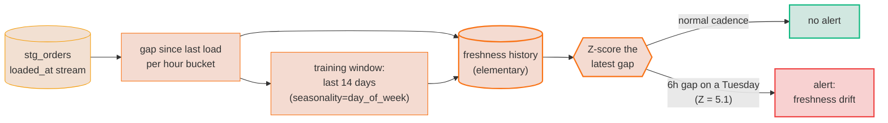

# TM-AU-03 · Detect freshness drift against a learned cadence

| Rule | Role | DAMA-UK6 | Wang–Strong | Cost class |
| --- | --- | --- | --- | --- |
| TM-AU-03 | time (system-time / audit) | Timeliness | Timeliness | history-bound |

A fixed `source freshness:` SLA ([`TM-AU-01-freshness-source-and-model.md`](./TM-AU-01-freshness-source-and-model.md)) answers "is the newest row younger than N hours?". That works when the cadence is regular. When a feed lands every few minutes on weekdays and twice on weekends, any single threshold is either too loose (misses a real stall) or too noisy (cries wolf every Sunday). Elementary's freshness anomaly tests learn the table's normal update rhythm and fire when the gap since the last load — or the lag between event time and load time — departs from that learned rhythm.

---

## Symptoms

- A feed that normally refreshes every 15 minutes silently went quiet for 6 hours on a Tuesday, but the fixed `warn_after: { count: 12, period: hour }` SLA was set loose enough to absorb weekend gaps, so nothing fired.
- The table is "fresh" by wall-clock — rows keep arriving — but the **events inside them** are now landing 9 hours after they happened; a pipeline lag nobody is watching.
- Every Sunday the freshness check pages someone because the fixed SLA doesn't understand that the source batches less often at the weekend.

## Pattern

> **Pattern name:** *Learned-Cadence Freshness*
>
> Record each run's freshness metric (time since the latest `loaded_at`, and optionally the event-to-load lag), build a history, and Z-score the latest gap against the table's own recent cadence. Fire when the gap is anomalously large for *this* table at *this* time — not against a hand-picked constant.

## Mechanics

### 1. Elementary is already installed

This rule assumes the Elementary setup from [`../model/MD-07-volume-anomaly.md`](../model/MD-07-volume-anomaly.md) (package, `+schema: elementary`, the dbt-1.8 `materialization_test_default` override). Elementary models are **prod-only** in this project, so this test is prod-scoped.

### 2. Add `freshness_anomalies` on the load timestamp

```yaml
# models/staging/stg_orders.yml
models:
  - name: stg_orders
    config:
      elementary:
        timestamp_column: loaded_at
    data_tests:
      - elementary.freshness_anomalies:
          arguments:
            time_bucket: { period: hour, count: 1 }
            training_period: { period: day, count: 14 }
            seasonality: day_of_week        # weekends batch differently
            anomaly_sensitivity: 3
          config:
            tags: [elementary, anomaly]
            severity: warn
```

`freshness_anomalies` measures the **gap between consecutive `loaded_at` values** and Z-scores the latest gap. `seasonality: day_of_week` is what lets it tolerate the quieter weekend without loosening the weekday SLA.

### 3. Catch event-to-load lag with `event_freshness_anomaly`

Freshness of the *table* and freshness of the *data inside it* are different questions. `event_freshness_anomaly` watches the lag between an event timestamp and the time it was loaded:

```yaml
- elementary.event_freshness_anomaly:
    arguments:
      event_timestamp_column: ordered_at     # when it happened
      update_timestamp_column: loaded_at      # when we saw it
      anomaly_sensitivity: 3
```

This is the test that catches "rows keep arriving, but they're describing events from this morning".

### 4. Keep the fixed SLA as the floor

A learned band is for subtle drift, not for "the source is down". Keep the cheap, deterministic `source freshness:` block (TM-AU-01) as the hard floor and let the anomaly test catch the slow degradations underneath it.

### 5. Control cost on BigQuery

Like all history-bound tests, each run scans the detection window. Match `timestamp_column` to the partition key so BigQuery can prune, and keep `elementary_full_refresh: false` so a project-wide `--full-refresh` doesn't torch the metrics history.

## Diagram



## Framework choice

| Option | Where it lives | When to pick |
|--------|----------------|--------------|
| `source freshness:` block | dbt core | **First.** Cheap, deterministic floor: "newest row older than N hours". Always keep this. |
| `dbt_utils.recency` | dbt-utils | Model-level fixed recency check when the source-freshness block doesn't reach a derived model. |
| `elementary.freshness_anomalies` | elementary | **This rule.** Learned band for irregular/seasonal cadence where a fixed SLA is too brittle. |
| `elementary.event_freshness_anomaly` | elementary | Different question: event-to-load **lag**, not table staleness. |

## When NOT to use

- **Regular, predictable cadence** (a clockwork hourly batch). A fixed `source freshness:` SLA is cheaper, deterministic, and entirely sufficient — don't reach for history here.
- **Less than ~2× `training_period` of history.** The band hasn't learned the rhythm yet; it will false-positive. Stay on the fixed SLA until history accumulates.
- **Dev / CI environments.** Elementary is prod-only in this project, and freshness has no meaning against a one-shot seed.
- **Tables with no natural load/event timestamp.** There's nothing to measure a gap against — fix the audit columns first ([`TM-AU-01-freshness-source-and-model.md`](./TM-AU-01-freshness-source-and-model.md)).

## See also

- [`TM-AU-01-freshness-source-and-model.md`](./TM-AU-01-freshness-source-and-model.md) — the fixed-SLA floor this escalates from (TM-AU-01)
- [`../model/MD-07-volume-anomaly.md`](../model/MD-07-volume-anomaly.md) — sibling Elementary anomaly test on row volume
- [`../model/MD-09-column-anomalies.md`](../model/MD-09-column-anomalies.md) — automated column-statistic monitors on the same engine
