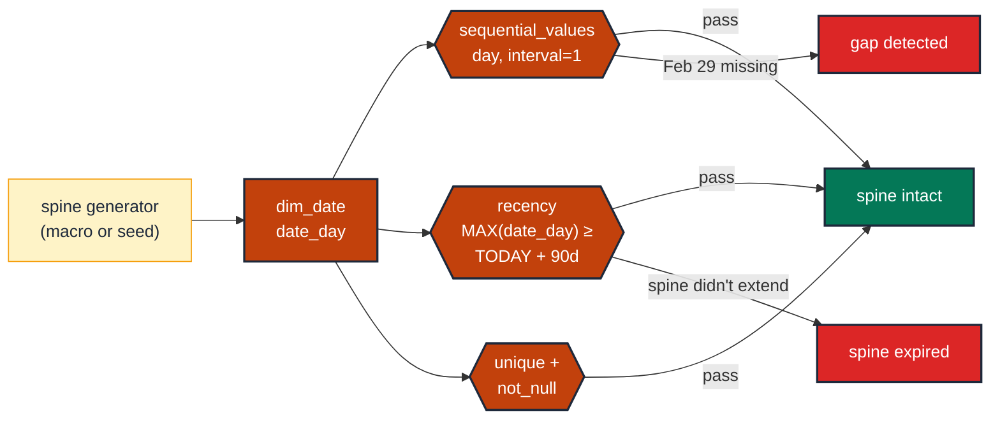

# Assert a date dimension has no gaps

> **Role:** time (time-grain dimension) · **Wang–Strong dimension:** Completeness + Timeliness · **Cost class:** cheap

A daily fact table — or a date-dimension table — must have one row per day (or per chosen grain) with no missing days. A missing row produces an empty bucket downstream; cumulative metrics undercount; year-over-year comparisons skip the gap.

## Smell

- A retention chart has a hole on a single date that nobody noticed for weeks.
- `MAX(date_day)` in `dim_date` returns a date 5 days in the past — the spine wasn't extended.
- A leap-year bug: Feb 29 is missing from the dim table because the spine generator excluded it.

## Pattern

> **Pattern name:** *Sequential Spine*
>
> Assert that the date column increases by exactly one day (or chosen interval) between consecutive rows, has no gaps, and extends to at least `CURRENT_DATE + N`. The test is `dbt_utils.sequential_values` (gap detection) plus an `expect_row_values_to_have_recent_data` (forward extension).

## Mechanics

### 1. Spine assertion

```yaml
# models/marts/dim_date.yml
models:
  - name: dim_date
    columns:
      - name: date_day
        data_tests:
          - unique
          - not_null
          - dbt_utils.sequential_values:
              datepart: day
              interval: 1
```

### 2. Forward-extension assertion

The spine must include today AND a forward buffer for scheduled events:

```yaml
- dbt_utils.recency:
    datepart: day
    field: date_day
    interval: -90    # MAX(date_day) >= CURRENT_DATE + 90 days
    ignore_time_component: true
```

Note the **negative interval** semantics — `dbt_utils.recency` here asserts the spine extends *into the future* by 90 days. If your `dbt_utils` version doesn't accept negative intervals, fall back to:

```yaml
- dbt_utils.expression_is_true:
    expression: "max(date_day) >= current_date + interval 90 day"
```

### 3. For fact tables that should have one row per day

```yaml
# models/marts/daily_active_users.yml
models:
  - name: daily_active_users
    data_tests:
      - dbt_utils.unique_combination_of_columns:
          combination_of_columns: [user_id, date_day]
      - dbt_expectations.expect_row_values_to_have_data_for_every_n_datepart:
          date_col: date_day
          date_part: day
          interval: 1
          test_start_date: "2022-01-01"
          test_end_date: "{{ modules.datetime.date.today() }}"
```

`expect_row_values_to_have_data_for_every_n_datepart` (dbt_expectations) builds a `date_spine` and LEFT JOINs your fact, returning gaps. It supports `exclusion_condition` for known-missing dates (Christmas, market closures).

### 4. Watch the BQ literal-date constraint

`test_start_date` / `test_end_date` **must be date literals** — `current_date()` and macros that compile to SQL functions are not accepted (the `date_spine` macro requires compile-time literals). Use Jinja Python to inject a literal at compile time:

```yaml
test_end_date: "{{ modules.datetime.date.today() }}"
```

### 5. Bound the test window for cost

On a fact table spanning years, the spine test scans the full history. Limit to the recent window:

```yaml
- dbt_expectations.expect_row_values_to_have_data_for_every_n_datepart:
    date_col: date_day
    date_part: day
    test_start_date: "{{ (modules.datetime.date.today() - modules.datetime.timedelta(days=30)).isoformat() }}"
    test_end_date: "{{ modules.datetime.date.today().isoformat() }}"
```

## Diagram



## Framework choice

| Option | Where it lives | When to pick |
|--------|----------------|--------------|
| `dbt_utils.sequential_values` + `dbt_utils.recency` | dbt-utils | **Default for `dim_date` spine.** Simple, cheap. |
| `dbt_expectations.expect_row_values_to_have_data_for_every_n_datepart` | dbt_expectations | **Default for fact tables** that should have one row per day. Supports `exclusion_condition` for known-missing periods. Maintenance flag applies. |
| `dbt_date.get_date_dimension` macro | dbt-date package | The canonical spine generator — use this in your `dim_date.sql`, then test it. |
| `elementary.dimension_anomalies` grouped by `date_day` | elementary | When per-day row count anomalies (drops to near-zero) are also a concern. |

## When NOT to use

- **Tables that legitimately have gaps** (weekend-only data, market-hours-only data). Use `exclusion_condition` to whitelist the gaps, or scope the test with `where:`.
- **Hourly or sub-daily grains where the spine is too dense to maintain.** Use sampling or skip — the test is cheaper than maintaining a perfect minute-grain dim_date.
- **Brand-new models with no historical spine yet** — the test will always fail until the spine populates.

## See also

- [`event-time-bounds.md`](./event-time-bounds.md) — bounding the values within the spine
- [`freshness-source-and-model.md`](./freshness-source-and-model.md) — when the spine should but doesn't auto-extend
- [`../entity/compound-grain.md`](../entity/compound-grain.md) — `(user_id, date_day)` uniqueness on a daily fact
