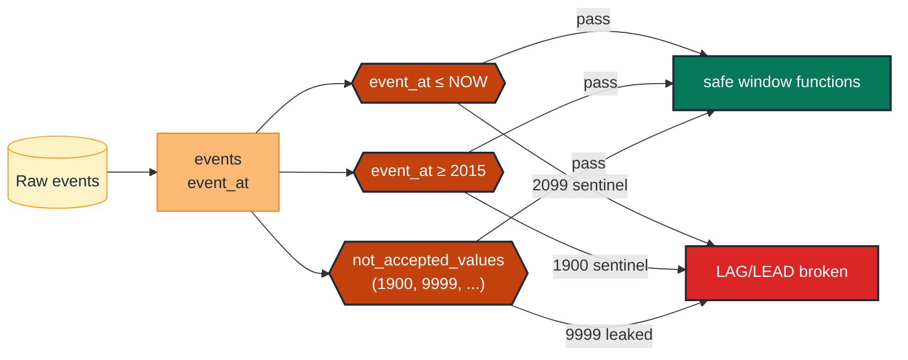

# Bound event-time scalars: no future, no sentinels

> **Rule:** TM-SC-01 · **Role:** time (event-time scalar) · **DAMA-UK6:** Validity · **Wang–Strong:** Believability · **Cost class:** cheap

Event timestamps that drift into the future (`event_at > NOW()`) or sentinel values (`9999-12-31`, `1900-01-01`) wreck window functions, `MIN`/`MAX` aggregates, and time-bucketed metrics. The fix is a two-bound test.

## Symptoms

- `LAG(amount) OVER (ORDER BY event_at)` returns wrong values because a `2099-12-31` row sorts to the end of the partition.
- A retention chart's "earliest cohort" reports as 1900 because a `NULL`-replacement sentinel landed in the data.
- A daily-active-users metric has an anomalous Tuesday because one user's `event_at` is somehow 3 days in the future.

## Pattern

> **Pattern name:** *Temporal Sanity Bounds*
>
> Pin two invariants on every event-time scalar: (1) no value is in the future, (2) no value is a known sentinel. Both are expression-is-true tests that compile to a single SCAN per partition.

## Mechanics

### 1. Upper bound: no future dates

```yaml
# models/marts/events.yml
models:
  - name: events
    columns:
      - name: event_at
        data_tests:
          - dbt_utils.expression_is_true:
              expression: "event_at <= current_timestamp()"
              config:
                severity: error
```

Allow a small buffer if clocks may legitimately drift (e.g., client-side timestamps):

```yaml
- dbt_utils.expression_is_true:
    expression: "event_at <= timestamp_add(current_timestamp(), interval 1 hour)"
```

### 2. Lower bound + sentinel block

Pick a sane historical floor based on the business's existence:

```yaml
- dbt_utils.expression_is_true:
    expression: "event_at >= timestamp('2015-01-01')"   # business founded 2015
```

Plus explicit sentinel block:

```yaml
- dbt_utils.not_accepted_values:
    values:
      - '1900-01-01'
      - '1970-01-01'
      - '2099-12-31'
      - '9999-12-31'
```

### 3. Combine into `accepted_range` if a clean band exists

For BigQuery `TIMESTAMP`:

```yaml
- dbt_utils.accepted_range:
    min_value: "cast('2015-01-01' as timestamp)"
    max_value: "current_timestamp()"
    inclusive: true
```

### 4. Pair with the epoch-units sanity check

Epoch timestamps in seconds vs milliseconds is a 1000× difference. A `2024` event accidentally stored as milliseconds becomes year `~57000`:

```yaml
- dbt_utils.accepted_range:
    min_value: 2015
    max_value: 2100
    config:
      where: "extract(year from event_at) is not null"
```

This catches "off by 1000" without needing to convert back to an epoch.

### 5. Scope to recent partition for cost

```yaml
- dbt_utils.expression_is_true:
    expression: "event_at <= current_timestamp()"
    config:
      where: "event_date >= dateadd(day, -7, current_date)"
```

Run an unscoped variant nightly with `severity: warn`.

## Diagram



## Framework choice

| Option | Where it lives | When to pick |
|--------|----------------|--------------|
| `dbt_utils.accepted_range` + `not_accepted_values` | dbt-utils | **Default.** Simple, dialect-portable. |
| `dbt_utils.expression_is_true` | dbt-utils | When the bound is a SQL expression (`current_timestamp() + interval 1 hour`). |
| `dbt_expectations.expect_column_values_to_be_between` | dbt_expectations | Need `group_by` (per-tenant bounds). Maintenance flag applies. |
| Model contract on `data_type` | dbt core | Catches `STRING`-stored dates at parse; pair with the value tests. |

## When NOT to use

- **Future-dated business records** (subscription `expires_at`, scheduled `runs_at`). These legitimately exceed `NOW()`. Scope the test to the columns where future is invalid, or use a different upper bound (`expires_at <= NOW() + interval 10 years`).
- **Bitemporal models where `valid_to` is intentionally `9999-12-31` for current SCD2 rows.** That's a documented sentinel — exclude from `not_accepted_values` or use `where: is_current = false`. See [`scd2-quartet.md`](./scd2-quartet.md).
- **Source models you don't own** — clamp the lower bound generously and accept some historical mess.

## See also

- [`monotonic-pair.md`](./monotonic-pair.md) — for paired-timestamp causality
- [`timezone-contract.md`](./timezone-contract.md) — `NOW()` semantics differ across TZ-aware vs naive types
- F.4 (Future-Date Window Trap) in the [semantic-taxonomy research](../README.md)
