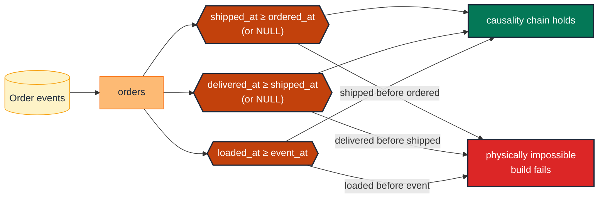

# Assert causality on paired timestamps

> **Rule:** TM-SC-02 · **Role:** time (event-time scalar pair) · **DAMA-UK6:** Consistency · **Wang–Strong:** Representational consistency · **Cost class:** cheap

When two timestamps describe sequential events (`ordered_at` → `shipped_at` → `delivered_at`; `created_at` → `updated_at`), causality requires the later one is at least as recent as the earlier one. A single `expression_is_true` test enforces the chain.

## Symptoms

- A negative `fulfillment_duration` appears on a row (`shipped_at - ordered_at` < 0).
- A refund is recorded with `refunded_at < ordered_at` — impossible by business rule.
- An audit log shows `updated_at < created_at` for some records; a snapshot script ran before the create timestamp was applied.

## Pattern

> **Pattern name:** *Monotonic Pair*
>
> For every pair of timestamps that describe sequential events, assert `later >= earlier`. The test uses `dbt_utils.expression_is_true`. NULL is allowed on the later timestamp (the later event hasn't happened yet); both NULL or both non-NULL must respect the order.

## Mechanics

### 1. Single-pair monotonicity

```yaml
# models/marts/orders.yml
models:
  - name: orders
    data_tests:
      - dbt_utils.expression_is_true:
          expression: "shipped_at is null or shipped_at >= ordered_at"
          config:
            severity: error
      - dbt_utils.expression_is_true:
          expression: "delivered_at is null or delivered_at >= shipped_at"
          config:
            severity: error
```

The `shipped_at is null or …` guard allows "not yet shipped" rows to pass. Without it, `NULL >= ordered_at` evaluates to NULL, which the test treats as failure.

### 2. Multi-pair causality chain

When three or more timestamps form a chain, test every adjacent pair:

```yaml
data_tests:
  - dbt_utils.expression_is_true:
      expression: "shipped_at is null or shipped_at >= ordered_at"
  - dbt_utils.expression_is_true:
      expression: "delivered_at is null or delivered_at >= shipped_at"
  - dbt_utils.expression_is_true:
      expression: "returned_at is null or returned_at >= delivered_at"
```

Transitivity does the rest: `returned_at >= delivered_at >= shipped_at >= ordered_at`.

### 3. Strict vs non-strict inequality

Most pairings allow equality (an order shipped within the same millisecond it was created — edge case but valid). Use `>=` by default. Force strict `>` only when the system explicitly increments timestamps:

```yaml
- dbt_utils.expression_is_true:
    expression: "updated_at > created_at"   # update must be strictly after create
```

### 4. Pair with the load-time-vs-event-time check

A common parallel: `loaded_at >= event_at`. Always-true by physics (you can't load data before it was generated), but easy to violate during clock skew:

```yaml
- dbt_utils.expression_is_true:
    expression: "loaded_at >= event_at"
```

This is the structural fix for F.12 (Ingest-Time Filter Mistake) — the test exists not to catch a clock-skew bug, but to keep the *naming* discipline: if you write `loaded_at` somewhere, the test enforces that you couldn't have meant `event_at`.

### 5. Use `dbt_expectations.expect_column_pair_values_A_to_be_greater_than_B` for documentary clarity

When the test name itself documents the intent:

```yaml
- dbt_expectations.expect_column_pair_values_A_to_be_greater_than_B:
    column_A: shipped_at
    column_B: ordered_at
    or_equal: true
    row_condition: "shipped_at is not null"
```

(Maintenance flag for dbt_expectations applies.)

## Diagram



## Framework choice

| Option | Where it lives | When to pick |
|--------|----------------|--------------|
| `dbt_utils.expression_is_true` | dbt-utils | **Default.** Simplest, NULL-aware via `is null or …`. |
| `dbt_expectations.expect_column_pair_values_A_to_be_greater_than_B` | dbt_expectations | Self-documenting name + explicit `row_condition`. Maintenance flag applies. |
| Model `check` constraint | dbt core (contracts) | DDL-level on adapters that support `check` (Postgres) — **not enforced on BigQuery**. Treat as documentation only. |
| Singular test with explicit JOIN | dbt core | When the two timestamps live in different models. |

## When NOT to use

- **One of the timestamps is itself derived from the other.** The test is tautological by construction.
- **The "later" timestamp is set asynchronously and can legitimately precede the "earlier" by clock skew tolerance.** Loosen with a buffer: `shipped_at >= ordered_at - interval 1 minute`.
- **The events are concurrent by design** (an event emits both timestamps from the same source at the same moment). Equality is fine; no test needed.

## See also

- [`event-time-bounds.md`](./event-time-bounds.md) — the single-column bounds half
- [`scd2-quartet.md`](./scd2-quartet.md) — for `valid_from <= valid_to` (the SCD2 specialisation)
- F.12 (Ingest-Time Filter Mistake) in the [semantic-taxonomy research](../README.md)
