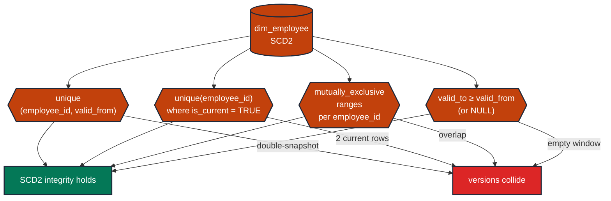

# Apply the four tests every SCD2 dimension needs

> **Rule:** TM-AU-02 · **Role:** time (system-time / audit) · **Wang–Strong dimension:** Consistency · **Cost class:** scan-bound

A Slowly Changing Dimension Type 2 keeps history by adding `valid_from`, `valid_to`, and `is_current` columns. Four invariants must hold *together* — testing any subset leaves a hole that the others can hide.

## Symptoms

- A point-in-time join from `fct_payroll` to `dim_employee` fans out: one employee's salary shows up twice in monthly aggregates.
- The same employee has two rows where `is_current = TRUE`.
- A specific timestamp falls in no SCD2 row's `[valid_from, valid_to)` — the entity is invisible at that moment.

## Pattern

> **Pattern name:** *SCD2 Quartet*
>
> Every SCD2 dimension needs four tests, applied **together**:
>
> 1. `unique` on `(natural_key, valid_from)` — version uniqueness
> 2. `unique` on `natural_key` filtered to `is_current = TRUE` — exactly one current version
> 3. `mutually_exclusive_ranges` on `(valid_from, valid_to)` partitioned by `natural_key` — no overlaps
> 4. `expression_is_true: valid_to IS NULL OR valid_to >= valid_from` — non-empty windows

## Mechanics

### 1. Version uniqueness

```yaml
# models/marts/dim_employee.yml
models:
  - name: dim_employee
    data_tests:
      - dbt_utils.unique_combination_of_columns:
          combination_of_columns: [employee_id, valid_from]
```

This catches double-snapshotting (same entity, same effective timestamp, two rows).

### 2. Exactly one current row per natural key

```yaml
    columns:
      - name: employee_id
        data_tests:
          - unique:
              config:
                where: "is_current = true"
                severity: error
```

The `where:` scope makes the `unique` apply only to current rows. The historical-version rows can legitimately repeat the `employee_id`; the current ones must not.

### 3. Mutually exclusive validity ranges per entity

```yaml
    data_tests:
      - dbt_utils.mutually_exclusive_ranges:
          lower_bound_column: valid_from
          upper_bound_column: valid_to
          partition_by: employee_id
          gaps: required           # SCD2 should NOT be contiguous when an entity has gaps in history
          zero_length_range_allowed: false
```

**Choosing `gaps:`:**
- `not_allowed` — every moment in time must be covered by exactly one row (no employment gaps). Use for entity types that are never "absent".
- `allowed` — gaps are tolerated but not required.
- `required` — entities have legitimate gaps (an employee left and returned). Most SCD2 dimensions are `allowed` in practice.

### 4. Non-empty windows

```yaml
      - dbt_utils.expression_is_true:
          expression: "valid_to is null or valid_to >= valid_from"
```

The `valid_to IS NULL` exception is for the current row (open-ended interval).

### 5. Use the snapshot dbt machinery to enforce structure

dbt snapshots auto-populate `dbt_valid_from`, `dbt_valid_to`, `dbt_updated_at` with the right semantics if you use the snapshot materialisation:

```sql

{{
    config(
      target_schema='snapshots',
      unique_key='employee_id',
      strategy='timestamp',
      updated_at='source_updated_at',
    )
}}
select * from {{ source('hr', 'employees') }}

```

The snapshot guarantees `dbt_valid_from`, `dbt_valid_to`, but **you still need the four tests** on the materialised SCD2 view to catch bugs in the snapshot's own logic.

### 6. Pair with referential integrity

Downstream fact tables that join through `(employee_id, as_of_date)` need the SCD2 to be intact; otherwise the join multiplies. After the quartet, add a `relationships_where` on the consuming side:

```yaml
# in fct_payroll.yml
- dbt_utils.relationships_where:
    to: ref('dim_employee')
    field: employee_id
    to_condition: "is_current = true"
```

## Diagram



## Framework choice

The quartet is intentionally heterogeneous — each test comes from a different (or same) package but checks a distinct invariant.

| Invariant | Test | Package |
|-----------|------|---------|
| Version uniqueness | `dbt_utils.unique_combination_of_columns` | dbt-utils |
| Exactly one current | `unique` with `where:` | dbt core |
| No overlapping windows | `dbt_utils.mutually_exclusive_ranges` | dbt-utils |
| Non-empty windows | `dbt_utils.expression_is_true` | dbt-utils |

No `dbt_expectations` or `elementary` reach is needed here — the four are well-supported in the maintained core+utils path.

## When NOT to use

- **The model is SCD Type 1** (overwrite-in-place, no history). Use the plain entity tests ([`../entity/unique-key.md`](../entity/unique-key.md)) instead.
- **The model is SCD Type 4 / 6** (history in a separate table). Apply the quartet to the historical table, plain tests to the current-state table.
- **The dimension is sourced from an immutable event log** (e.g., a typed event stream where each event is its own row) — the SCD2 structure is implicit, not materialised. The quartet doesn't apply.

## See also

- [`monotonic-pair.md`](./monotonic-pair.md) — for `valid_to >= valid_from` (the "non-empty windows" piece in isolation)
- [`../entity/soft-delete-scoped-fk.md`](../entity/soft-delete-scoped-fk.md) — when consumers must scope to `is_current = true`
- F.6 (The SCD2 Overlap) in the [semantic-taxonomy research](../README.md)
