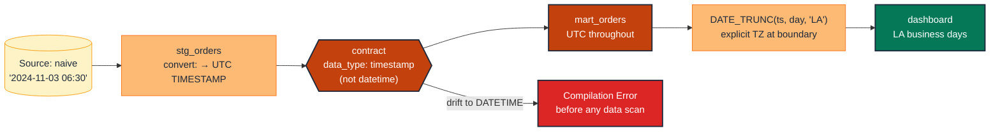

# TM-SC-03 · Pin the timezone semantics via contract

> **Rule:** TM-SC-03 · **Role:** time (event-time scalar) · **DAMA-UK6:** Validity · **Wang–Strong:** Believability + Interpretability · **Cost class:** free (compile-time)

`TIMESTAMP_NTZ`, `TIMESTAMP_TZ`, `DATETIME`, and `DATE` all *look* similar in raw query output but behave differently under `DATE_TRUNC`, `EXTRACT`, and `BETWEEN`. The day a downstream consumer runs the same query from a different session timezone, results diverge by hours. The fix is a contract `data_type` that pins the semantics, plus a singular convention test where the dialect doesn't enforce it.

## Symptoms

- The same dashboard query returns different daily totals at the start of business in Sydney vs end of business in San Francisco.
- A BigQuery model returns `DATETIME` from one upstream and `TIMESTAMP` from another; an inner JOIN on the column returns zero rows.
- Postgres reports incorrectly bucketed events on DST transition days.

## Pattern

> **Pattern name:** *Timezone Contract*
>
> Declare the canonical timezone semantics on every timestamp column in every model that exposes it. On BigQuery, prefer `TIMESTAMP` (UTC-anchored) over `DATETIME` (naive); store everything in UTC; convert to local time only at the BI / presentation boundary.

## Mechanics

### 1. Canonical type per column

For UTC-anchored event times: **`TIMESTAMP`** on BigQuery (or `TIMESTAMPTZ` on Postgres, `TIMESTAMP_TZ` on Snowflake).

For business-local "civil time" (e.g., a calendar date with no notion of UTC offset): **`DATETIME`** (BQ) / `TIMESTAMP` (Postgres without TZ) / `TIMESTAMP_NTZ` (Snowflake). Use sparingly; almost everything is better stored UTC.

```yaml
# models/marts/orders.yml
models:
  - name: orders
    config:
      contract:
        enforced: true
    columns:
      - name: ordered_at
        data_type: timestamp        # UTC, on BigQuery
        constraints:
          - type: not_null
      - name: order_date
        data_type: date             # calendar day in business TZ, derived at staging
```

### 2. Convert at the boundary, not in the middle

If the source is in `America/Los_Angeles` and the warehouse standard is UTC, the conversion lives **once**, in the staging model:

```sql
-- models/staging/stg_orders.sql
select
    order_id,
    -- assume source is naive Los Angeles civil time
    timestamp(ordered_at_local, 'America/Los_Angeles') as ordered_at,    -- → UTC TIMESTAMP
    date(ordered_at_local) as order_date,                                -- business-local date
    ...
from {{ source('orders_oltp', 'orders') }}
```

After this, downstream models use `ordered_at` (UTC) for arithmetic and `order_date` for grouping.

### 3. Test the conversion at the staging boundary

For the day someone disables the `timestamp(...)` wrapper:

```yaml
- name: ordered_at
  data_type: timestamp        # if it's DATETIME, contract preflight fails
  data_tests:
    - dbt_utils.expression_is_true:
        expression: "extract(timezone from cast(ordered_at as string format 'YYYY-MM-DDTHH24:MI:SS+TZH:TZM')) = '+00:00'"
        config:
          severity: warn       # dialect-specific; sometimes hard to express
```

In practice, contract enforcement of `TIMESTAMP` vs `DATETIME` is usually sufficient.

### 4. For the `date_trunc` bucket grain, document the TZ explicitly

```sql
-- BigQuery: DATE_TRUNC respects the TZ argument; document it
select
    date_trunc(ordered_at, day, 'America/Los_Angeles') as la_business_date,
    ...
```

Without the TZ argument, BigQuery `DATE_TRUNC` on a `TIMESTAMP` uses UTC — which usually isn't what the business wants for "daily" reports.

### 5. CI: assert the contract under two sessions

For robust validation, run a CI job with the session TZ set to two different values and compare outputs. dbt unit tests are useful here — mock a known input timestamp and assert the bucketed output:

```yaml
unit_tests:
  - name: tz_safety_daily_bucket
    model: daily_active_users
    given:
      - input: ref('stg_events')
        rows:
          - { user_id: 1, event_at: '2024-11-03 06:30:00 UTC' }  # late Nov 2 in LA
    expect:
      rows:
        - { date_day: '2024-11-02', user_id: 1 }                  # bucketed in LA day
```

Unit tests are mocked — they don't depend on the warehouse session TZ. They lock the bucketing semantics into a test that survives any session change.

## Diagram



## Framework choice

| Option | Where it lives | When to pick |
|--------|----------------|--------------|
| Contract `data_type: timestamp` (or `timestamptz`) | dbt core | **Default.** Parse-time, free. |
| `dbt_expectations.expect_column_values_to_be_of_type` | dbt_expectations | When the model can't have a contract (ephemeral). Maintenance flag applies. |
| Unit test (dbt 1.8+) with explicit TZ inputs | dbt core | Locks the bucketing semantics; survives session changes. |
| Session-TZ guard in `on-run-start` hook | dbt core | Set `SET TIME ZONE 'UTC'` (Postgres) or session TZ explicitly to prevent ambient drift. |

## When NOT to use

- **Single-region project where everyone agrees on local time** and there's no cross-TZ consumer. Document the convention; skip the contract overhead. (Beware: this assumption rarely survives expansion to new regions.)
- **Models materialised as `view` where the timezone semantics are evident from the SQL** — the contract preflight still runs but the runtime conversion is what matters.
- **Date-only columns** with no time component — `DATE` is timezone-agnostic by construction.

## See also

- [`event-time-bounds.md`](./event-time-bounds.md) — bounds depend on `NOW()` which is TZ-sensitive
- [`../entity/type-stable-join.md`](../entity/type-stable-join.md) — TIMESTAMP-vs-DATETIME join failures
- [`../model/contracts.md`](../model/contracts.md) — full contract reference
- F.5 (The Timezone-Naïve Daily Cohort) in the [semantic-taxonomy research](../README.md)
