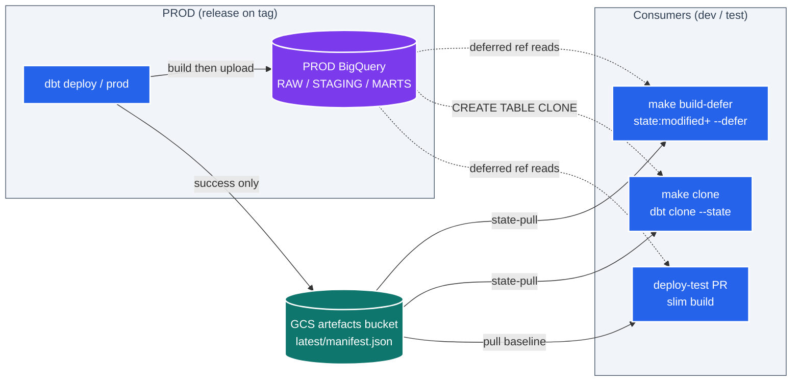
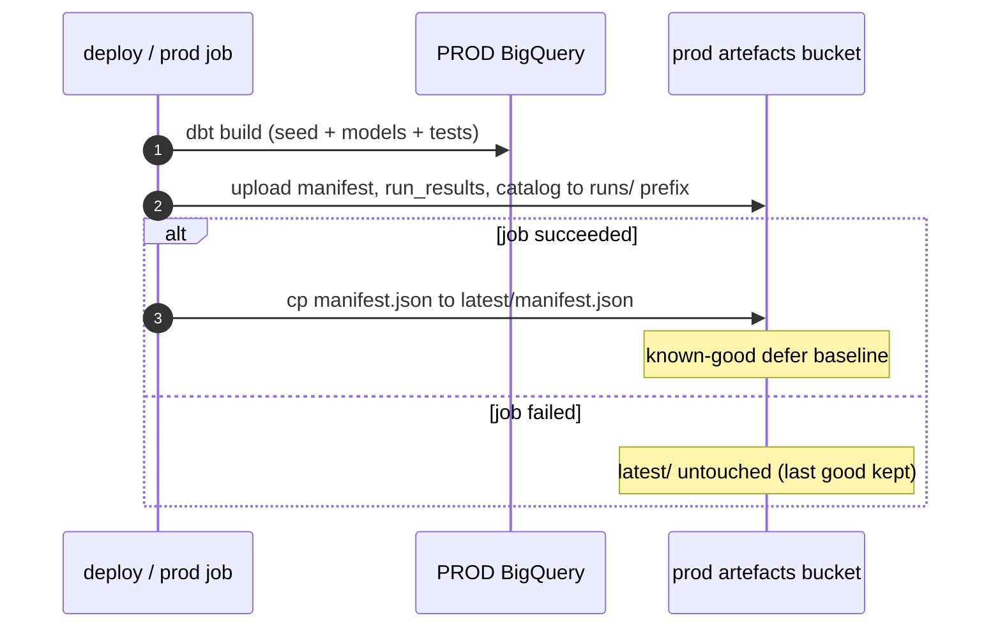
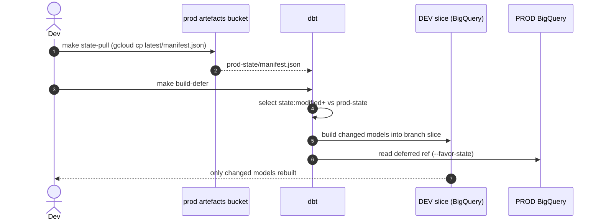
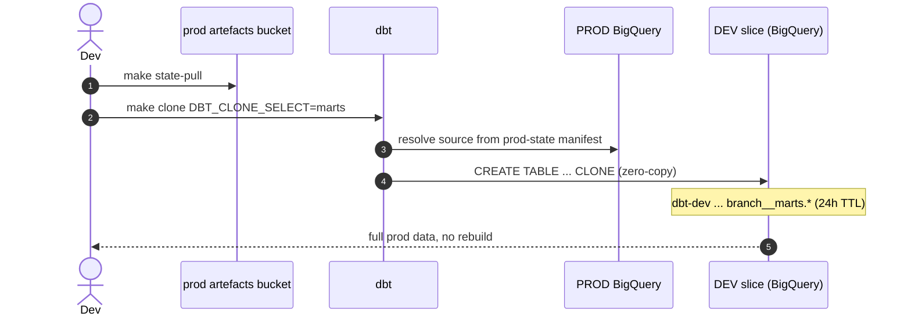
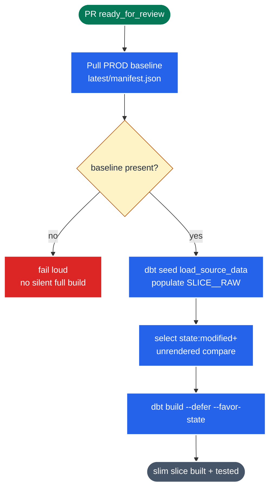

# Runbook: defer against prod & shallow-clone into dev/test

Use the persisted PROD dbt state (`manifest.json`) to (a) build only what changed,
deferring everything else to live prod relations, and (b) zero-copy clone prod
tables into your dev slice. Both avoid rebuilding the full DAG from source.

## At a glance: the state plane and its consumers

One artefact — prod's `latest/manifest.json` — is produced by the release deploy
and consumed by three flows. Solid arrows are GCS metadata reads (the manifest);
dotted arrows are BigQuery data-plane reads/writes.



## How the state gets persisted (already in place)

`dbt-deploy-prod.yml` uploads `manifest.json` / `run_results.json` / `catalog.json`
to the prod artefacts bucket on every release:

- `gs://dbt-prod-jaffleshop-dbt-artefacts/runs/<run_id>/…` — every run (incl. failures)
- `gs://dbt-prod-jaffleshop-dbt-artefacts/latest/manifest.json` — **success only**; the
  known-good baseline the targets below consume.



Buckets are versioned with a 90-day lifecycle (`infra/stacks/dbt_platform/dbt.tf`).
`dbt-deploy-test.yml` and `make deploy-dev` upload per-run artefacts to their own
env buckets too (no `latest`).

## IAM (who can read what)

| Action | Needs | Granted by |
|---|---|---|
| Fetch prod `manifest.json` | `storage.objectViewer` on prod bucket | `dbt_artefacts_developer_viewer` (you) / `dbt_artefacts_cross_env_viewer` (dbt-test SA) |
| `--defer` reads unselected prod refs | `bigquery.dataViewer` + `jobUser` on prod | `cross_env_readers` (dev/test → prod) |
| `dbt clone` writes into dev slice | `bigquery.dataEditor` + `jobUser` on dev | self grants (`dbt_self_*`) |

The GCS `objectViewer` grants were added alongside these targets — apply the
`dbt_platform` stack (dev + prod) once before first use, or `state-pull` 403s.

## Inner-loop: defer against prod

```bash
make login                 # one-time: gcloud auth + ADC impersonating dbt-dev
make -C dbt-jaffleshop state-build
# == state-pull (download prod manifest) then:
#    dbt build --select state:modified+ --defer --favor-state --state prod-state
```



- `state:modified+` selects nodes that differ from the prod manifest **and their
  children**; everything upstream is deferred to the existing prod relation.
- `--favor-state` prefers the prod relation for deferred refs even if a stale
  same-named relation exists in your branch slice.
- Re-run `make -C dbt-jaffleshop build-defer` for subsequent iterations (skip the
  re-pull); `make state-pull` again when prod has moved on.
- Override the selector: `make build-defer DBT_DEFER_SELECT='state:modified+,tag:nightly'`.

## Shallow-clone prod into your dev slice

```bash
make -C dbt-jaffleshop state-pull
make -C dbt-jaffleshop clone DBT_CLONE_SELECT=marts
```



BigQuery runs `CREATE TABLE … CLONE` (zero-copy, unbilled scan) for tables and
recreates views. Source relations come from the prod state manifest
(`dbt-prod-jaffleshop.MARTS.*`); targets resolve to your branch slice
(`dbt-dev-jaffleshop.<branch>__marts.*`) via `generate_database_name` /
`generate_schema_name`. Omit `DBT_CLONE_SELECT` to clone the whole manifest.

Cloned dev tables inherit the 24h TTL (`dbt_project.yml +hours_to_expiration`), so
they self-clean.

## Test/PR CI: slim defer against prod (wired)

`dbt-deploy-test.yml` builds slim: it pulls the prod baseline, seeds the slice's
RAW, then `dbt build --select state:modified+ --defer --favor-state --state prod-state`.
Each PR rebuilds only what changed vs prod (and children); unchanged upstream
defers to live prod relations.



Two non-obvious correctness requirements:

- **The seed is kept, not dropped.** `--defer` redirects `ref()` only, never
  `source()`. Sources are slice-prefixed (`models/staging/__sources.yml` →
  `<SLICE>__RAW`), so a rebuilt staging model reads the slice's RAW — which must be
  seeded to exist. Defer saves the unchanged staging+marts rebuilds, not the seed.
- **`state_modified_compare_more_unrendered_values: true`** (`dbt_project.yml`).
  Without it, `state:modified` compares rendered relation names — prod's `MARTS`
  vs the slice's `PR<n>_RUN<n>__marts` differ for every node, so everything is
  flagged modified and nothing is slim. The flag compares unrendered values
  (`jaffleshop` / `marts`), which are env-independent.

The `dbt-test` SA has prod BQ read (`cross_env_readers`) and prod bucket read
(`dbt_artefacts_cross_env_viewer`). The state pull fails loud if the baseline is
missing — there is deliberately no silent fall-back to a full build.
