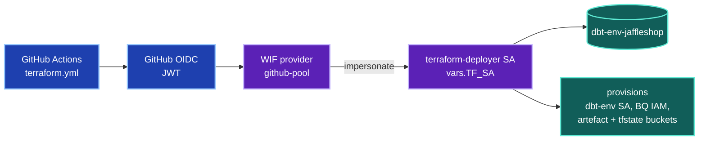
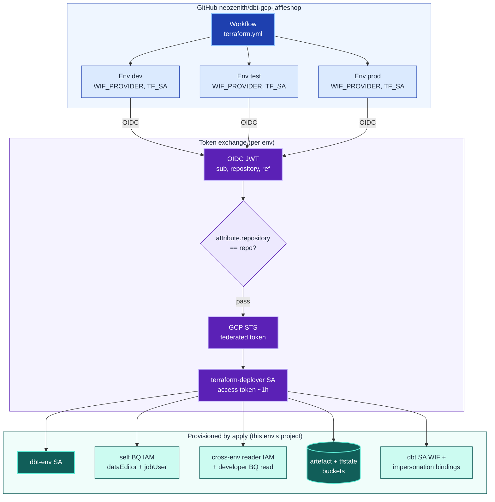
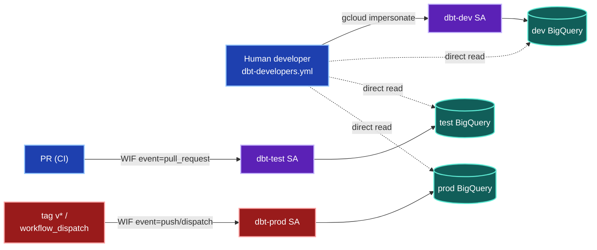
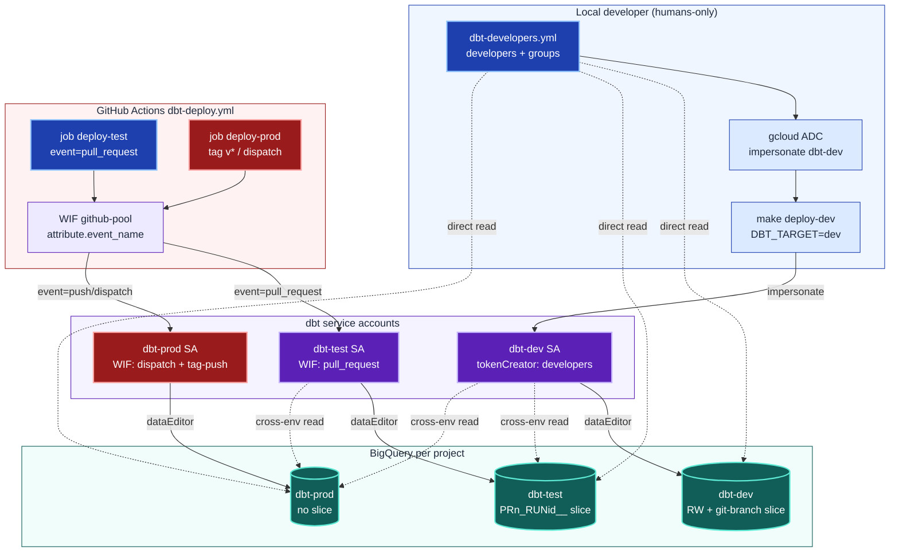

# Authentication & Authorization

How identities are established and what they may touch, across the two distinct
principals that operate this project. Both authenticate with **zero long-lived
keyfiles** — every cloud token is short-lived, obtained either by GitHub OIDC →
Workload Identity Federation (machines) or by `gcloud` ADC impersonation (humans).

Two lenses:

- **TF Deployer** — the `terraform-deployer` SA that *provisions* identities and
  IAM (the `infra/` stack). Mediated by `terraform.yml`.
- **DBT Developer** — the `dbt-<env>` SAs (and the humans in
  [`dbt-developers.yml`](./dbt-developers.yml)) that *run dbt* against BigQuery.
  Mediated by `dbt-deploy.yml` for CI and `make deploy-dev` for local work.

The two layers hand off: the TF Deployer must apply an environment *before* the
DBT Developer can authenticate into it — the deployer is what creates the
`dbt-<env>` SA and its WIF/impersonation bindings in the first place.

---

## Lens 1 — TF Deployer

The deployer SA is reached only through GitHub OIDC. A GitHub-signed JWT is
exchanged at the WIF provider (gated on `attribute.repository`), yielding a
federated token that impersonates `terraform-deployer`, which then runs
`plan`/`apply` and provisions everything else.

*One repo → one deployer SA per project → it provisions everything else.* | VCS: low ✅

📋 Detailed — token exchange + provisioned resources (13 nodes)

*Each env's GitHub Environment supplies `WIF_PROVIDER` + `TF_SA`; the repo claim
is verified before STS mints a federated token. One apply provisions the dbt SA,
its IAM (including the developer grants), buckets, and WIF bindings.* | VCS: ~32 ✅

---

## Lens 2 — DBT Developer

Three authentication paths, one per environment, each gated differently:

- **dev** — *humans only*. A developer listed in `dbt-developers.yml` uses
  `gcloud` ADC to impersonate the `dbt-dev` SA (`make deploy-dev`). No CI path.
- **test** — *PRs only*. `dbt-deploy.yml` federates via WIF where
  `attribute.event_name == pull_request` → `dbt-test` SA.
- **prod** — *releases only*. WIF where `event_name` is `workflow_dispatch`, or
  `push` with an IAM condition restricting the ref to `refs/tags/*` → `dbt-prod` SA.

The dotted edges from `dbt-developers.yml` show the **direct** human BigQuery
read granted in every project (browse/query as yourself) — distinct from the
write path, which always routes through a dbt SA.

*dev = human-impersonated, test = PR-triggered, prod = release-gated (red).
Humans also get direct read into all three.* | VCS: ~14 ✅

📋 Detailed — env vars, WIF gating, slices, cross-env reads (12 nodes)

*Solid = read/write via a dbt SA; dotted = read-only. Cross-env reads (dev→test,
dev→prod, test→prod) come from the `cross_env_readers` map; the three `reg` dotted
edges are the new direct human grants from `dbt-developers.yml`. Non-prod datasets
carry an isolation slice (branch name / `PRn_RUNid__`); prod has none.* | VCS: ~32 ✅

---

## Why no keyfiles anywhere

Both lenses fail **closed** if either side of the trust is misconfigured:

| Path | GitHub-side gate | GCP-side gate |
|------|------------------|---------------|
| TF Deployer | `terraform.yml` env + `id-token: write` | WIF `attribute.repository` condition + `terraform-deployer` `workloadIdentityUser` binding |
| dbt test | `deploy-test` `if: event_name == pull_request` | `dbt-test` SA `workloadIdentityUser` on `attribute.event_name/pull_request` |
| dbt prod | `deploy-prod` `if: tag-push OR dispatch` | `dbt-prod` SA bindings on `workflow_dispatch` + `push` (IAM condition: `ref` startsWith `refs/tags/`) |
| dbt dev (human) | — | `dbt-dev` SA `serviceAccountTokenCreator` granted to `dbt-developers.yml` members |

The workflow `if:` conditions are belt-and-suspenders — even if one misfired, the
WIF binding itself matches a single `event_name`, so the wrong trigger cannot
impersonate the wrong SA.
